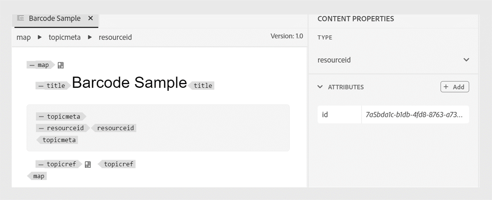

# Add a barcode to the PDF output

A barcode is a data pattern that machines can read. Customers can scan barcodes with a barcode scanner or their smartphone camera. Encoding information such as product details, inventory numbers, or website URLs can be helpful. Adding barcodes helps you easily capture the data, enhances the customer experience, and facilitates better data management and security.

You can create a style for the barcode. and use it to insert a barcode in a page layout. You can apply the style to a sample barcode in the desired page layout. 


This tutorial helps you to add barcodes in the PDF output. 

## Steps to generate a barcode

To generate a barcode, perform the following steps: 

### Update the template's CSS to render a barcode value

Modify the `layout.css` file to render a barcode during the PDF generation. Various barcode types like 'qrcode' and 'pdf417' are supported.  For more details, view [Barcode types](#barcode-types).


```css
...
.barcode { 
-ro-replacedelement: barcode;   
-ro-barcode-type: code128;   
-ro-barcode-size: 100%;   
-ro-barcode-content: content();   
object-fit: contain;   
margin-top: 2mm;
 
}
...
```

### Use the CSS style to generate the barcode 

**Example 1** 

 Add a barcode placeholder in the template header and apply the style:
 
1. Edit **Templates** > **Page Layouts** 
1. Select a page layout. For example, you can select the BackCover page layout, which contains the header or footer.
1. Add the following span to the location where you want to insert the barcode.

    `<span class="barcode">Sample barcode</span></p>`.

    >[!NOTE]
    >
    > Use the same class name that you have defined in the `layout.css`.

1. Replace `<Sample barcode>` with the value that you wish to display under the barcode.  

You can view the barcode on generating the output PDF using the template, which includes the page layout. Once you have performed the previous steps, you can generate the PDF output with a barcode. 

The following screenshot displays a sample barcode in a PDF output.

  

**Example 2**

Modify the `Common.plt` file in the **Basic** template to add a barcode after the project title.  

To create a barcode for an ISBN number, add an ISBN number. Then use the ISBN number to generate the barcode.

```html
...

  <div data-region="header">
    <p class="chapter-header"><span data-field="project-title" data-format="default">Project Title</span> </p>
    <p><span class="barcode">978-1-56619-909-4</span></p>
  </div>
} 
...
```

**Example 3**

To create a barcode using the map metadata:


Add a resource ID element to the DITA map. The resource ID serves as the main input to generate the barcode. 

```xml
<?xml version="1.0" encoding="UTF-8"?>
<!DOCTYPE map PUBLIC "-//OASIS//DTD DITA Map//EN" "technicalContent/dtd/map.dtd">
<map id="GUID-3c330691-4dac-4020-904a-d2d6246aeeb1-en">
  <title>Barcode Sample</title>
  <topicmeta>
    <resourceid id="7a5bda1c-b1db-4fd8-8763-a731e2e8abba">
    </resourceid>
  </topicmeta>
  <topicref href="GUID-139f6c64-bea3-4f17-8b22-ee131557e249-en.dita" type="topic">
  </topicref>
</map>  
```

You can also edit the resource ID in the Authoring mode. 




```html
  <div data-region="header">
    <p class="chapter-header"><span data-field="project-title" data-format="default">Project Title</span> </p>
    <p><span class="barcode" data-field="metadata" data-format="default" data-subtype="//resourceid/@id">Resource ID (barcode)</span></p>
  </div>
} 
```

## Barcode types {#barcode-types}

Some of the commonly used barcodes are as follows:

| Type  | -ro-barcode-type| Additional details | 
| ---| --- | --- |
| QR Code   | qrcode    |  The QR Code bar code symbology according to ISO/IEC 18004:2015.  | 
|Code 128  | code128               |The Code 128 barcode symbology as defined in ISO/IEC 15417:2007.|
Code 32| code32   | Code 32, also known as Italian harmacode.                           |               
| Code 49  |code49     | Code 49 according to ANSI/AIM-BC6-2000.                            |  
| Code 11                         |code11                   |                            |  
| Code 93                         |code93                   |                            |  
| Code16k                         |code16k                  |                            |  
| PDF417    |pdf417 | The PDF417/MicroPDF417 bar code symbologies according to ISO/IEC 15438:2006 and ISO/IEC 24728:2006.                            |  
| Code 3 of 9 | code39       | The code 3 of 9 bar code symbology according to ISO/IEC 16388:2007. |  
| MSI Plessey    |msiplessey  |                            |
| Channel Code     |channelcode | Channel Code according to ANSI/AIM BC12-1998.                            |
| Codabar | codabar                 |    Codabar barcode symbology according to BS EN 798:1996.                        |
| EAN-8|ean-8| EAN bar code symbology according to BS EN 797:1996.|
|EAN-13|ean-13|EAN bar code symbology according to BS EN 797:1996.|
|UPC-A|upc-a|UPC bar code symbology according to BS EN 797:1996.|
|UPC-E|upc-e|UPC bar code symbology according to BS EN 797:1996.|
|Ean/UPC Addon|addon|EAN/UPC add-on bar code symbology according to BS EN 797:1996.|
|Telepen|telepen|Also known as Telepen Alpha.|
|GS1 Databar / Databar 14|databar|GS1 DataBar according to ISO/IEC 24724:2011.|
| GS1 Databar Expanded / Databar 14 Expanded | databar-expanded | GS1 DataBar Expanded according to ISO/IEC 24724:2011.|  
| GS1 Databar Limited             | databar-limited         | GS1 DataBar Limited according to ISO/IEC 24724:2011.    |
| POSTNET (Postal Numeric Encoding Technique) | postnet                 | The POSTNET (Postal Numeric Encoding Technique) barcode symbology used by the United States Postal Service.    |
|Pharmazentralnummer (PZN-8)|pzn8|A Code 39 based symbology used by the pharmaceutical industry in Germany.| 
| Pharmacode      | pharmacode   |                            | 
| Codablock F   | codablockf  | Symbology according to AIM Europe "Uniform Symbology Specification Codablock F", 1995.| 
| Logmars  | logmars  |   The LOGMARS (Logistics Applications of Automated Marking and Reading Symbols) standard used by the US Department of Defense.               |
|Aztec Runes|aztec-runes|Aztec Runes bar code symbology according to ISO/IEC 24778:2008 Annex A.|
| Aztec Code  | aztec-code   |Aztec Code bar code symbology According to ISO/IEC 24778:2008.|                            |
| DataMatrix        |data-matrix             |  Data Matrix ECC 200 bar code symbology According to ISO/IEC 16022:2006.                          |
| Code One    | code-one                |                            |


