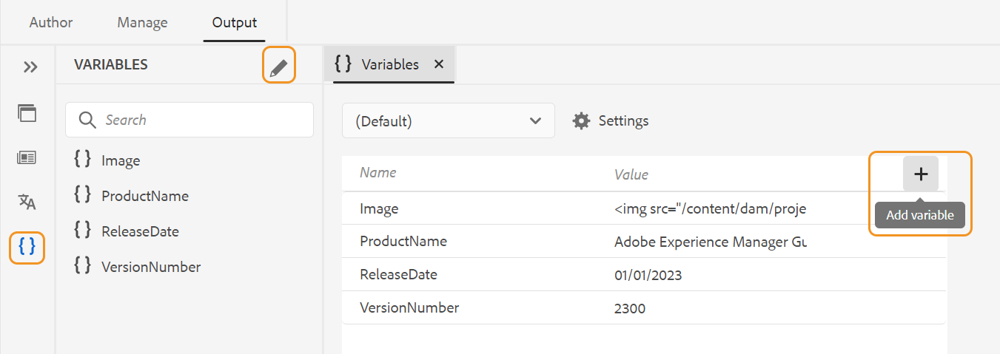

# Variables in the PDF output

A variable is a name-value pair of data that serves as a reusable piece of information. This makes your content portable and easy to update. When you modify a variable or its value, every occurrence of that variable or value is updated.

## Create a new variable

Perform the following steps to create a variable:

 {width="800" align="left"}

 *Create variables and define values for them.*

1. In the Web Editor, go to the **Output** tab.
1. Select **Variables**  in the left panel.
1. Select **Edit**  to open the **Variables** editor. 
 The variables are listed alphabetically. 
1. Enter the variable name in the **Name** column and its value in the **Value** column.
   >[!TIP]
   >
   >You can use any HTML content as a variable value to display the variable value in specific formatting. For example, you can add a `<b>` tag to the variable value to display the value **Experience Manager Guides** in bold. You can also add images from the repository as values. 

1. Select **Add variable**  to add a new variable. You cannot create a variable with the same name as an existing variable. An error is displayed.

   >[!NOTE]
   >
   >If you don’t select **Add variable** , the variable is not created and added to the list.

In this way, you can create variables with default values. For example: 
* ProductName: Experience Manager Guides
* VersionNumber: 2300
* ReleaseDate: 01/01/2023

### Edit a variable

You can edit a variable in two ways:

**From the Variables panel on the left side**

1. Select a variable in the **Variables** panel. 
1. Hover over the variable to view the **Options** menu and then select the **Edit** option.
1. In the **Edit Variable** dialog box, you can edit the default value of the selected variable.
1. Click **Done**.

**From the Variables editor** 

1. Select **Variables**  in the left panel.
1. Select **Edit**  to open the **Variables** editor.

1. In the **Variables** editor, you can edit the value of the selected variable.

You need to save any changes you make from the **Variables** editor to view them in the **Variables** panel on the left side. 

 >[!NOTE]
 >
 > If you edit any variable value, Adobe Experience Manager Guides simultaneously updates all the references wherever applicable.

### Search and preview a variable

You can search and preview the value of a variable. Enter a string in the search box of the **Variables** panel. It searches both based on the variable name and its value. 
You can preview a variable in two ways:

The preview of the variable displays the default value. For example, if you have defined the default value of the ProductName variable as “Adobe Experience Manager Guides”, it displays this value in the preview.

**From the Variables panel on the left side**

1. Select a variable in the **Variables** panel. 
1. Hover over the variable to view the **Options** menu and then select the **Preview** option.

 {width="550" align="left"}

 *Preview the default value for a variable.*
 
**From the Variables editor**

1. Hover over the variable in the list to view the **Options** menu.
1. Select **Preview**.

 

### Duplicate a variable

You can duplicate a variable and modify the value according to your requirements. 

1. Hover over the variable in the list to view the **Options** menu.
1. Select **Duplicate**.

The default name of the variable is `<selected variable name>` (like “sample”). You can change the name according to your requirements.

### Delete a variable

You can delete a variable in two ways:

**From the Variables panel on the left side**

1. Select a variable in the **Variables** panel. 
1. Hover over the variable to view the **Options** menu and then select the **Delete** option.

**From the Variables editor** 

1. Hover over the variable in the list to view the **Options** menu.
1. Select **Delete** option.

The variable is deleted from all the variable sets.

## Variable sets for the output presets

Adobe Experience Manager Guides also supports variable sets, which let you assign your variables alternate values. For example, a company can sell two products, A and B. It has different specifications for each of them. These specifications could include product name, version number, and release date. There can be other differences in branding. Using variable sets, you define a different set of values for your variables. When you generate the output, you choose the appropriate variable set and produce the required output. 

### Configure variable sets

You need to configure variable sets before adding any variables to them. 

1. Select **Settings**  to open the **Configure variable sets** dialog box. 
 {width="550" align="left"} 
1. Enter the variable set name in the **Name** column. 
1. Select **Add variable**  to add a new variable set. The variable sets are listed alphabetically.
1. You can select **Delete** to remove a variable set.

### Variable set operations

All variable sets have the same variables but can have different values. 

You can view, edit, and preview the values for a specific variable set. Select a variable set from the **Variable sets** dropdown. The values are displayed according to the chosen variable set. 
When you edit the values for the variables in specific variable sets, it overrides the default values and changes the values of the selected variable set.
For example, you can set the following values for the variable sets, *Adobe-set1* and *Adobe-set2* .

**Variable set 1**: *Adobe-set1*

* ProductName: ProductA
* VersionNumber: 2311
* ReleaseDate: 11/02/2023

**Variable set 2**: *Adobe-set2*

* ProductName: ProductB
* VersionNumber: 2310
* ReleaseDate: 09/07/2023

Every new variable is added to all variable sets. When you delete or duplicate a variable, it's updated for all variable sets.

You can also preview the values for a variable set.
For example, for the variable set *Adobe-Set1*, you have defined the value of the ProductName variable as “ProductA”, then it displays this value in the preview in the Variables editor .

 {width="550" align="left"}

*Preview the value that you have defined in the selected variable set.*

### Reset the value of a variable

If you have edited the value, you can also reset a variable to the default value. 
Reset  appears for a variable with a changed value.
For example, you can reset the value for the ProductName variable to the default value Expereince Manager Guides.

## Use variables in the Native PDF templates

You can add variables while you generate the output of your product documents to make them portable and easy to update. You can insert these variables within the page layout that appears across the different pages in your documents. For example, you can add the variable ProductName that appears in the page layout’s header area (or any other part like the footer or body).

To insert a variable like your ProductName in the header area, perform the following steps:
1. Open the required page layout for editing.

   >[!NOTE]
   >
   > View [Customize a page layout](../native-pdf/components-pdf-template.md#customize-a-page-layout-customize-page-layout) section for opening a page layout for customization or editing.

1. Select the header to make it active to insert a variable.

1. You can insert the variable in two ways:

   **From the Variables panel on the left side**

   * Drag a variable from the **Variables** panel and drop it on the header area.

   **From the toolbar**

   1. Select **Insert Variable/Fields** . 
   1. In the **Variable** dialog box, select the name of the variable to insert it in the header area.
   1. You can also enter the search string in the text box. The variable names containing the given string are filtered and displayed in the list. The selected variable is inserted in the header area. You can view the default value of the variable.
   1. To replace a variable, double-click the variable value and select another variable from the **Variable** dialog box. The variable is replaced. 

## Generate PDF output with variables

You can generate the PDF output with the values of different variables. Before generating the layout, choose a variable set from an output preset's **Variable set** drop-down list to pick its values.
 
 {width="550" align="left"}

*Select a variable set from the dropdown in the output preset that you want to use to generate the PDF output.*

>[!NOTE]
>
> You can also select (Default) from the dropdown to publish the default values for all variables. 

Depending on your chosen variable set, you'll get an output corresponding to the variable values defined in the variable set. For example, if you select the variable set *Adobe-set1*, your output displays the variables' values as defined in this set.
 

  

*Generate the PDF output using variables in the page layout.*

You can also quickly update the values for any variable set whenever required and regenerate the output. For example, if you need to update the details for a version, you can update the value of the version in the VersionNumber variable and regenerate the output.
