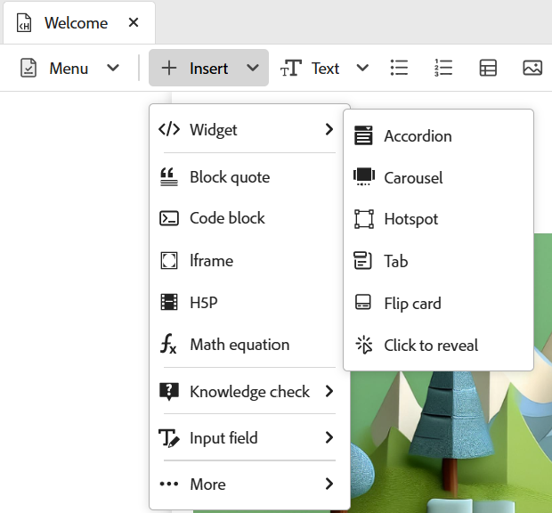
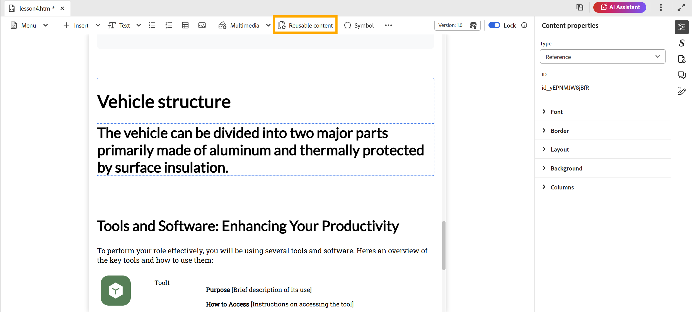

# December 2025 release of Product Training and Learning content  

This release note covers the new and enhanced features introduced in December 2025 release of Product Training and Learning content. In addition, all the reported issues and bugs have been resolved in this release, ensuring improved stability and performance.

## Authoring

- **New options in the Insert menu**: Introducing new options in the Insert menu of the Editor toolbar to enrich your learning content: 

    - **MathML equation**: Insert MathML equations seamlessly for technical or scientific topics.
    - **Knowledge check**: Add quick, non-graded quizzes within the learning topics to validate learner's understanding.
    - **H5P**: Embed interactive H5P packages for an enhanced learning experience.

    For more details, view [Other options in the Insert menu](../learning-content/lc-other-insert-options.md).

    {width="650"}

- **New interactive widgets**: You can engage learners with some new interactive widgets that make content more immersive: **Click to reveal**, **Flip card**, and **Tab**.

    For details, view [Use interactive widgets](../learning-content/lc-widgets.md).

    {width="350"}  

- **Match the following**: A new question type, **Match the following**, is available for quizzes. Learners can match items from two lists to connect related ideas, encouraging critical thinking.

    For details, view [Quiz question types](../learning-content/quiz-insert-questions.md#question-types).

    {width="650"}    

## Review

- **Create review task**: You can now create a review task for your learning course and assign it to Reviewer for their feedback. This ensures content quality, streamlines collaboration, and makes tracking reviews easier. 

    For details, view [Create review task](../learning-content/manage-course.md#create-review-task).

    {width="650"}

## Content management  

- **Reusable content**: You can reuse existing content across multiple courses. This feature helps maintain consistency and reduces duplication.

    For more details, view [Add basic building blocks](../learning-content/lc-basic-blocks.md).

    {width="650"}
