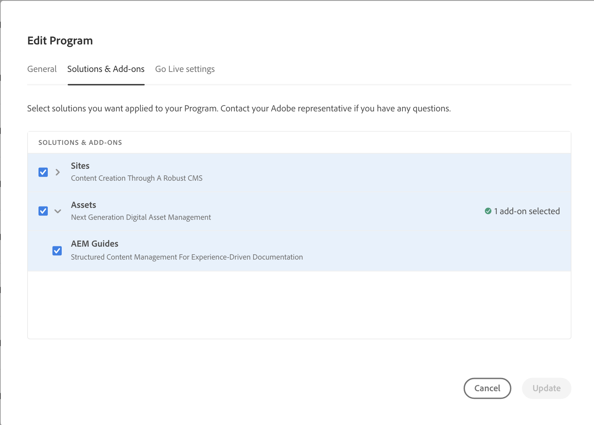

# [!DNL Adobe Experience Manager Guides] as a Cloud Service deployment

Learn how to add [!DNL Experience Manager Guides] to your [!DNL Experience Manager as a Cloud Service] environment.

>[!NOTE]
>
> Starting 2024.2.0 release, Experience Manager Guides is only available as an automated add-on for Experience Manager as a Cloud Service. If you use manual deployments for Experience Manager Guides, please remove the line `<module>dox.installer</module> from file dox/pom.xml` in your cloud manage git codebase before enabling Experience Manager Guides for your program.

1. Login to [!UICONTROL Cloud Manager].

1. Edit the program for which you want to configure [!DNL Experience Manager Guides].

1. Switch to **[!UICONTROL Solutions and Add-ons]** tab.

1. In the **[!UICONTROL Solutions and Add-ons]** table, click on **[!UICONTROL Assets]**.

1. Select **[!UICONTROL Guides]** and select **[!UICONTROL Save]**.

You have successfully configured your program for automatic provisioning of Experience Manager Guides solution.

>[!NOTE]
>
>To install [!DNL Experience Manager Guides] on any environment under the integrated program, you must run the pipeline associated with the environment. No additional configuration is required in your CM git codebase for installing [!DNL Experience Manager Guides].
