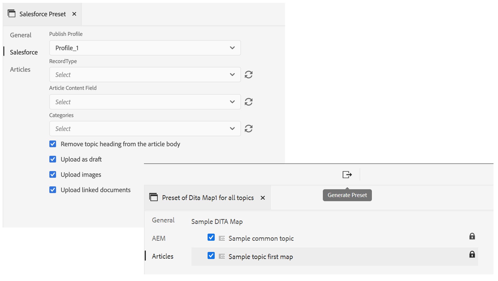
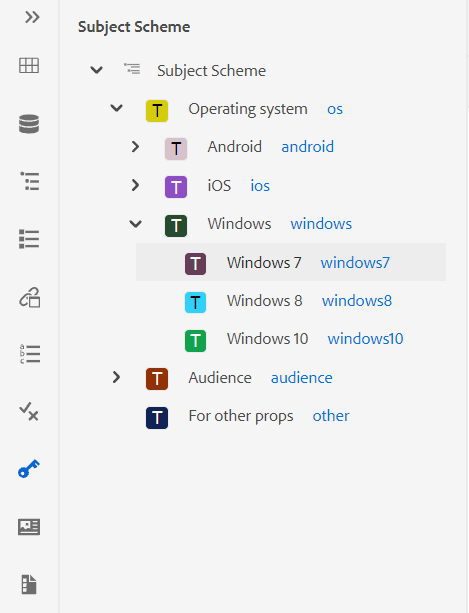
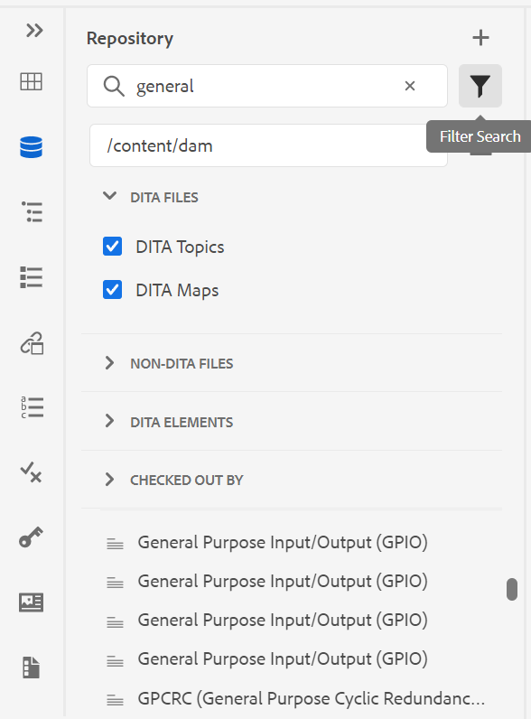
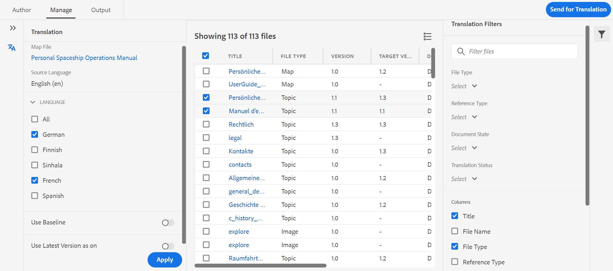
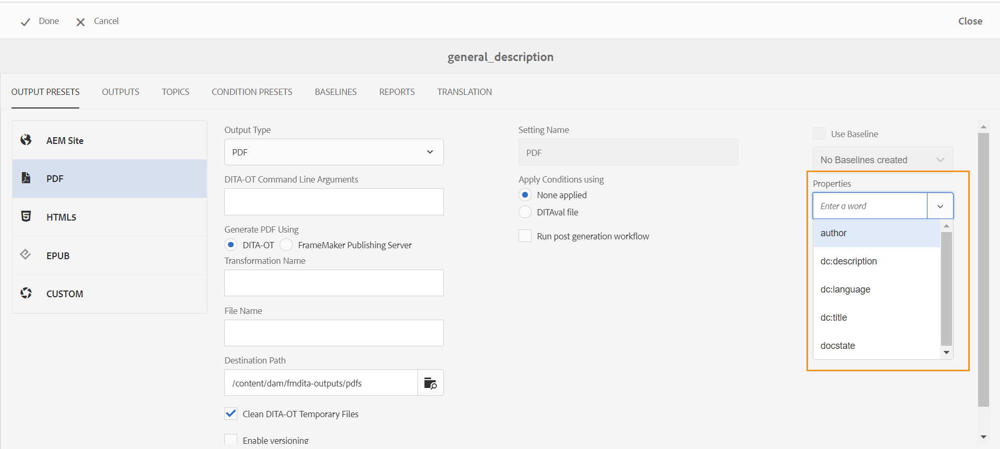

# Release notes | Adobe Experience Manager Guides 4.0.x

**Disclaimer**:

*Adobe Experience Manager Guides* was formerly branded as *XML Documentation for Adobe Experience Manager*. Please note certain references within the documentation may still refer to prior branding but are still applicable to the current offering.

This release notes covers the upgrade-instructions, new features, and enhancements in version 4.0.x of Adobe Experience Manager Guides (referred to as AEM Guides later).

## 4.0.3 | Release notes

### Compatibility matrix

This section lists the compatibility matrix for the software applications supported by AEM Guides version 4.0.3.

#### Adobe Experience Manager

- Version 6.5 Service Pack 12, 10, 11, or 9

For more details, see the *Technical requirements* section in the Installation and Configuration Guide.

#### FrameMaker and FrameMaker Publishing Server

| Release | FMPS 2020 | FMPS 2019 | Fm 2020 | Fm 2019 |
|---|---|---|---|---|
| Non-UUID | 2020.2 or higher* | 2019 | 2020.3 or higher | 2019.8 (latest update) |
| UUID | 2020.2 or higher* | Not compatible | 2020.4 or higher | Not compatible |

*Baseline and conditions created in XML Documentation solution are supported in FMPS release 2020.2 onwards.*

#### Oxygen Connector

| Release | Oxygen Connector Windows | Oxygen Connector Mac | Edit in Oxygen Windows | Edit in Oxygen Mac |
|---|---|---|---|---|
| Non-UUID | 1.6.8 | 1.6.8 | 1.5 | 1.5 |
| UUID | 2.3.8 | 2.3.8 | 2.2 | 2.2 |

### Fixed issues

The bugs fixed in various areas are listed below:

- Oxygen checks out an incorrect version of a topic after reverting a file version in AEM. (9661)
- Incorrect timestamp differences are displayed in Assets UI on reverting a file version. (9662)
- Files are checked out automatically on reverting to any version. (9663)
- Translated content is broken if the language code is mentioned as fr-fr or en-us. (9665)
- In the non-UUID version, approved translation does not integrate to the target language when the target language code contains five characters like fr_ca. (9666)
- Target version of image is displayed as jcr:root, after translation is done with create new version enabled. (9668)
- When translation is done using baseline, wrong version of the image is send for translation. (9669)

## 4.0.2 | Release notes

### Compatibility matrix

This section lists the compatibility matrix for the software applications supported by AEM Guides version 4.0.2.

#### Adobe Experience Manager

- Version 6.5 Service Pack 12, 10, 11, or 9

For more details, see the *Technical requirements* section in the Installation and Configuration Guide.

#### FrameMaker and FrameMaker Publishing Server

| Release | FMPS 2020 | FMPS 2019 | Fm 2020 | Fm 2019 |
|---|---|---|---|---|
| Non-UUID | 2020.2 or higher* | 2019 | 2020.3 or higher | 2019.8 (latest update) |
| UUID | 2020.2 or higher* | Not compatible | 2020.4 or higher | Not compatible |

*Baseline and conditions created in XML Documentation solution are supported in FMPS release 2020.2 onwards.*

#### Oxygen Connector

| Release | Oxygen Connector Windows | Oxygen Connector Mac | Edit in Oxygen Windows | Edit in Oxygen Mac |
|---|---|---|---|---|
| Non-UUID | 1.6.8 | 1.6.8 | 1.5 | 1.5 |
| UUID | 2.3.8 | 2.3.8 | 2.2 | 2.2 |

### Fixed issues

The bugs fixed in various areas are listed below:

- The position of inserted or deleted text is not correct in a newly created review document. (9454)
- Version 1.0 is not listed in certain cases under **Version History** panel after 4.0.1 upgrade. (9441)
- Label and comments are not displayed for the current version under Version 1.0 is not listed in certain cases under **Version History** panel. (9440)
- Editor freezes when certain content files are opened in the editor. (9433)
- Search in repository panel and the *topicref* browse dialog freezes on searching large content files. (9432)
- Two versions are created for a file on saving a file once from the Web Editor. (9428)
- Unable to insert non-DITA and ditaval assets in topicref. (9363)
- The editor hangs on loading the preview of a map with a large no of keys. (9332)
- References break on moving the assets in the source files while authoring using FM update 4. (9177)

### Known issues

- If the setting **Create New Version for Uploaded File** is ON, a new version is created on choosing **Save All** intermittently in certain cases.
- Delete Users functionality under the Folder Profile doesn't work intermittently on the Chrome browser. **Workaround**: Refresh the Chrome browser.

## 4.0.1 | Release notes

### Compatibility matrix

This section lists the compatibility matrix for the software applications supported by XML Documentation solution version 4.0.1.

#### Adobe Experience Manager

- Version 6.5 Service Pack 12, 11, or 10
- Java: 11

#### FrameMaker and FrameMaker Publishing Server

| Release | FMPS 2020 | FMPS 2019 | Fm 2020 | Fm 2019 |
|---|---|---|---|---|
| Non-UUID | 2020.2 or higher* | 2019 | 2020.3 or higher | 2019.8 (latest update) |
| UUID | 2020.2 or higher* | Not compatible | 2020.4 or higher | Not compatible |

*Baseline and conditions created in XML Documentation solution are supported in FMPS release 2020.2 onwards.*

#### Oxygen Connector

| Release | Oxygen Connector Windows | Oxygen Connector Mac | Edit in Oxygen Windows | Edit in Oxygen Mac |
|---|---|---|---|---|
| Non-UUID | 1.6.8 | 1.6.8 | 1.5 | 1.5 |
| UUID | 2.3.8 | 2.3.8 | 2.2 | 2.2 |

### Fixed issues

The bugs fixed in various areas are listed below:

- References tree is broken for a map when duplicate topic references are added/removed. (8922)
- Multiple issues present in the **Current** versions section of the **Version History.** (8909)
- References break on using **Select All** and moving the multimedia files or DITA content to some other folder. (8897)
- Multiple UI issues on **Insert Cross Reference** > **File Reference** > **Search File** > **Filters** > **Change Search Path** dialog in the Web Editor. (8889)
- Search issues with *topicref* and *ditavalref* on Map Editor (8983).
- Searching as you type causes unwanted search requests in the Repository view. (8982)
- Unable to delete the Administrator users in the folder profile. (8926)
- Use-by-reference footnote doesn't scroll to the footnote section in AEM Site output. (9061)
- Unable to publish the updated articles to Salesforce. (9008)
- The position of highlighting is incorrect in the side-by-side view. (9009)
- Unable to drag-and-drop conditions on DITA topics. (9031)
- css_layout.css cannot be overlayed in the folder profile. (9032)
- Exception is received on viewing an asset after upload. (9068)
- Customization of allowed special characters in XML Editor is not working properly. (9075)
- In the translation workflow, an additional version is created for the translated asset. (9107)
- Baseline publishing with a topic using an image as *conref* from other topic, the image does not appear in the output. (9172)
- When using download map API temporary directories do not get cleaned up in case download fails. (9176)
- Horizontal alignment is not available for a table in version 4.0. (9207)
- Keys attribute is not displayed for *glossref*, so the abbreviated form cannot be inserted via insert references. (9213)
- Creating a *keydef* only allows the selection of a link in 4.0. (9214)
- Insert Key Definition/*keyref* functionality behavior is different in 4.0 as compared to 3.8.10. (9215)
- Fixed Web Editor issues present in versions 3.8.6 to 3.8.10. (9219)
- Issues occur when any keyword is used in the title for tab. (9317)
- Source view displays multiple errors for non-conditional attributes. (9278)
- Issues present in browse dialog of **Select Path**. (9289)

## 4.0 | Release notes

### Compatibility matrix

This section lists the compatibility matrix for the software applications supported by XML Documentation solution version 4.0.

#### Adobe Experience Manager

- Version 6.5 Service Pack 11, 10, or 9

#### FrameMaker and FrameMaker Publishing Server

| Release | FMPS 2020 | FMPS 2019 | Fm 2020 | Fm 2019 |
|---|---|---|---|---|
| Non-UUID | 2020.2 or higher* | 2019 | 2020.3 or higher | 2019.8 (latest update) |
| UUID | 2020.2 or higher* | Not compatible | 2020.4 or higher | Not compatible |

*Baseline and conditions created in XML Documentation solution are supported in FMPS release 2020.2 onwards.*

#### Oxygen Connector

| Release | Oxygen Connector Windows | Oxygen Connector Mac | Edit in Oxygen Windows | Edit in Oxygen Mac |
|---|---|---|---|---|
| Non-UUID | 1.6.8 | 1.6.8 | 1.5 | 1.5 |
| UUID | 2.3.8 | 2.3.8 | 2.2 | 2.2 |

### New features and enhancements

#### Article-based publishing

With version 4.0, we have introduced an article-based publishing feature integrated within the Web Editor. You can use the article-based publishing feature to incrementally generate output of one or more topics or publish your content to a knowledgebase platform.

This feature allows the users to build the DITA map in an additive fashion and publish topics as and when they are ready. Once you have published your map, use the article-based publishing feature to achieve incremental publishing for the updated articles only.

In addition to AEM, you can use this unique feature to publish your articles to any knowledgebase portals such as Salesforce. This feature also comes with an OOTB content template, built on top of AEM core components, which lets you create a knowledge-based repository of the technical content. What's great about this template is that it is completely customizable to suit your organizational requirements and can also support use cases like corporate intranet portals.

This on-the-go need-based article publishing not only gives you complete control on your content publishing, but also reduces the overall time to publish your updated content.

For more details, see *Article-based publishing from the Web Editor* in the User Guide.

#### Improved Web Editor

There are a lot of enhancements and new features that are introduced in the Web Editor:

- Changed the core framework from Coral-based UI to Spectrum-based UI. This gives a very standardized and intuitive UI.
- New File Properties feature has been introduced in right panel. You can check the properties of an active document. The information is categorized under two sections:
  - *General*: contains the general file details such as filename, UUID, metadata tags, language, creation date, checked out status, and document state.
  - *Reference*: contains incoming and outgoing references.

  

- Support for subject scheme has also been added in the Web Editor. You can now create and use subject scheme using the Subject Scheme panel. With the addition of subject scheme, you can now use own corporate metadata and taxonomy.

  

- A new glossary hotspot tool has been introduced in this version to manage glossaries in bulk. Using this tool, you can quickly convert text to glossary and glossary to terms in bulk for a selected map or open topics.

  

- Added refresh functionality in Reusable Content panel that allows you to quickly refresh the reusable content in reference files.
- New file update indicator shows you whether your current (working copy) of file is in sync with the saved version or not.

  

- Search filter in the Repository Panel and file browse dialog has been enhanced to give more filtering options, which can be further customized.

  

- You can now upload .docx files from the Web Editor.
- User preferences are now stored in user profile and not browser's cookies. This helps users to retain their preferences across browsers or user sessions.

#### New translation dashboard

A new translation dashboard has been introduced in the Web Editor with the following features:

- Sorting, searching, and filtering of topics list.
- Filter content by reference type - direct or indirect references.
- Easy navigation to find an existing project while initiating a translation request.
- Introduced a multi-language translation mechanism to avoid creating multiple projects for each language when translation request is initiated for more than one language.
- Introduced a configuration to hide the translation tab in map dashboard. By default, it is visible. You can choose to translate content using either the map dashboard or the Web Editor.

#### Enhanced publishing

The following enhancements are now available in the publishing process:

- PDF generation through FrameMaker Publishing Server now supports baselines and condition presets.
- Authors can now pass map- and topic-level metadata to DITA-OT publishing. This is helpful when custom PDF templates are designed to use file metadata properties like tags, author, document state, and more.

  

- A new configuration has been added in the configMgr to allow users to retain or delete the versions of the topics being deleted when **Delete and Create** option is used in the AEM Site output generation.

#### Improved file handling

The following improvements can now be seen while working with files in AEM Assets:

- A new file upload experience and a new dialog for choosing a conflict resolution strategy has been introduced.

  

- Ability to create a new version of uploaded file with an ability to prevent overwriting a checked-out file.
- Now you can see a preview of images directly from the Version History view. Also, for DITA and non-DITA files, Version History shows the current version information separately.

  

#### New report export feature

Reports are very useful in identifying the health of your content. XML Documentation solution provides various reports to take control of your content. Now, you can not only view the reports, but also export the report data in a CSV file to view and share with your larger team. Report data can give you a quick glance of any broken links or missing images.

#### Improved Oxygen DAM refresh experience

When you refresh files from AEM Server in Oxygen, a warning message is displayed if you have unsaved files in your current Oxygen session. You can choose to cancel the refresh operation to save any unsaved files. Without this feature, users were losing any unsaved information in their documents.

#### Other feature enhancements

- In accordance to AEM's best practices, application data has now been migrated from /content/fmdita, /etc/fmdita/, and /content/dxml/ to newer location.
- DAM Asset Update workflow has been reintroduced with better handling and optimized performance to run along with XML post-processing workflow.
- XML Documentation API package is now available in a publicly accessible Maven repo.
- You can now create a new Dita Project template under the /apps/projects/templates path.
- Now download the default ui_config.json file from your folder profiles. This can be used to merge custom changes from the existing ui_config.json file while upgrading.

### Fixed issues

The bugs fixed in various areas are listed below:

#### Web Editor

- conrefs appears in red color even when they are not broken. (8239)
- Value for conditional attribute is not auto populated when **Add All Properties** is selected in the DITAVAL editor. (8234)
- Authors are unable to insert an image in a topic using relative path. (8112)
- Ph conref added in table cell are displayed in red color. (8083)
- In case of UUID-based systems, links in a review task do not update when the files under review are moved. (8080)
- Web Editor does not correctly render images that have scaling property set to 75% or higher. (8073)
- GIF images are rendered as static images in the Web Editor. (8024)
- A conkeyref in a note element is not displayed in the Web Editor preview or in the output. (8006)
- xref to an element that itself is a conref is not resolved in the editor. (7933)
- Title having key is not rendered correctly in the editor preview and the Repository panel. (7909)
- Snippets with special characters are not stored correctly. (7908)
- Even when there is a JS validation issue, the POST request is still sent to the server. (7989)
- Saving a topic after formatting MathML equations results in an error. (7954)
- keydef having (tm) are not rendered properly in the editor and the AEM site output contained duplicate TM symbols. (7859)
- Dragging and dropping a snippet does not work as per the DTDs. (7758)
- HTML is ignoring custom defined dimensions for graphics. (7718)
- conrefend attribute does not update when the source file is moved. (7698)
- Working with Reference topic type documents leads to several UI issues. (7656)
- DITAVAL files are not shown when author adds ditavalref in a map. (7594)
- Unexpected space is found in each blank `<entry>` element when outputclass attribute is added to `<tgroup>` element. (7532)
- Source button does not work for topics opened via map dashboard. (7465)
- Pretty print inserts blank lines and spaces that can be seen when the file is opened in FrameMaker or Oxygen. (7408)
- Maps with href="/" in any of the topics do not publish on AEM sites (7405)
- Performance issues found in the editor when the root map has large number of keydefs. (7400)
- Document state for a map with custom template is not getting inherited from its corresponding states profile. (7359)
- `<tm>` element incorrectly rendered as a block element. (7286)
- Duplicate templates are displayed in editor templates panel when a new template is created. (5814)
- Templates defined in ui_config for images for setting additional attribute is not applicable for drag/drop cases. (5713)
- Incorrect default appearance of uicontrol in menucascade. (5483)
- Custom templates for Topic/Map do not show new name in the UI. It shows the name as "Topic"/"Map" rather than showing the configured name (4958)

#### Oxygen Connector

- Files whose parent folder has special characters give error while loading in Oxygen. (8054)
- When a newly created document is opened in Oxygen, it throws "Cannot find GUID" error. (7856)
- Check-in option is disabled after the file is checked-out from AEM using Edit in Oxygen. (7471)

#### Review

- When review tasks are being reassigned from the AEM inbox, the payloads associated with the tasks are not viewable by the assignees. (8003)
- If a file name has space, then Review task page does not show the (multimedia) file's contents. (8111)

#### Map Dashboard

- Unable to see conref content in title of a topic in map dashboard's topics or reports tab. (8263)
- AEM Sites Output | jcr:title of the generated site page does not update when DITA topic title is updated. (8131)
- Download MAP does not download the video files used inside the topics. (8070)
- AEM bookmap download is failing for the flat hierarchy if bookmap has 2 topics with same name in different folders. If there are files with same name but different case, they are treated as the duplicate files. (8058)
- Media files are not downloading when the object Tag is used through the download bookmap API. (8057)
- Incorrect report is shown in Reports tab if any topic has conref to file whose title starts with conref. (4698)

#### Publishing

- PDF creation fails for the first time when Enable Versioning is selected. (8053, 8294)
- For non-UUID content, conref images are not shown in AEM Site output. (7907)
- White-space character is auto-added after a 'tm; tag in AEM Site output. (7964)
- Unable to view YouTube videos in AEM Site output. (7401)
- Filter by label fails for referenced content after the user clicks on browse all topics in the baseline tab of map dashboard. (7388)
- Publishing topic with element `<tm>` having property value SM or reg is displayed incorrectly in generated output. (7239)
- Baseline publishing with image is not picking the image's latest version in published output. (7231)
- Relatable referenced topics is shown in baseline tab. (5424)
- Incremental publish for a topic with conkeyref in its title does not work as expected. (4474)
- Page title is not used for output URL generation even though that setting is checked. (8257)
- Baseline publishing picking the current version of the images instead of the frozen node. This is also seen if an image has space or special characters in the file name. (8274, 8322)
- Incremental publish fails for DITA map with type subject scheme having mapref. (8218)

#### AEM Assets

- Performance issues found while performing selection/deletion on huge content set in Assets UI. (8238)
- Saved search feature (smart collection) breaks if DITA Predicate is added to Search filters. (8048)
- Reverting image to older version does not work. (DXML-7903)
- Delete option is also visible for authors who do not have permission for delete. (7322)
- CCMS overlay for Assets Editor breaks rendering of Delete option. (8093)

#### Content import

- HTML to DITA conversion | Table with 'tr' having empty 'td' entries causes additional rows in output. (8132)
- HTML to DITA conversion | HTML having a table with multiple tbody fails with exception. (7940)
- HTML to DITA conversion | errors out if source HTML has comments. (7937)
- Importing DITA 1.3 DITA files causes some href to transform into malformed links. (8019)

#### Others

- In the Version History view, thumbnail of images is missing or broken. (7948, 8008)
- zipMapWithDependents API does not give relevant information in case of faulty references in content. (7521)
- For UUID customers, default configuration values have changed for few configurations like regex for identifying UUID files, using page title for generating the output, and more. (8301, 8305)

## Upgrade instructions {#upgrade-instructions}

You can easily upgrade your current version of AEM Guides to version 4.0.3. Before you proceed with upgrading to version 4.0.3 of AEM Guides, you must consider the following points:

- If you are using version 4.0.2, then you can directly upgrade to version 4.0.3. You need to upgrade to version 4.0.2 before upgrading to 4.0.3.
- If you are using version 4.0, then you can directly upgrade to version 4.0.2.
- If you are using version 4.0.1, then you need to uninstall it.
- If you are using version 3.8.5, then you need to upgrade to version 4.0 before upgrading to 4.0.2.
- If you are on a version prior to 3.8.5, refer to the upgrade section in the product-specific installation guide.

For details, see [Upgrade instructions](https://helpx.adobe.com/content/dam/help/en/xml-documentation-solution/4-0-3/Adobe-Experience-Manager-Guides_Upgrade-Instructions_EN.pdf).

