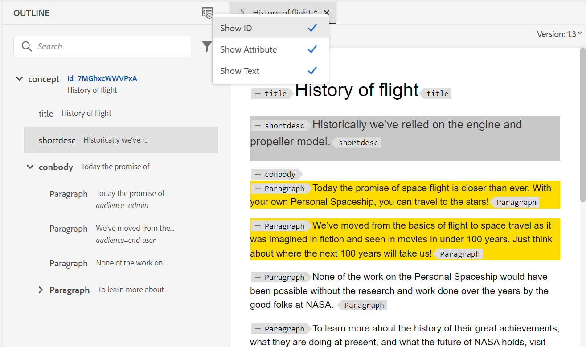

# What's new in April 2023 release of Adobe Experience Manager Guides as a Cloud Service

This article covers the new and enhanced features in version April 2023 of Adobe Experience Manager Guides (later referred as *AEM Guides as a Cloud Service*).

For more details on the upgrade instructions, compatibility matrix, and the issues fixed in this release, see the [Release notes](release-notes-2023-4-0.md) article.

## Advanced metadata support in PDF publishing

AEM Guides now provides advanced support for the metadata which is mapped to the metadata in your PDF output. The metadata options include information about the document and its contents, such as the author's name, document title, keywords, copyright information, and other data fields.

You can import a XMP file and AEM Guides can pick the information from the file. You also have the option to provide the metadata names and values using the dropdown. You can also add custom metadata by typing directly in the name field.
 

## Enhanced Outline View panel

AEM Guides provides an improved Outline View panel in which you get the hierarchical view of the elements used in the document.

The Outline View provides the following enhancements:

* View Options dropdown is displayed on top of the Outline View panel. If an element has an ID, attribute, and text, you can select them from the dropdown to display them along with the element. The attributes which can be displayed in the Outline View panel are determined by the Display Attributes settings that have been configured by your administrator within the **Editor Settings**.

* Using the search feature, you can  you can search for an element by its name, id, text or attribute value. 

## Microservice-based publishing for AEM Guides as a Cloud Service

AEM Guides as a Cloud Service provides the feature to run large publishing workloads concurrently with microservice-based publishing and leverage the industry-leading Adobe I/O Runtime serverless platform.

Now in the April release you can run multiple publishing requests concurrently and generate bulk PDF outputs very efficiently using the microservice-based Native PDF publishing.
For more details, see [Configure new microservice-based publishing for AEM Guides as a Cloud Service](../knowledge-base/publishing/configure-microservices.md).
