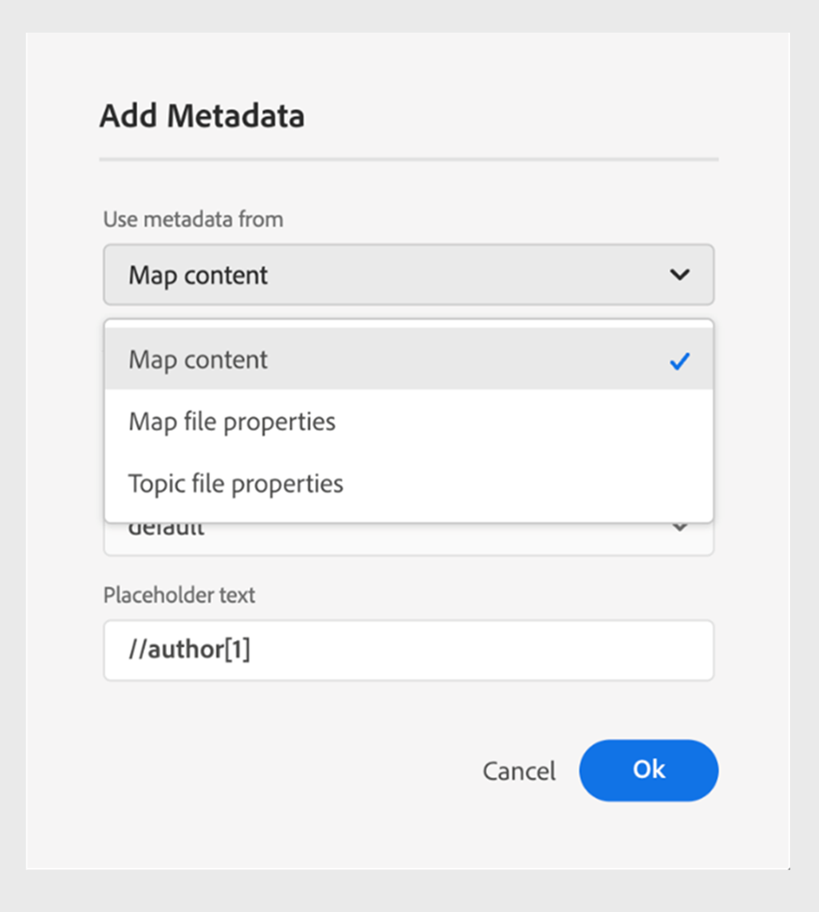

# What's new in the 2024.06.0 release 

This article covers the new and enhanced features of the 2024.06.0 release of Adobe Experience Manager Guides.

For the list of issues fixed in this release, view [Fixed issues in the 2024.06.0 release](fixed-issues-2024-06-0.md).

Learn about [upgrade instructions for the 2024.06.0 release](upgrade-instructions-2024-06-0.md).

## Publish a topic or its elements to an Experience Fragment

An Experience Fragment is a modular content unit within Adobe Experience Manager that integrates content and layout. Experience Fragments are instrumental in creating consistent and engaging experiences and reuse them across multiple channels.

Experience Manager Guides now allows you to publish a topic or its elements to an Experience Fragment. You can create a JSON-based mapping between a topic and its elements in an Experience Fragment.  For example, you can create experience fragments for headers or footers with branding elements, promotional banners, customer testimonials, and event promotions.  

   {width="300" align="left"}

For more details, view [Publish Experience Fragments](../user-guide/publish-experience-fragment.md). 

## Enhancements in the Content Fragment publishing

  Experience Manager Guides also provides some helpful enhancements in Content Fragments: 

 - You can easily filter content with conditions while publishing to a Content Fragment. You can filter the content using a DITAVAL file or add condition attributes to your DITA topics. 

 - You can also publish and view the Content Fragments of a topic from the **Outputs** section in the **File Properties**. 

    {width="300" align="left"}

For more details, view [Publish Content Fragments](../user-guide/publish-content-fragment.md). 

## Ability to pass metadata from topic file properties to Native PDF output

Now, Experience Manager Guides allows you to add the metadata from the topic file properties to the page layouts while generating the Native PDF output. Use this feature to add specific metadata for each topic, such as title, tags, and description. You can also customize your published PDF based on the topic's metadata, such as add a watermark to the topic background based on the topic's document state.

 {width="300" align="left"}

*Add metadata to the fields in your page layouts.*

Learn how to [add fields and metadata](../native-pdf/design-page-layout.md#add-fields-metadata) in a page layout.

## Ability to select partial content across elements and perform operations

Experience Manager Guides enhances your experience of selecting the content across the elements in the Web Editor. You can easily select content across elements and perform various operations like making it bold, italics, and underlined. This feature allows you to seamlessly apply or remove the formatting for partially selected content. You can also quickly delete the content that you have selected across elements. Once the content is deleted, if necessary, the remaining content is put under a single valid element.

You can also select the content and then surround the content under a valid DITA element.
 {width="300" align="left"}

*Surround the selected content with a valid element.*

Overall, these enhancements provide a better experience and help you improve your efficiency while editing your documents. 

For more details, view [Partial selection of content across element](../user-guide/web-editor-edit-topics.md#partial-selection-of-content-across-elements).

## Support for Markdown documents in Native PDF publishing

Experience Manager Guides also supports Markdown documents in Native PDF publishing. This feature is handy and helps you generate PDFs for the Markdown files in your DITA map. Markdown support in PDF helps you easily create, manage, and share your documents.

For more details, view [support for Markdown documents](../web-editor/native-pdf-web-editor.md#support-for-markdown-documents).

## Improved performance and scalability for large translation projects

The translation feature is faster and more scalable than ever. It comes with a new architecture that provides enhanced performance. The project creation time is now 700 % faster than earlier, and the conflicts during the process are nearly nonexistent. This improved performance helps you with faster translations, ensuring smooth operation even for large translation projects.

This improvement is very beneficial as it enhances productivity and overall experience.

Learn more about how to [translate documents from the Web Editor](../user-guide/translate-documents-web-editor.md).
