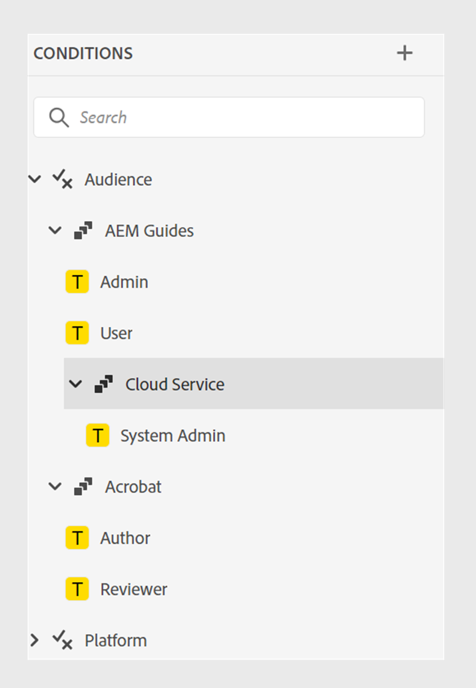

# What's new in the 2024.10.0 release (October 2024)

This article covers the new and enhanced features introduced with 2024.10.0 release of Adobe Experience Manager Guides as a Cloud Service.

For the list of issues fixed in this release, view [Fixed issues in the 2024.10.0 release](fixed-issues-2024-10-0.md).

Learn about [upgrade instructions for the 2024.10.0  release](../release-info/upgrade-instructions-2024-10-0.md).

## Publishing enhancements 

The following content publishing enhancements have been made in the 2024.10.0  release: 

### Enhancements in the Content Fragment publishing

Experience Manager Guides also provides some helpful enhancements in Content Fragments: 

- Experience Manager Guides allows you to publish a topic or its elements to a content fragment.

 - You can publish and view the Content Fragments of a topic from the **Outputs** section in the **File Properties**.

 - You can easily create Content Fragment variations by filtering content with conditions while publishing to a Content Fragment. 

- Use the new mapping interface to easily select and publish the elements to a Content Fragment. 

Now, Content Fragment publishing only replaces the mapped content instead of overwriting the complete Content Fragment. This feature allows a Content Fragment to contain data from multiple sources, such as multiple topics or the Content Fragment editor.

   

   For more details, view [Publish Content Fragments](../user-guide/publish-content-fragment.md). 

### Publish Experience Fragment variants based on condition filters

Experience Manager Guides allows you to publish a topic or its elements to an Experience Fragment. Now, you can also create Experience Fragment variants by using the condition or DITAVAL filters and reuse them across different channels or for different audiences.

 Learn more about how to [Publish Experience Fragments](../user-guide/publish-experience-fragment.md). 

### AEM Sites preset reorganized for ease of use

The settings have been reorganized to help you quickly configure the output preset and generate the AEM Sites output. 
You can create the existing AEM Sites presets by selecting the **Use legacy component mapping** option in the **New output preset** dialog box.

View the **General**, **Content**, and **Cross map reference** tabs in the AEM Sites presets:
- **General**: Contains the general configurations to generate the output. You can specify the site and output path, delete or overwrite existing output pages, delete the previously generated pages for removed topics, select the design template, retain the temporary files, and specify the post-generation workflow.
- **Content**: Contains the settings applicable to the content for output generation. You can select the filters, the baseline of the DITA map, and the metadata properties for publishing. 
- **Cross map references**: This list contains topics containing cross-map references with scope =”peer”. You can specify the publishing context for a list of cross map references with scope=”peer” to topics available in other DITA maps. This tab appears if you use the Experience Manager Guides (UUID) version.

### Cross map references from AEM Sites presets in the Web Editor

The latest enhancement to Experience Manager Guides introduces cross map references in the AEM Sites presets of the Web Editor.
Cross map references in Experience Manager Guides help improve content navigation, increase content reuse, and enhance user experience.

  You can specify the publishing context for a list of cross map references to topics available in other DITA maps with scope=”peer”. For example, Topic 1 in Map A contains a reference to Topic 2. Topic 2 can be present in single or multiple maps.  You can select the parent map and a specific preset or the most recently published output for each link.  

If the same topic is referred to more than once in a file, then you can add a different publishing context for each instance. This provides greater flexibility and control over their content. For example, Topic 3 is present in both Map B and Map C. Topic 1 contains two references to Topic 3. You can choose Map B as a parent map for the first link and Map C as the parent for the second link.

  
 
 *Specify the publishing context for the linked topics from the **Cross map references** tab of the **AEM Sites** preset.*

Learn more about [AEM Sites Presets](../user-guide/generate-output-aem-site.md).

### Option to either choose a flat or nested file hierarchy for HTML5 output

Now, Experience Manager Guides allows you to retain the flat folder hierarchy for the temporary files wherein the entire content is published in HTML5 output format and saved in a single folder.
If you don't choose to flatten the file hierarchy, the HTML5 output is generated in a nested folder hierarchy. This implies that the content's original folder structure, with files organized into subfolders, is replicated in the output. This nested folder hierarchy allows for more complex organization and categorization of files, making it easier to manage and navigate large volumes of data.

Learn more about how to [generate HTML5 output](../user-guide/generate-output-html5.md).

## Editor enhancements

The following editor enhancements have been added in the 2024.10.0 release:

### Read-only access to Author and Source mode for locked files

If a DITA or Markdown file is locked or checked out by another user, you cannot edit or change the content. Besides the Preview, you can also view it as a read-only file in the Author or Source mode. 
In read-only mode, you can view the content along with the tags and attributes within the **Author** or **Source** mode and edit the file properties.

You can also access the **Layout** view for read-only DITA maps. 
 >[!NOTE]
 >
 > Your folder profile administrators must update *ui_config.json* so that you can harmoniously access the read-only files in the Author, Source, and Layout modes.

*View the locked files in Author and Source mode.*

Learn how to [open locked files in Author and Source modes](../user-guide/web-editor-edit-topics.md#open-locked-files-in-author-and-source-modes).

### Grouped conditions for enhanced content organization

Experience Manager Guides now allows you to group conditions and present them in a nested hierarchy, allowing you to add multiple conditions to a single group. By grouping conditions, you can better organize and apply them across your content.

{width="300"}

Learn more about the **Conditions** feature description in the [Left Panel](../user-guide/web-editor-features.md#id2051EA0M0HS) section.
