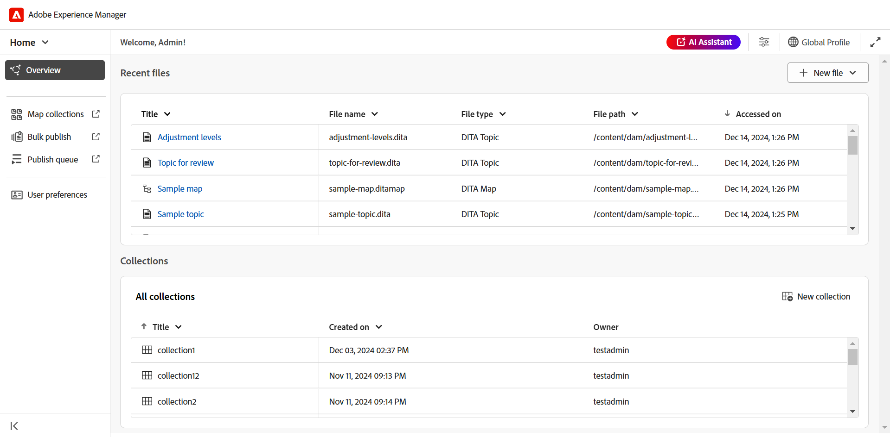

# What's new in the 2025.02.0 release (February 2025)

This article covers the new and enhanced features introduced with 2025.02.0 release of Adobe Experience Manager Guides as a Cloud Service.

## Revamped Experience Manager Guides UI for enhanced productivity and experience

Adobe Experience Manager Guides now features a revamped design and enhanced features to help you work faster and more efficiently than ever before. The new UI brings an intuitive and enhanced user experience, with an all-new home page, a cleaner and more organized editor toolbar, dedicated map console, and enhanced features. 

The key highlights are as follows: 

- **Introducing Home page**: Experience Manager Guides now features a Home page that offers an intuitive welcome screen experience, including a quick view of the files that you recently accessed, collections, and more. 
 
    For more details, view [Adobe Experience Manager Guides Home page experience](../user-guide/intro-home-page.md). 

    {width="800" align="left"}

- **New Editor experience**: Now, experience the Editor in a new look and feel. The revamped editor interface features a cleaner and more organized toolbar, seamless navigation, and overall intuitive experience to help author documents faster and more efficiently.  
 
    Get to [know the Editor features](../user-guide/web-editor-features.md). 

    {width="800" align="left"}

- **Dedicated Map console**: Introducing Map console, a dedicated console where all the map management and publishing features are clubbed. Now, you get options to generate output, translate content, create reports, and more - all directly from Map console. 
 
    Learn more about [map management and publishing](../user-guide/map-management-and-publishing.md). 

    {width="800" align="left"}

## Integration with Adobe Workfront for robust work management capabilities 

Experience Manager Guides now integrates seamlessly with Adobe Workfront, giving you access to robust project management features on top of Experience Manager Guides core CCMS capabilities. 

With this integration, you can create and manage Adobe Workfront tasks directly from Experience Manager Guides. For example, as an author, you can create a review task (with one or more DITA topics or maps added) directly within the Experience Manager Guides interface and assign it to a reviewer. As a reviewer, you can work on assigned tasks in the Experience Manager Guides Review UI and return them to the author with comments. Similarly, you can create a publishing and translation task, and then assign it to the users who are required to work upon it.

The integration also provides you the ability to monitor your work queues, ensuring you stay organized and on top of all your tasks (assigned tasks). It also enables project managers to leverage the power of Adobe Workfront for in-depth project management within Experience Manager Guides.

For more details, refer [Workfront integration](../user-guide/workfront-integration.md). 

{width="800" align="left"}

## AI Assistant(Beta) for GenAI powered smart help and authoring

Now, experience enhanced productivity with GenAI powered smart help and content reuse features in Experience Manager Guides. With AI Assistant, quickly find relevant content from the Experience Manager Guides documentation, use smart suggestions to reuse the content from the existing content repository or enhance productivity with one-click content enhancement features such as smartly convert a paragraph to a list, create a short description, improve and translate the selected content.

For more details, view [AI Assistant in Experience Manager Guides](../user-guide/ai-assistant.md).  

{width="300" align="left"}

## Introducing new AEM Sites publishing with more enhanced features

Experience faster and scalable publishing to AEM Sites with the all-new publishing engine, optimized with composite component mapping and a new editable template. With the new AEM Sites publishing, you can access all topics present in your DITA map and selectively generate the AEM Sites output only for specific topics. 

{width="300" align="left"}

If you prefer not to use topics from the current version of your DITA map, use the Baseline feature, from the **Content** tab, to generate incremental AEM Sites output.

Learn more about [AEM Sites publishing](../user-guide/generate-output-aem-site-web-editor.md).

## Single topic publishing introduced for AEM Sites 

Introducing single topic publishing to AEM Sites pages that allows you to publish individual topics directly to Adobe Experience Manager Sites pages. This means, you no longer need to create and publish an entire map if you want to publish a single topic. This streamlines the publishing process, making it more efficient when working with standalone content, such as marketing collateral, monthly newsletters, or any other standalone content. 

{width="300" align="left"}

## The all-new Markdown editor for rich authoring experience 

Now, experience a cleaner, more efficient, and powerful way to author markdown topics. Experience Manager Guides introduces a new Markdown editor interface with a well organized toolbar and advanced features, including a **Side-by-side** view to author and preview content at the same time. It also enables seamless publishing of Markdown topics that are a part of a map, to multiple channels.

For more details, refer [Markdown authoring](../user-guide/web-editor-markdown-topic.md). 

{width="300" align="left"}

## Editor enhancements 

The following Editor enhancements has been made as part of the new release:

**Enhancements to Table insertion**

- Ability to configure the default values for header rows, body rows and columns in the table or simpletable insertion dialog. 
- Ability to configure the table settings to paste tables copied from external sources as simpletable or a table. 

    For more details, view the Tables section in [Know the Editor features](../user-guide/web-editor-features.md#content-insertion-options).  

**Enhanced the friendly name feature for DITA elements** 

The friendly name feature for DITA elements has been improved. Now, default enumerated values are retained when a friendly name is assigned to an element, and the updated name is reflected in breadcrumbs, Content properties, the Reusable content panel, the Glossary panel, and other relevant locations. 

**Enhanced experience for filtered searches**

The asset display limit for filtered search results in the Adobe Experience Manager Guides Repository has been increased. The search results now return all relevant assets or files that match the search criteria. You can scroll through the list to load more results, eliminating the need to perform repeated searches to locate the required assets.

**Alternate text for images now added as an element**
  
  Images now use the `<alt>` element for alternate text, as per the latest DITA standards. The use of `@alt` attribute for alternate text has been deprecated but remains supported in earlier DITA versions. 

**Customizing Cross-reference in the editor toolbar**

Now, create a custom toolbar button for **Cross-reference** to directly access one of the menu options. For example, you can configure this option to directly jump to a web link, email link, file reference, or any other available option as per the requirement. 

For more details, view [customizing the topbar and toolbar](../guides-ui-extensions/customisations/toolbar-topbar.md).

## Review enhancements 

The following Review enhancements have been done in the 2025.02.0 release:

- Now, when creating a review task, you can type in a project name to quickly locate and select it in the Project drop-down list. This enhancement removes the need to scroll through lengthy project lists, making it faster and more efficient to assign review tasks, especially when managing multiple projects. 

- In the Editor and Review UI, the review comment box now support multi-line entries. You can use **Shift**+**Enter** to go the next line. You can also expand the comment box while writing the comment.   

  For more details, view [Review topics](../user-guide/review-topics.md).  

-  Now, authors can access the review comments in the Editor even when the review task is marked closed. With the latest enhancements, the Review panel features both active and closed review tasks for each project in the Editor. When you select a closed review task, the corresponding comments are displayed in the Comments panel on the right, ensuring continuous access to important review comments even after a task is closed. 

   For more details, view the Review section of the [Know the Editor features](../user-guide/web-editor-features.md).

## Publishing enhancements

The following publishing enhancements has been made as part of the new release:

**Enhancements to the Native PDF**

- Ability to include the metadata from a topic's `prolog` element, such as copyright, author, and other details, into the page layouts when generating Native PDF output. 

    {width="300" align="left"}
    
- Introduced an option to enable or disable the DITA-OT preprocessing for Native PDF output. Enable this option if your content requires DITA-OT-based normalization or custom DITA-OT plugins during processing. This ensures consistent content formatting and supports any required transformations. By default, the setting is set to**Enabled**.

    {width="300" align="left"}

- The Print settings for Native PDF output generation have been moved from **Templates** setting to the **Native PDF Output preset** for better usability. You can now use the same template for online and print PDFs with different print settings such as color profile.  

    For more details, view [publish PDF output](../web-editor/native-pdf-web-editor.md) 

- Ability to include the **Contents** title in the Native PDF bookmark, which when selected, takes you to the TOC page in the PDF. This facilitates seamless page navigation, especially in long PDFs. 

## Content management enhancements

The following content management enhancements has been made as part of the new release:

**Custom metadata fields in reports**

This feature allows you to create custom metadata fields for reports. You can easily add these fields through **Settings**. Once created, you can view these fields under **Columns** in the Filter panel of the Reports, where you can select or deselect them to control their visibility. 

For more details, refer [DITA map report from the Map Console](../user-guide/reports-web-editor.md).

**Refresh button in the Translation UI**

Introducing a Refresh button in the Translation UI that allows you to refresh the translation dashboard with updated files and status.

**Enhancement to Asset post-processing workflow** 

The support for Asset post-processing has been provided via the REST API as well as API SDK. Now, the Asset processing event would be triggered and can be listened to define further workflow. 

For more details, view [Post-processing event handler](../api-reference/post-process-event.md). 

## Deprecated features

**Quick Generate**

Experience Manager Guides no longer supports the **Quick Generate** feature to generate output directly from the Repository view or Map view. 

This feature has been removed from both the Repository and Map view panels. It is recommended to use the **Map console** for all map management and publishing related actions. 

For more details, view [Map management and publishing](../user-guide/map-management-and-publishing.md).

**Pass root map metadata arguements to DITA-OT Command line**

The ability to pass root map metadata arguements through DITA-OT command line has been deprecated as part of the release. Now, it is reccomended to use the **Property** field in the map dashboard to pass the required DITA-OT metadata.  

However to avoid any disruptions, a new property has been added in the `Config.Manager` to enable or disable the functionality. 

For more details, view [Configure output generation settings](../cs-install-guide/conf-output-generation.md#configure-the-dita-ot-command-line-arguement-field-on-the-dita-map-dashboard).

