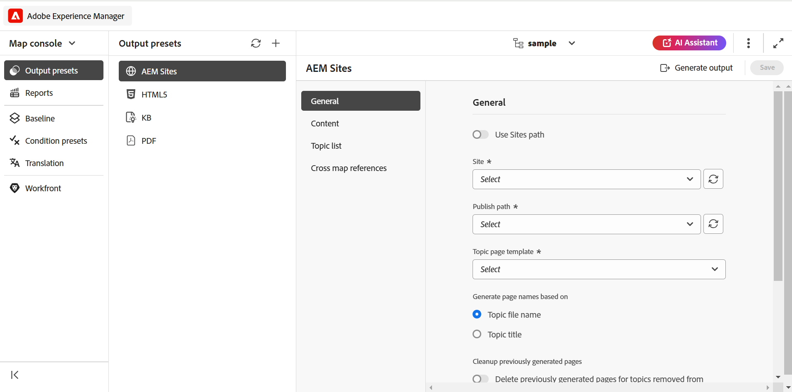
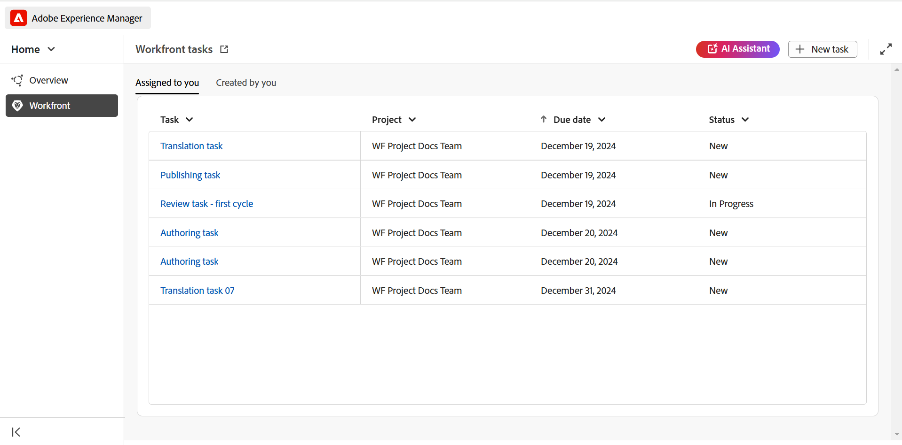

# What's new in the 2025.02.0 release (February 2025)

This article covers the new and enhanced features introduced with 2025.02.0 release of Adobe Experience Manager Guides as a Cloud Service.

For the list of issues fixed in this release, view [Fixed issues in the 2025.02.0 release](fixed-issues-2025-02-0.md).

Learn about [upgrade instructions for the 2025.02.0  release](../release-info/upgrade-instructions-2025-02-0.md).

## Experience Manager Guides in a new look and feel 

Adobe Experience Manager Guides now features a revamped design and enhanced features to help you work faster and more efficiently than ever before. 

The key highlights are as follows: 

 - **Introducing Home page**: Experience Manager Guides now features a Home page that offers an intuitive welcome screen experience, including a quick view of the files that you recently accessed, collections, and more. 
 
    For more details, view [Adobe Experience Manager Guides Home page experience](../user-guide/intro-home-page.md). 

    {width="800" align="left"}

 - **New Editor experience**: Now, experience the Editor in a new look and feel. The revamped editor interface features a cleaner toolbar and enhanced features to help author documents faster and more efficiently.  
 
    Get to [know the Editor features](../user-guide/web-editor-features.md). 

    {width="800" align="left"}

 - **Dedicated Map console**: Introducing Map console, a dedicated console where all the map management and publishing features are clubbed. Now, you get options to generate output, translate content, create reports, and more - all directly from Map console. 
 
    Learn more about [map management and publishing](../user-guide/map-management-and-publishing.md). 

    {width="800" align="left"}

## Adobe Workfront integration in Experience Manager Guides 

Experience Manager Guides now integrates seamlessly with Adobe Workfront, giving you access to robust project management features on top of Experience Manager Guides core CCMS capabilities. 

With this integration, you can create and manage Adobe Workfront tasks directly from Experience Manager Guides. For example, as an author, you can create a review task (with one or more DITA topics or maps added) directly within the Experience Manager Guides interface and assign it to a reviewer. As a reviewer, you can work on assigned tasks in the Experience Manager Guides Review UI and return them to the author with comments. Similarly, you can create a publishing and translation task, and then assign it to the users who are required to work upon it.

The integration also provides you the ability to monitor your work queues, ensuring you stay organized and on top of all your tasks (assigned tasks).

For more details, view [Workfront integration](../user-guide/workfront-integration.md). 

{width="800" align="left"}

## AI Assistant(Beta) Revamped 

The **AI Assistant** in Experience Manager Guides now features a new user interface, designed to enhance productivity and user experience by bringing together its smart **Authoring** and **Help** features at one place. Now, unlock the power of AI with a click of a button. Choose to launch the AI-powered conversational search feature or enhance productivity with smart authoring.  

For more details, view [AI Assistant in Experience Manager Guides](../user-guide/ai-assistant.md).  

{width="300" align="left"}

## Enhanced the Markdown authoring experience 

Now, experience a cleaner and more efficient way to author markdown topics. Experience Manager Guides introduces a revamped interface and added features for markdown authoring, including Side-by-side view, editor toolbar, seamless publishing to AEM Sites and PDF, and more.  

For more details, view [Markdown authoring](../user-guide/web-editor-markdown-topic.md). 

## Native PDF enhancements

The following Native PDF enhancements have been done in the 2025.02.0 release:

 - Introduced an option to enable or disable the DITA-OT preprocessing for Native PDF output. By default, the setting is set to Enabled.

    {width="300" align="left"}

 - Now, you can add a **Contents** title in the Native PDF bookmark, which when selected, takes you to the TOC page in the PDF. You can enable or disable this feature by configuring the `ui_config.json` setting.  

-   The Print settings for Native PDF output generation have been moved from **Templates** setting to the **Native PDF Output preset**.  

    For more details, view [publish PDF output](../web-editor/native-pdf-web-editor.md) 

- Ability to include the metadata from a topic's `prolog` element into the page layouts, such as copyright, author, and other details, while creating Native PDF output. 

    {width="300" align="left"}

## Enhancements in the Table configuration

The following Table enhancements have been done in the 2025.02.0 release:

- Ability to configure the default values for header rows, body rows and columns in the table template for table and simpletable. 
- Ability to configure the table settings to display pasted tables as simpletable or normal table. 

    For more details, view the Tables section in [Know the Editor features](../user-guide/web-editor-features.md#content-insertion-options).  

## Enhanced experience for filtered searches 

The asset display limit for filtered search results in the Adobe Experience Manager Guides Repository has been increased. The search results now return all relevant assets or files that match the search criteria. You can scroll through the list to load more results, eliminating the need to perform repeated searches to locate the required assets. 

## Enhanced the friendly name feature for DITA elements  

The friendly name feature for DITA elements has been improved. Now, default enumerated values are retained when a friendly name is assigned to an element, and the updated name is reflected in breadcrumbs, Content properties, the Reusable content panel, the Glossary panel, and other relevant locations. 

## Refresh button in the Translation UI 

Introducing a Refresh button in the Translation UI that allows you to refresh the target languages list and baseline list in one click. 

## Use Baseline while generating incremental AEM Sites output 

Experience Manager Guides now allows you to use a Baseline when generating incremental AEM Sites output. You can create a new AEM Sites preset, with the legacy mapping option disabled, to use the baseline feature for incremental output generation.   

Learn about [working with AEM Sites presets](../user-guide/generate-output-aem-site-web-editor.md). 

## Review enhancements 

The following Review enhancements have been done in the 2025.02.0 release:

- Now, when creating a review task, you can type in a project name to quickly locate and select it in the Project drop-down list. This enhancement removes the need to scroll through lengthy project lists, making it faster and more efficient to assign review tasks, especially when managing multiple projects. 

- In the Editor and Review UI, the review comment box now support multi-line entries. You can expand it as needed for comprehensive comments, and also use **Shift**+**Enter** to go to the next line. 

-  Now, you can access the review comments even when the review task is marked closed. 

## Alternate text attributes for images enhanced
  
  Images now use the `<alt>` attribute for alternate text, as per modern DITA standards. The use of `@alt` attribute for alternate text has been deprecated but remains supported in earlier DITA versions. 

## Customizing Cross-reference in the editor toolbar 

Now, create a custom toolbar button for **Cross-reference** to directly access one of the menu options. For example, you can configure this option to directly jump to a web link, email link, file reference, or any other available option as per the requirement. 

For more details, view [customizing the topbar and toolbar](../guides-ui-extensions/customisations/toolbar-topbar.md).

## Enhanced support for post-processing operations

The support for post-processing operations in Experience Manager Guides is now extended to UUID and Cloud environments, ensuring compatibility with modern workflows and systems.

For more details, view [Post-processing event handler](../api-reference/post-process-event.md). 
