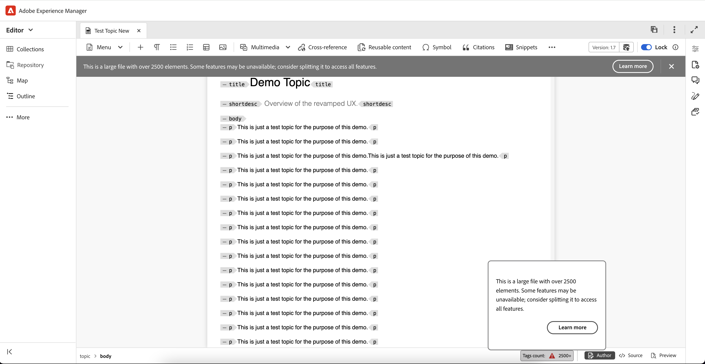

# What's new in the 2025.04.0 release (April 2025)

This article covers the new and enhanced features introduced with the 2025.04.0 release of Adobe Experience Manager Guides as a Cloud Service.

For the list of issues fixed in this release, view [Fixed issues in the 2025.04.0 release](fixed-issues-2025-04-0.md).

Learn about [upgrade instructions for the 2025.04.0  release](../release-info/upgrade-instructions-2025-04-0.md).

## New 'Format' attribute introduced for reference links

Adobe Experience Manager Guides now adds a **format** attribute for reference links (external or local) within the Editor. This attribute is displayed in the **Source view** and clearly indicates the file type, such as:

- For files with a **.pdf** extension, the format will be set to **pdf**
- For files with a **.html** extension, the format will be set to **html**
- For files with a **.dita** or **.ditamap** files, the format will be set to **dita**

Additionally, files with a **.xml** extension will also have their format set to **dita**. For files without any extension, the format will be left blank. Furthermore, for any reference links  with a scope set to **external**, the format will be set to **html** regardless of the file extension in the reference links.

## Notification for large files and limited functionality in the Editor 

Experience Manager Guides now notifies that a file is classified as large file, and certain functionalities, such as undo, redo, the outline panel, and the dirty marker, may not work as expected. An alert message is displayed at the top of the interface for large files as shown in the snippet below, indicating the number of elements based on the **largeFileTagCount** parameter in the **uiconfig.json** file. 

Additionally, the tag count is shown on the bottom bar, with a tooltip appearing when you hover over it. Selecting the **Learn more** tab provides detailed information about handling large files. This alert is available only for DITA files and is visible across all views: Author, Source, and Layout.

For more details, view [Handling large files in the Editor](../user-guide/web-editor-other-features.md). 

{width="800" align="left"}

## Exported Baseline now includes Document state

The Export Baseline feature now includes the **document state** alongside key details such as title, file name, file type, and version number in the baseline snapshot. This enhancement improves baseline management by providing a more comprehensive overview of the baseline.

For more details, view [Create and manage baselines from Map console](../user-guide/web-editor-baseline.md#manage-baselines).

## Enhanced search experience for Reusable content panel

Experience Manager Guides introduces an enhanced search experience in the Reusable Content Panel. With this update, searching for any keyword now scans all the files added as reusable content, and not just the open ones, ensuring you find the exact position of the keyword across all occurrences, whether the containers are open or collapsed. Additionally, when you clear the search bar, the original state of all containers is retained, providing a more efficient and user-friendly search functionality.

For more details, view [Reusable content](../user-guide/web-editor-features.md#reusable-content).

## DITA OT version update for microservice containers

For microservice-enabled cloud environments, we will transition to using Java 21, ensuring that the existing DITA-OT and native PDF generation processes remain unaffected. The existing workflow of DITA-OT 3 will continue to function seamlessly with Java 21.  Additionally, DITA-OT 4  will be fully operational, allowing users to generate PDFs using DITA-OT and native PDF, as well as produce outputs for native AEM sites and other formats.