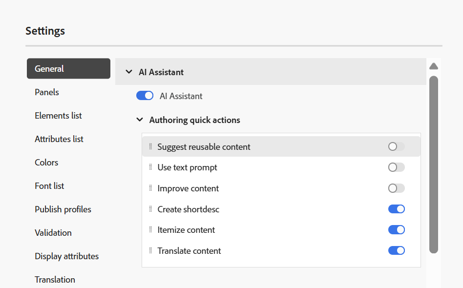

# What's new in the 2025.08.0 release (August 2025)

This article covers the new and enhanced features introduced with the 2025.08.0 release of Adobe Experience Manager Guides as a Cloud Service.

For the list of issues fixed in this release, view [Fixed issues in the 2025.08.0 release](fixed-issues-2025-08-0.md).

Learn about [upgrade instructions for the 2025.08.0  release](../release-info/upgrade-instructions-2025-08-0.md).

## Configurable AI Assistant actions in the Editor settings

The latest update introduces enhanced configurability for the AI Assistant within the **Authoring quick actions** menu, empowering Administrators to customize the authoring environment according to specific workflows and preferences.

Once the **AI Assistant** toggle is enabled, Administrators can selectively choose which quick actions are visible under the **Authoring** tab, helping streamline author interactions. These visibility settings are specific to each folder profile.

{width="350" align="left"}

Learn more about [AI assistant in Editor settings](../user-guide/web-editor-settings.md#general) in Experience Manager Guides.

## Improved log filtering for better visibility

This release introduces upgraded log filtering capabilities that offer enhanced clarity. You can now filter logs by four distinct levels; **Info**, **Warn**, **Error** (including both errors and exceptions), and **Fatal**; with intuitive color-coded indicators that simplify analysis and sharpen visibility across the log stream. This improvement empowers you to navigate logs more efficiently and locate the critical issues with precision. 

For more details, view [Basic troubleshooting](../user-guide/generate-output-basic-troubleshooting.md).

## Editor toolbar enhancements and improved User preferences settings

This release introduces notable improvements to the Editor interface, focusing on increased clarity and customization. The **User preferences** panel is refined to ensure accurate labeling across all visible options,which includes updating the label **Opening preferences for Maps** to align with the requirement it serves.

Additionally, the Editor toolbar now includes a newly added **Show** option within the Menu dropdown. This feature provides quick-access toggles for enabling or disabling Track Changes, Tags, and Non-Breaking Spaces, helping users to customize their editing environment.

For more details, view [Toolbar in the Editor](../user-guide/web-editor-toolbar.md#menu-dropdown).

## Enhanced content flagging using DITAVAL Editor

This update brings new capabilities for customizing the content publishing through enhanced flagging support in DITAVAL files. You can now apply start and end flags around specific content, including images, and enrich flagged sections with formatting options like bold, italics, and more. To handle condition overlaps, the **Style conflict** can be configured, which includes setting a default background color, ensuring clarity and consistency in the output. These flags are fully supported in Native PDF generation, and the resulting output accurately and comprehensively reflects all applied styling elements.

{width="650" align="left"}

For more details, view [Use the DITAVAL Editor](../user-guide/ditaval-editor.md)

## Editable DITAVAL fields in Output presets

This update enhances the output preset creation process by introducing editable DITAVAL fields across multiple output formats; including Native PDF, AEM Sites, HTML5, DITA-OT PDF, and Custom configurations for both on-premises and cloud services. You can now manually input the path to the relevant DITAVAL file directly within the AEM repository, allowing for greater flexibility and control. 

To further streamline the experience, the system now validates the entered path and promptly displays an error message if the input is incorrect, ensuring reliable and accurate output generation.

Learn more about [Output presets](../user-guide/generate-output-understand-presets.md) in Experience Manager Guides.

## Temporary files for published output now include Author and Publish URLs in a new config file

The latest publishing enhancements to Experience Manager Guides now upgrades to a new `system_config.xml` file to the temporary files generated while publishing HTML, PDF, and JSON outputs using DITA-OT, as well as Native PDF output. This file is automatically included in the publishing job and also accessible through temporary files when you enable the **Retain temporary files** option for the presets and generate the output.

The `system_config.xml` file contains key instance details, including the Author URL, Local URL, and Publish URL, which provide clearer context and improve the traceability of the downloaded URLs.

For more details, view [Understand the output presets](../user-guide/generate-output-understand-presets.md).

## Multiple DITAVAL files support for Native PDF

The Native PDF output preset now includes the ability to associate multiple DITAVAL files during configuration. Each selected DITAVAL file is displayed as a tagged entry, providing a clear and organized view of the selected files.

You are also given the option to remove any previously selected DITAVAL files, allowing for correction of the output preset as needed. This enhancement significantly improves flexibility and precision in managing conditional content settings within Native PDF outputs.

For more details, view [Native PDF preset](../web-editor/native-pdf-web-editor.md#native-pdf-preset-configuration)

## New output path variable support for PDF generation

This release introduces an enhancement for Native PDF and DITA-OT PDF output, wherein the output path is now defined as a dynamic variable, providing greater flexibility and control. Instead of manually setting static paths, the output location can be managed by defining the value of this variable, at the time of installation.

For more details, view [Output path for Native PDF preset](../web-editor/native-pdf-web-editor.md#native-pdf-preset-configuration)

