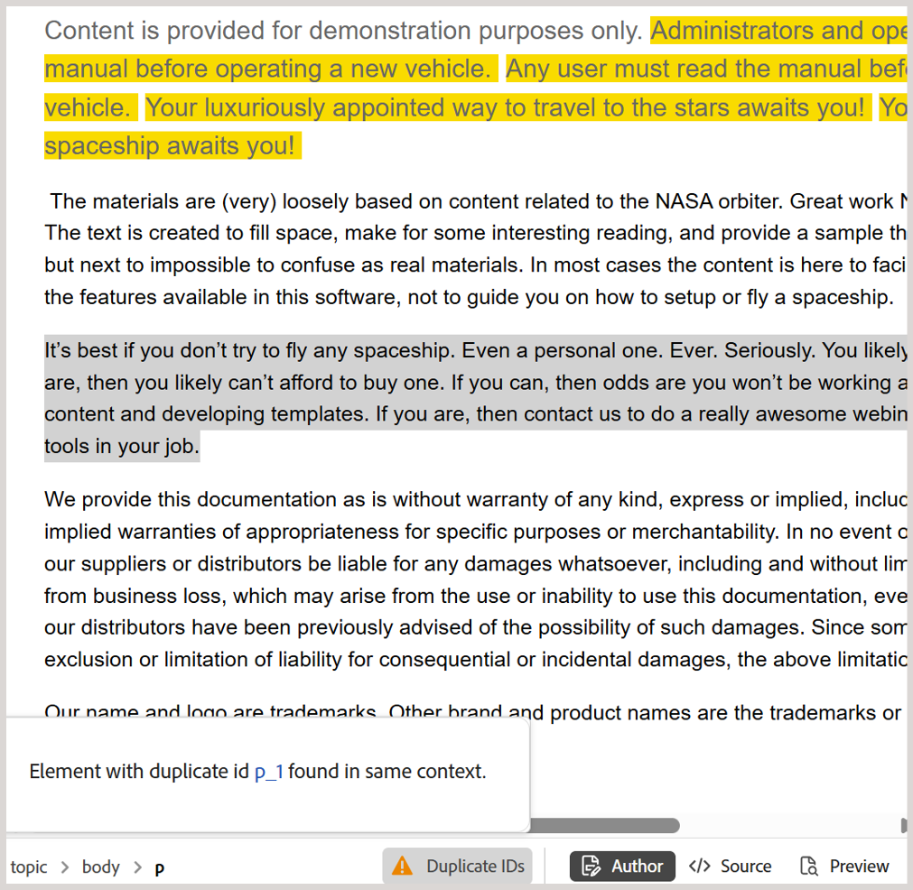

# What's new in the 2025.10.0 release (October 2025)

This article covers the new and enhanced features introduced with the 2025.10.0 release of Adobe Experience Manager Guides as a Cloud Service.

For the list of issues fixed in this release, view [Fixed issues in the 2025.10.0 release](fixed-issues-2025-10-0.md).

Learn about [upgrade instructions for the 2025.10.0  release](../release-info/upgrade-instructions-2025-10-0.md).

## Editor settings is now renamed to Workspace settings and accessible from the Homepage

To improve clarity and usability, **Editor settings** in Experience Manager Guides has been renamed to **Workspace settings**.

Additionally, the **More actions** menu (the three-dot menu), previously available only in the Editor and Map console interface, is now accessible from the [Homepage](../user-guide/intro-home-page.md) - enhancing workspace navigation and the overall efficiency.

## Access status report of review tasks directly from the Review panel

As an initiator of a review task, you can now check the status report of your review task directly from the Review panel. With the latest enhancements, the **Update task** dialog within the Review panel includes a new **Check review status** option. Selecting this option takes you directly to the status report of your review task in the Review dashboard, enabling quicker access to task's progress without switching contexts.

For more details, view [Request a re-review or close a review task as an Author](../user-guide/review-close-review-task.md).

{width="650" align="left"}

## Easily identify and fix duplicate IDs in topics and maps in the Author view 

Experience Manager Guides now includes a **Duplicate IDs** button in the Editor to help you quickly identify and fix duplicate IDs present within a single topic or map. When duplicate IDs are detected, this button appears at the bottom-left corner of the Editor interface in the **Author** view. Upon selecting the button, a list of all instances with duplicate IDs is displayed in a popover. Selecting an instance highlights the corresponding content in the topic or map, enabling you to locate and fix the duplicate IDs from the right panel.

For more details, view [Additional features in the Editor](../user-guide/web-editor-other-features). 

{width="650" align="left"}

## API to track post-processing status for folders or assets

A new API is now available for tracking the post-processing status of individual assets and folders. This is especially useful for teams using automated workflows, where publishing needs to happen only after content is fully processed. The API offers a reliable way to confirm readiness, reducing the risk of publishing failures caused by incomplete processing.

For details, view [API to track post-processing status for folders or assets](../api-reference/track-post-processing-status.md).

## Experience faster and smoother filtering with paginated loading

The user list in **Advanced** filter (Repository) and **Author** filter (DITA map reports) now supports asynchronous, paginated loading. Instead of loading the entire list at once, user data is now fetched in smaller sets as you scroll. This enhancement improves performance and usability, especially when working with large user datasets.
