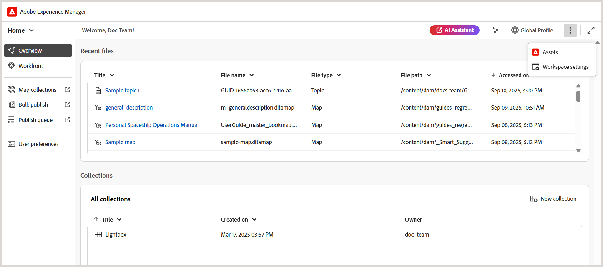

# What's new in the 2025.10.0 release (October 2025)

This article covers the new and enhanced features introduced with the 2025.10.0 release of Adobe Experience Manager Guides as a Cloud Service.

For the list of issues fixed in this release, view [Fixed issues in the 2025.10.0 release](fixed-issues-2025-10-0.md).

Learn about [upgrade instructions for the 2025.10.0  release](../release-info/upgrade-instructions-2025-10-0.md).

## Editor settings is now renamed to Workspace settings and accessible from the Homepage

To improve clarity and usability, **Editor settings** in Experience Manager Guides has been renamed to **Workspace settings**.

Additionally, the **More actions** menu (the three-dot menu), previously available only in the Editor and Map console interface, is now accessible from the **Homepage**. With fewer clicks and direct access to key actions, this update enhances workspace navigation and improves overall efficiency.

## Access status report of review tasks directly from the Review panel

As an initiator of a review task, you can now check the status report of your review task directly from the Review panel. With the latest enhancements, the **Update task** dialog within the Review panel includes a new **Check review status** option. Selecting this option takes you directly to the status report of your review task in the Review dashboard, enabling quicker access to task's progress without switching contexts.

For more details, view [Request a re-review or close a review task as an Author](../user-guide/review-close-review-task.md).

{width="650" align="left"}

## 