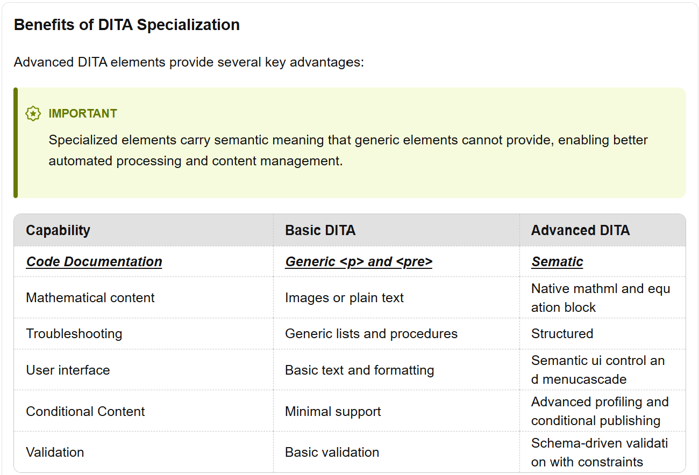
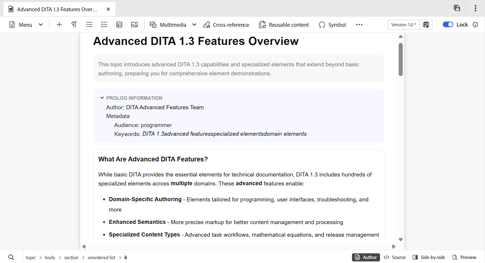

# What's new in the 2026.05.0 release (May 2026)

This article covers the new and enhanced features introduced with the 2026.05.0 release of Adobe Experience Manager Guides as a Cloud Service.

For the list of issues fixed in this release, view [Fixed issues in the 2026.05.0 release](fixed-issues-2026-05-0.md).

Learn about [upgrade instructions for the 2026.05.0 release](../release-info/upgrade-instructions-2026-05-0.md).

## Introducing Editor 2.0

Editor 2.0 marks a significant evolution in authoring, emphasizing performance, usability, and UI/UX to simplify working with large files, complex tables, and structured content without compromising control over how content is viewed and edited. For details, view [Editor 2.0](../user-guide/web-editor.md).

>[!VIDEO](https://video.tv.adobe.com/v/3484007)

### Improved table editing 

Table authoring is enhanced for a smoother, more intuitive experience, enabling faster creation and modification with fewer manual steps and improved accuracy.

- Fluid and responsive table interactions
- Easy row and column insertion
- Drag-and-drop support for column/row reordering 
- Contextual table toolbar for cell alignment, merging and splitting cells, applying common attributes
- Ability to add multiple rows or columns in a single action 

{width="650" align="left"}

For details, view [Toolbar](../user-guide/web-editor-toolbar.md).

### New Editor settings 

A new centralized settings panel gives Authors better control over editor behavior . Configuration options include, ability to enable/disable: 

- Non-breaking spaces in Author mode 
- Tag visibility settings with attributes or without attributes 
- XML comments in Author view 
- Quick insert menu with the ability to configure favorite elements 

{width="350" align="left"}

For more information about how to configure Editor settings, view [Editor settings](../user-guide/config-editor-settings.md).

### Enhanced Author view 

The Author view now provides greater visibility into structured content for improved transparency and control over content structure without switching to Source view. 

- XML comments are visible in Author view for both DITA Maps and Topics and can be shown or hidden through the Editor settings

    {width="650" align="left"}

- Tags along with the attributes are now visible using the Editor settings. 

    {width="650" align="left"}

For more details on using the new functionality, view [Editor settings](../user-guide/config-editor-settings.md).    

### New editing view

Editor 2.0 introduces powerful new ways to edit content efficiently. This ensures faster authoring with reduced context switching and easier access to structured elements. 

- Side-by-side view available for DITA Topics that allows you to view the Author and Source view adjacent to each other. 
- In-line element insertion toolbar that allows quick insertion of valid elements directly at the cursor position. 

{width="650" align="left"}

### UI & UX improvements 

Several visual and usability enhancements providing improved readability, accessibility, and a more modern editing interface. 

- Dark theme available for the Content editing area in the Editor 
- Richer out-of-the-box CSS for Author mode and Preview mode 
- Better indication of conditional content

{width="650" align="left"}

### Performance enhancements 

Editor 2.0 enhances responsiveness for large DITA files, enabling authors to edit extensive topics and maps without performance issues or loss of edit history.

- Undo/Redo support enabled for large files containing more than 3,500 elements 
- Dirty marker support added for large documents, ensuring accurate change tracking and save-state awareness

{width="650" align="left"}

## Editor enhancements

### Enhanced reference visibility

Now, the Link URL (relative path) of the selected reference across maps and topics in the Content properties panel is renamed to Link Path. Additionally, Link UUID field is added that shows the UUID of the selected references. You can now copy the complete absolute path as well as the associated UUID directly from the interface using the icons adjacent to the Link URL nad Link UUID, improving traceability and reuse of linked assets.
For details, view [Content properties](../user-guide/web-editor-right-panel.md#content-properties).

### Restricted actions for read‑only files

For DITA, DITAMAP, DITAVAL, XML, and markdown files opened in Read‑only mode, the **File properties** option in the Right panel, Properties from the context menu, and Manage Metadata under Reports are disabled.

## Review enhancements

The following Review enhancements have been made as part of this release:

- You can now enable **Automated reminders** to schedule AEM notifications and email reminders for reviewers, both before a review task's due date and after it becomes overdue. You can configure multiple reminders in each case, with pre-due reminders sent in a defined sequence and overdue reminders triggered after the task is marked overdue, based on the configured reminder schedule. For details on how to configure the reminders for review tasks, view [Send one or more topics for review](../user-guide/review-manage-tasks-review-dashboard.md).

- Reviewers can now access Version history for topics under review, allowing them to view and compare previously reviewed and updated versions of the same topic. This helps reviewers validate changes made since earlier review cycles and maintain continuity by reviewing comments, labels, and other related details within the current review context. For details, view [Version history for the Reviewer](../user-guide/review-topics.md#version-history-for-the-reviewer).

## New baseline introduced in Experience Manager Guides

Managing large, complex baselines is now faster, more stable, and easier to scale with the **new baseline experience**, built on a redesigned baseline architecture. This update addresses long‑standing performance and reliability challenges while preserving existing workflows.

Available as a beta enhancement, this update provides solution to common pain points such as slow loading, inconsistent baseline states, and limited manageability by delivering a faster, more stable, and more predictable baseline experience, with added support for automation and large‑scale baseline operations. Improvements are delivered through a more efficient data model, incremental loading, and stronger coordination between the UI and backend validation. The key improvements are:

- Improved performance and scalability
- Stronger UI and backend consistency
- Expanded filtering, navigation, and dependency visibility

For details, view [New baseline in Experience Manager Guides](../user-guide/web-editor-baseline-v2.md).

