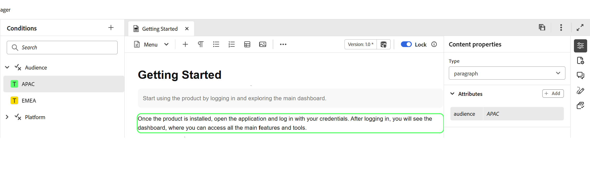
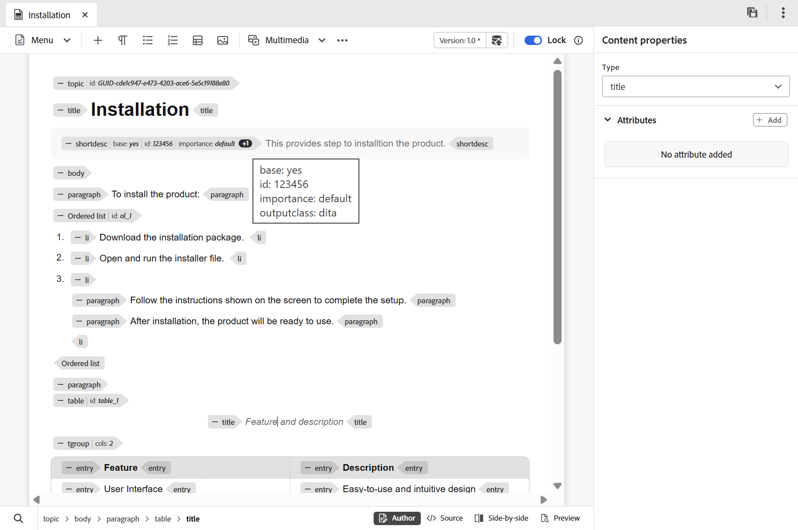
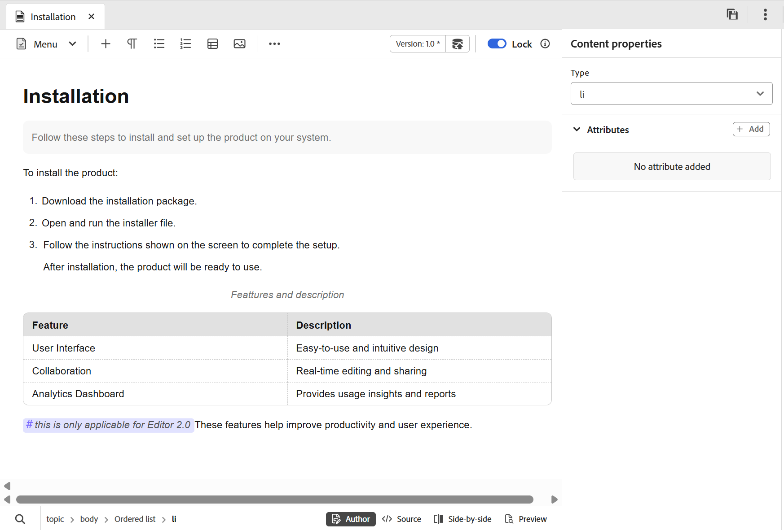

# What's new in the 2026.05.0 release (May 2026)

This article covers the new and enhanced features introduced with the 2026.05.0 release of Adobe Experience Manager Guides as a Cloud Service.

For the list of issues fixed in this release, view [Fixed issues in the 2026.05.0 release](fixed-issues-2026-05-0.md).

Learn about [upgrade instructions for the 2026.05.0 release](../release-info/upgrade-instructions-2026-05-0.md).

## Introducing New editor 

New Editor provides simplified authoring, enabling you to create content more efficiently across both tag and non-tag modes through a more intuitive experience. The release brings improved performance, with faster page loads and smoother editing even for large and complex topics. It also delivers enhanced stability by addressing key authoring gaps, particularly around navigation and cursor behavior. Additionally, a modern interface offers a refreshed and user-friendly UI that balances functionality with ease of use. For details, view [Editor 2.0](../user-guide/web-editor.md).

>[!NOTE]
>
> Please reach out to AEM Guides Customer Success team to get the New Editor enabled on your environment.

>[!VIDEO](https://video.tv.adobe.com/v/3484007)

### Redesigned user interface & experience

A refreshed interface improves overall usability, making navigation and content authoring more intuitive and consistent.

- Richer CSS elements in the Author mode: Enhanced default CSS provides improved styling and better visual consistency across both authoring and preview modes.

    {width="650" align="left"}

- Dark theme support: Support for a dark theme in the content editing area enhances the authoring experience for users who prefer working with a dark interface.

    {width="650" align="left"}

- Consolidated user-level Editor settings: A new centralized settings panel that gives Authors better control over editor behavior allowing users to manage preferences more easily from a single location. Configuration options include, ability to enable/disable: 

    - **Non-breaking spaces** in Author mode 
    - **Tag** visibility settings with attributes or without attributes 
    - **XML comments** in Author mode
    - **Quick insert menu** for element insertion in editor

    {width="350" align="left"}

    For more information about how to configure Editor settings, view [Editor settings](../user-guide/config-editor-settings.md).

- Better representation of conditional content in Author mode: Conditional content is more clearly displayed in Author mode, helping authors identify and manage variations more effectively. For details, view [Conditions](../user-guide/web-editor-left-panel.md#conditions) in Left panel of Editor.

    {width="650" align="left"}

### Enhanced authoring capabilities

Provides improved tools and flexibility to streamline content creation and editing workflows.

- View attributes along with elements in tag mode: Authors can now view element attributes with the tag mode, offering better visibility and control over structured content. To configure this feature, view [Editor settings](../user-guide/config-editor-settings.md).

    {width="650" align="left"}

- Quick insert menu: Enables adding elements directly while editing in Author mode at the cursor position without navigating to the toolbar. Frequently used elements can also be configured in the Favorites section through Editor settings for quicker access. For details, view [Edit topics](../user-guide/web-editor-edit-topics.md).

    {width="650" align="left"}

- Ability to view, edit, and insert XML comments in the Author mode: Enables authors to view, edit, and insert XML comments directly in Author mode, for better visibility within the content. To configure this feature, view [Editor settings](../user-guide/config-editor-settings.md).

    {width="650" align="left"}

- Side-by-side mode: Allows simultaneous viewing of Author and Source modes, with both views remaining in perfect sync for easier comparison, editing, and validation of content changes. For details, view [Editor views](../user-guide/web-editor-views.md).

    {width="650" align="left"}

- Improved table authoring: Enhances the overall table authoring experience with more intuitive and efficient interactions for creating and managing tables.

    - Fluid and intuitive interactions: Easily insert rows and columns, along with drag-and-drop support for reordering rows and columns.
    - Contextual toolbar: Access table-specific actions such as formatting, alignment, merging, and other additional actions directly within the table.
    - Configuring tables: Add multiple rows or columns in a single action, reducing repetitive steps and improving efficiency.

    {width="650" align="left"}

    For details, view [Toolbar](../user-guide/web-editor-toolbar.md).

### Improved performance for large topics

With the New Editor, the editing experience for large and complex topics with faster loading and more responsive interactions, including optimized document load times, reliable undo and redo support for managing changes, and a dirty marker for large topics.   

## Access and copy the path and UUID for references in files

Now, you can use **Link path** to view the relative path of the selected reference, and **Link UUID** to view its unique identifier from the Content properties panel. You can also copy the complete absolute path and the associated UUID directly from the interface using the icons next to Link Path and Link UUID, making it easier to trace and reuse linked assets.

For details, view [Content properties](../user-guide/web-editor-right-panel.md#content-properties).

## Review enhancements

The following Review enhancements have been made as part of this release:

- You can now enable **Automated reminders** to schedule AEM notifications and email reminders for reviewers, both before a review task's due date and after it becomes overdue. You can configure multiple reminders in each case, with pre-due reminders sent in a defined sequence and overdue reminders triggered after the task is marked overdue, based on the configured reminder schedule. For details on how to configure the reminders for review tasks, view [Send one or more topics for review](../user-guide/review-manage-tasks-review-dashboard.md).

- Reviewers can now access Version history for topics under review, allowing them to view and compare previously reviewed and updated versions of the same topic across previous review tasks. This helps reviewers validate changes made since earlier review cycles and maintain continuity by reviewing comments, labels, and other related details within the current review context. For details, view [Version history for the Reviewer](../user-guide/review-topics.md#version-history-for-the-reviewer).

## New baseline introduced in Experience Manager Guides

Managing large, complex baselines is now faster, more stable, and easier to scale with the **new baseline experience**, built on a redesigned baseline architecture. This update addresses long‑standing performance and reliability challenges while preserving existing workflows.

Available as a beta enhancement, this update provides solution to common pain points such as slow loading, inconsistent baseline states, and limited manageability by delivering a faster, more stable, and more predictable baseline experience, with added support for automation and large‑scale baseline operations. The key improvements are:

- Improved performance and scalability
- Stronger UI and backend consistency
- Expanded filtering, navigation, and dependency visibility

For details, view [New baseline in Experience Manager Guides](../user-guide/web-editor-baseline-v2.md).

