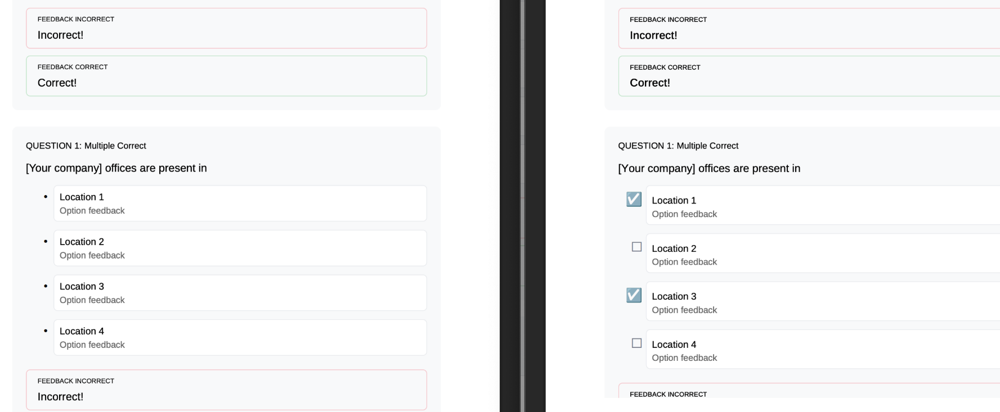

# What's new in the 2026.06.0 release (June 2026)

This article covers the new and enhanced features introduced with the 2026.06.0 release of Adobe Experience Manager Guides as a Cloud Service.

For the list of issues fixed in this release, view [Fixed issues in the 2026.06.0 release](fixed-issues-2026-06-0.md).

Learn about [upgrade instructions for the 2026.06.0 release](../release-info/upgrade-instructions-2026-06-0.md).

## Fetch content from Git repositories using Git connector (Beta)

>[!NOTE]
>
> This feature is currently available as a Beta feature and is disabled by default. To enable it in your environment, contact the Customer Success team.

Experience Manager Guides now introduces Git Connector (Beta), which allows you to import content from Git repositories into Experience Manager Guides.

After the content is imported, teams can continue using Experience Manager Guides for their authoring, review, translation, and publishing workflows.

To help keep imported content up to date, Git Connector also supports re-fetching content from the source repository to bring in updates. It includes intelligent change detection to identify content updates, preserves topic and map GUIDs during import and re-fetch operations, and provides conflict resolution capabilities to help manage differences between repository content and content already available in Experience Manager Guides. For more details, view [Import DITA content from Git repositories using Git Connector](../user-guide/web-editor-git-connector.md). 

## New Map Collection (Beta) for managing maps and publishing outputs

>[!NOTE]
>
> This feature is currently available as a Beta feature and is disabled by default. To enable it in your environment, contact the Customer Success team.

The new Map Collection (Beta) brings map collection management and output generation activities together in a single interface. From one location, you can manage maps and presets, generate and publish outputs, view generation and publishing history, update metadata, and more. By bringing related publishing tasks together, it makes it easier to work with map collections and track output activity across multiple maps and languages.

Also, you can filter maps by modification status, preset, and language, update metadata for selected maps, perform bulk actions across multiple maps, and manage collection content directly within the collection.

For more details, view [Use New map collection for output generation (Beta)](../user-guide/generate-output-use-new-map-collection-output-generation.md). 

## Introducing a new publishing engine for Native PDF

A new publishing engine, *Native PDF engine v2*, is now available for Native PDF in Experience Manager Guides. You can enable this engine to use the latest PDF generation framework for Native PDF output.

The new PDF engine includes rendering enhancements and fixes for several Native PDF issues. Because rendering behavior has been updated, PDF output generated with *Native PDF engine v2* may differ from output generated with the existing Native PDF publishing engine, *Native PDF engine v1*.

The following example illustrates a rendering difference between Native PDF engine v1 and Native PDF engine v2. In this example, checklist items appear as bullet symbols in PDF output generated with Native PDF engine v1, while Native PDF engine v2 displays the items as checkmarks.

For information about enabling **Native PDF engine v2** and reviewing migration considerations, view [Work with the Native PDF engine v2](../web-editor/new-pdf-engine.md).

For more details, view [Working with the new publishing engine for Native PDF](../web-editor/new-pdf-engine.md). 

## Editor enhancements 

### Support for AMA citation style

Experience Manager Guides now supports the American Medical Association (AMA) citation style, extending the existing citation framework to meet the documentation standards required by customers in healthcare, regulatory, and life sciences sectors.

When AMA is selected as the citation style in **Workspace settings**, citations are automatically formatted according to AMA guidelines, including numeric superscript rendering, sequential numbering, and accurate reference list ordering. The **Parse citation** option in the Editor is available exclusively when AMA is selected, allowing authors to add and parse citations without switching contexts.

AMA citation style is supported across the Native PDF and AEM Sites output formats. To configure the citation style, go to **Workspace settings** and select AMA from the citation style options. For details, view [Work with citations](../user-guide/web-editor-apply-citations.md).

### Support for external data sources and citations now available in the New Editor

The New Editor now supports two existing Experience Manager Guides capabilities: Ability to connect with external data sources and and use citations in the documents.

Authors can continue using configured external data sources while creating or updating content in the New Editor. Citations are also supported, so authors can add and manage references in their content without switching editors. Learn more about how to [Add and manage citations in your content](../user-guide/web-editor-apply-citations.md).

## Product Training and Learning content enhancements

The following enhancements are available for the Product Training and Learning content feature in this release:

- Authors can now make a marked knowledge check mandatory before learners advance in a course. A new **Require knowledge check to proceed** option is introduced for knowledge checks in courses. When enabled, learners are enforced to attempt a knowledge check before proceeding to subsequent course content. This helps ensure that required knowledge checks are completed at designated points in the course. When used with Sequential Navigation, learners cannot bypass these checks and continue to the next section without attempting them. For more details, view [Other options in the Insert menu](../learning-content/lc-other-insert-options.md).
- You can now use multiline text input fields when creating learning content. This enhancement makes it easier to capture longer learner responses by supporting line breaks and text wrapping within a single field, without relying on custom scripting. Learn more about [Other options in the Insert menu](../learning-content/lc-other-insert-options.md).
- SCORM output templates now support assigning different page layouts to different topic types within a course. This means you can create and map separate layouts for lessons, quizzes, overview pages, and other topic types directly from the output template settings.

    This allows each topic type to use a layout that is appropriate for its content and structure, rather than applying the same layout across all course pages. For more details on configuring page layouts for SCORM output templates, view [Configure Folder profiles](../lc-config-guide/lc-folder-profile.md). 
- Experience Manager Guides now supports direct publishing of SCORM content to Adobe Learning Manager (ALM). After configuring an ALM publish profile, authors can generate SCORM output and upload it directly to Adobe Learning Manager without downloading and manually importing the package.

    After the upload is complete, users are redirected to Adobe Learning Manager, where they can configure module details, completion criteria, and course settings before publishing.

## Review enhancements

### User identification in the tagging list during review

When tagging users in review comments or replies, the tagging dropdown now displays each user's email address alongside their user ID. This makes it easier to identify and select the correct reviewer, especially in large organizations where display names alone may be ambiguous.

If an email address isn't available, the user ID is shown instead. For more details on working with Review UI, view [Review topics](../user-guide/review-topics.md).

### Sync review task completion between the Review UI and AEM Inbox (Beta)

>[!NOTE]
>
> This feature is currently available as a Beta feature and is disabled by default. To enable it in your environment, contact the Customer Success team.

You can now keep review task completion in sync between the Review UI and the AEM Inbox. When this feature is enabled, completing a task in the Review UI removes it from the AEM Inbox, and completing it from the AEM Inbox marks it as completed in the Review UI. This helps avoid completing the same task twice and makes the review workflow smoother. Authors and task initiators can continue to review feedback and reassign tasks when additional review is required. When a task is reassigned, a new AEM Inbox notification is generated for the reviewer, allowing the review cycle to continue seamlessly.

For more details on the working with the Review UI, view [Review topics](../user-guide/review-topics.md). 

## Publishing enhancements

## Customize PDF output with topichead styles

You can now use the `outputclass` attribute on `<topichead>` elements to apply custom styles in PDF output. Similar to `<topicref>`, you can style the topichead entry in the table of contents, the generated heading based on the topichead's navtitle, and the content associated with the topichead. This enhancement provides greater flexibility for customizing the appearance of PDF output. 

For more details, view [Apply custom style on TOC entries and topic content](../native-pdf/custom-style-toc.md).

