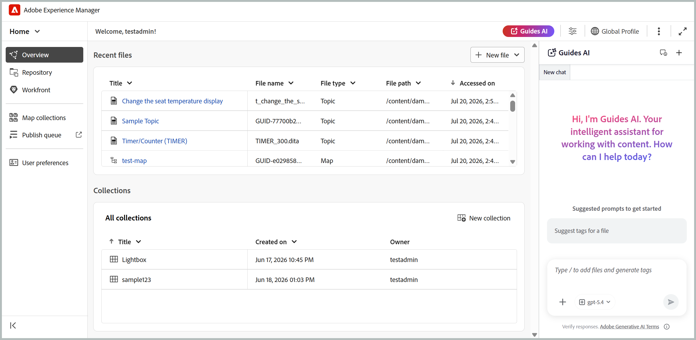

# What's new in the 2026.08.0 release (June 2026)

This article covers the new and enhanced features introduced with the 2026.08.0 release of Adobe Experience Manager Guides as a Cloud Service.

For the list of issues fixed in this release, view [Fixed issues in the 2026.08.0 release](fixed-issues-2026-08-0.md).

Learn about [upgrade instructions for the 2026.08.0 release](../release-info/upgrade-instructions-2026-08-0.md).

## Introducing Guides AI: Intelligent content tagging feature

Now we have **Guides AI**, a new intelligent assistant integrated into the Editor that enables you to interact with your content using natural, conversational prompts.

Currently, Guides AI streamlines content tagging by analyzing your content and recommending relevant tags. Simply ask Guides AI to suggest tags for a file, and it will review the content, generate tag recommendations, and present them for your review. Once you confirm, the suggested tags can be applied to the relevant topics, including across multiple topics within a map.

Guides AI is designed to evolve with additional capabilities that will further enhance the authoring experience over time. For more details, view [Placeholder].

## New map collection for managing maps and publishing outputs

>[!NOTE]
>
> To enable the New map collection feature your environment, contact the Customer Success team.

New map collection brings map collection management and output generation activities together in a single interface. From one location, you can manage maps and presets, generate and publish outputs, view generation and publishing history, and more. By bringing related publishing tasks together, it makes it easier to work with map collections and track output activity across multiple maps and their associated languages.

This update also addresses performance issues seen with large map collections, where loading a collection with hundreds of maps would often become unresponsive with no loading indicator.

For more details, view [Use New map collection for output generation](../user-guide/generate-output-use-new-map-collection-output-generation.md). 

## Editor enhancements 

In the New Editor, images can now be resized directly in Author mode by dragging their handles, using corner handles to maintain aspect ratio or Shift with middle handles to resize freely. The Content properties panel and Side by side/Preview modes reflect the change in real time.
For more deatils, view [Resize image in Editor](../user-guide/web-editor-toolbar.md).

## Review enhancements

### Delegate a review task to another Reviewer (Beta)

>[!NOTE]
>
> This feature is currently available as a Beta feature and is disabled by default. To enable it in your environment, contact the Customer Success team.

Reviewers can now recommend another user to weigh in on a review before it goes back to the Author, using the new **Delegate** option available for a review task. This is useful when part of the content falls outside the reviewer's expertise or when a second opinion is needed before completing the review, without having to route the request through a project administrator.

Selecting Delegate does not complete the review task; it sends the recommendation to the Author, who decides whether to add the recommended reviewer to the task. Learn more about [Delegate a review task to another Reviewer](../user-guide/review-complete-review-tasks.md#delegate-a-review-task-to-another-reviewer).

{width="350"}

### Task description now visible in the Review UI

Reviewers can now view the task description directly within the review experience, instead of relying only on the notification email. The description entered while creating a review task is used as the body of the notification email sent to reviewers and is also displayed in the Review details dialog, accessible through the **Info** icon in both the Review UI and the Editor interface.

This gives reviewers access to instructions, scope, and areas of focus throughout the review, rather than only at the time of notification. For more details, view [Send topics for review](../user-guide/review-send-topics-for-review.md).

{width="350"}

### User identification in the tagging list during review

When tagging users in review comments or replies, the tagging dropdown now displays each user's email address alongside their user ID. This makes it easier to identify and select the correct reviewer, especially in large organizations where display names alone may be ambiguous.

If an email address isn't available, the user ID is shown instead. For more details on working with Review UI, view [Review topics](../user-guide/review-topics.md).

### View all review tasks for a topic

>[!NOTE]
>
> To enable this feature in your environment, contact the Customer Success team.

Authors can now view all review tasks, open or closed, associated with the currently-open topic directly from the Comments panel. A drop-down lists every review task the topic is part of, along with each task's state and project, and lets you switch between them to view comments without leaving the topic or switching review projects. 

The task you're currently working from is marked as Current by default, and only its comments can be imported into your working copy; comments from other tasks are shown in read-only mode. For details, view [View all review tasks for a topic](../user-guide/review-address-review-comments.md).

{width="350"}

### Enhanced review experience with DITAVAL conditions

>[!NOTE]
>
> To enable this feature in your environment, contact the Customer Success team.

When a review task includes one or more attached DITAVAL files, the Conditions panel now presents each condition as a toggle, pre-set to match the attached DITAVAL file(s), so reviewers see content the way the review initiator intended.

Turning a toggle off hides that content from the review; turning it on restores it. Depending on the task configuration, reviewers may be able to override these toggles or find them locked to the initiator's settings, and any changes apply only for the current session.For details, view [Conditions panel with DITAVAL-based conditions](../user-guide/review-topics.md#conditions-panel-with-ditaval-based-conditions).

{width="350"}

### Sync review task completion between the Review UI and AEM Inbox (Beta)

>[!NOTE]
>
> This feature is currently available as a Beta feature and is disabled by default. To enable it in your environment, contact the Customer Success team.

You can now keep review task completion in sync between the Review UI and the AEM Inbox. When this feature is enabled, completing a task in the Review UI removes it from the AEM Inbox, and completing it from the AEM Inbox marks it as completed in the Review UI. This helps avoid completing the same task twice and makes the review workflow smoother. Authors and task initiators can continue to review feedback and reassign tasks when additional review is required. When a task is reassigned, a new AEM Inbox notification is generated for the reviewer, allowing the review cycle to continue seamlessly.

For more details, view [Complete the review task as a Reviewer](../user-guide/review-complete-review-tasks.md). 

## Publishing enhancements

### Template presets are now available for the output presets

>[!NOTE]
>
> To enable this functionality in your environment, contact the Customer Success team.

Admins can now designate output presets as templates, applying standardized configurations across all maps within a folder profile with a single action. When a template is applied, the system displays the number of maps affected, giving admins full visibility before rollout. To preserve consistency, template presets can only be modified by admin users, and output generation is disabled for template presets (unless output was already generated prior to templating). This functionality is available for all output presets except Edge Delivery Service, Knowledge Base, and SCORM. 

For details, view [Understanding the output presets](../user-guide/generate-output-create-edit-preset.md).

## Translation enhancements

### Specify a custom folder path for translation projects

When sending content for translation, you can now select the folder in which a new translation project is created, instead of all projects defaulting to a single location under `/content/projects`. If no custom path is selected, the project is created under the default path, as before. This helps avoid a cluttered project structure and improves page load performance as the number of translation projects increases. 

For details, view [Create translation project](../user-guide/translate-documents-web-editor.md#create-a-translation-project).

## Learning content enhancements

The following enhancements are available for the Product Training and Learning content feature in this release:

- A new **Learner experience** tab is now available in SCORM output configuration, letting you configure how learners interact with and navigate through SCORM output. Settings are organized under General, Navigation, and Quiz, giving you control over content accessibility, navigation flow, and quiz behavior for a tailored learning experience.

    Under **Navigation**, you can now control whether the **Next** button is enabled or disabled on a page, allowing learners to progress only after specified conditions on that page are met; such as opening all interactive elements, watching all media, attempting all knowledge checks, and spending a minimum configured duration on the page. Learn more about [Configure SCORM preset](../learning-content/config-scorm-preset.md).

    {width="650"} 

- Authors can now configure output-level options such as enabling PDF downloads for learners. When enabled, a PDF icon is added to the SCORM output, letting learners download a PDF version of the course content directly from the published output. For configuration details and prerequisites, view [Configure SCORM preset](../learning-content/config-scorm-preset.md).

    {width="650"} 

- In the published output of a course, learners can now use the Review answers option after completing a quiz attempt to revisit their submitted responses and see which answers were correct or incorrect. Learn more about [Question properties in a quiz](../learning-content/quiz-insert-questions.md#question-properties).

    {width="650"} 

- In Knowledge check questions within a course, the **Try again** button is now displayed when a learner selects an incorrect answer, allowing them to retry the question. This behavior is consistent across single-select and multiple-select Knowledge Checks. For details, view [Other options in the Insert menu](../learning-content/lc-other-insert-options.md).

- When an HTML topic is added to a Learning group map, the format="html" attribute is now automatically added to the corresponding topicref, ensuring correct processing and publishing under DITA-OT 4.x. For more details, view [Add existing content in your course](../learning-content/manage-course.md#add-existing-content).

