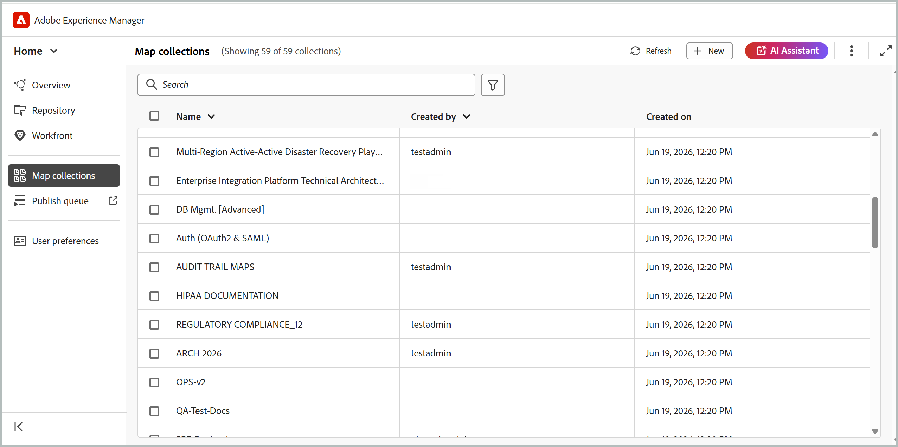
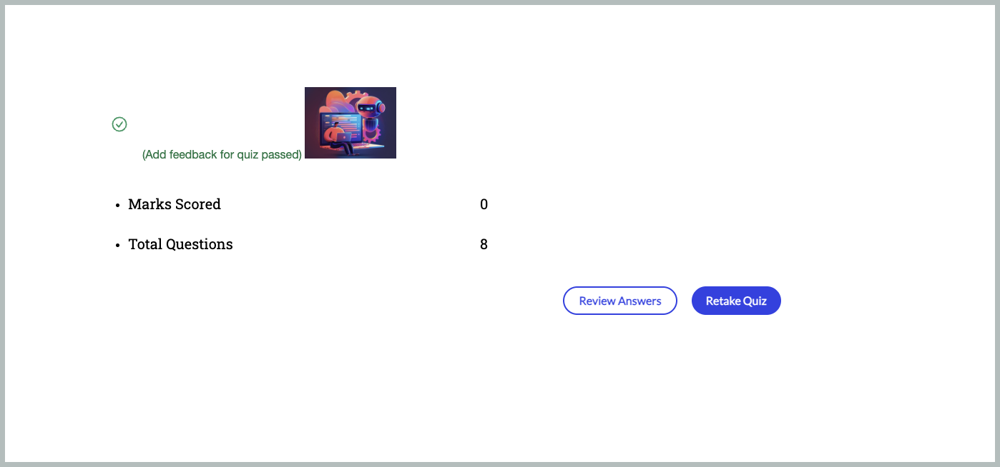

# What's new in the 2026.08.0 release (August 2026)

This article covers the new and enhanced features introduced with the 2026.08.0 release of Adobe Experience Manager Guides as a Cloud Service.

For the list of issues fixed in this release, view [Fixed issues in the 2026.08.0 release](fixed-issues-2026-08-0.md).

Learn about [upgrade instructions for the 2026.08.0 release](../release-info/upgrade-instructions-2026-08-0.md).

## New map collection for managing maps and publishing outputs

New map collection brings map collection management and output generation activities together in a single interface. From one location, you can manage maps and presets, generate and publish outputs, view generation and publishing history, and more. By bringing related publishing tasks together, it makes it easier to work with map collections and track output activity across multiple maps and their associated languages. This update also addresses performance issues seen with large map collections.

For more details, view [Use New map collection for output generation](../user-guide/generate-output-use-new-map-collection-output-generation.md). 

## Fetch content from Git repositories using Git connector

Experience Manager Guides now introduces Git Connector (Beta), which allows you to import content from Git repositories into Experience Manager Guides.

After the content is imported, teams can continue using Experience Manager Guides for their authoring, review, translation, and publishing workflows.

To help keep imported content up to date, Git Connector also supports re-fetching content from the source repository to bring in updates. It includes intelligent change detection to identify content updates, preserves topic and map GUIDs during import and re-fetch operations, and provides conflict resolution capabilities to help manage differences between repository content and content already available in Experience Manager Guides. For more details, view [Import DITA content from Git repositories using Git Connector](../user-guide/web-editor-git-connector.md).

## Experience Manager Guides adds MCP support for AI Assistant integration

Experience Manager Guides adds MCP support for AI Assistant integration
Experience Manager Guides now supports MCP (Model Context Protocol) integration, enabling AI assistants such as Anthropic Claude to connect directly to your AEM Guides environment. 

Through a single MCP endpoint, authenticated users can manage topics and maps, create and export baselines, and generate reports using natural language, all while operating under their existing AEM permissions. This eliminates repetitive, navigation-heavy tasks and allows documentation teams to work more efficiently across chat applications and MCP-capable developer tools such as Cursor and Visual Studio Code. For more details, view [Using the Experience Manager Guides MCP Server](../install-conf-guide/conf-aem-guides-mcp.md).

## Review enhancements

### Delegate a review task to another Reviewer

Reviewers can now recommend another user to weigh in on a review before it goes back to the Author, using the new **Delegate** option available for a review task. This is useful when part of the content falls outside the Reviewer's expertise or when a second opinion is needed before completing the review, without having to route the request through a project administrator.

Selecting Delegate option sends the recommendation to the Author, who decides whether to add the recommended reviewer to the task. Learn more about [Delegate a review task to another Reviewer](../user-guide/review-complete-review-tasks.md#delegate-a-review-task-to-another-reviewer).

{width="350"}

### Task description now visible in the Review UI

Reviewers can now view the task description directly within the review experience, instead of relying only on the notification email. The description entered while creating a review task is now displayed in the Review details dialog, accessible through the **Info** icon in both the Review UI and the Editor interface.

This gives reviewers access to instructions, scope, and areas of focus throughout the review. For more details, view [Send topics for review](../user-guide/review-send-topics-for-review.md).

{width="350"}

### User identification in the tagging list during review

When tagging users in review comments or replies, the tagging dropdown now displays each user's email address alongside their user ID. This makes it easier to identify and select the correct reviewer, especially in large organizations where display names alone may be ambiguous.

If an email address isn't available, the user ID is shown instead. For more details on working with Review UI, view [Review topics](../user-guide/review-topics.md).

### View all review tasks for a topic

Authors can now view all review tasks, open or closed, associated with the currently-open topic directly from the Comments panel. A drop-down lists every review task the topic is part of, along with each task's state and project, and lets you switch between them to view comments without leaving the topic or switching review projects. For details, view [View all review tasks for a topic](../user-guide/review-address-review-comments.md).

{width="350"}

### Enhanced review experience with DITAVAL conditions

When a review task includes one or more attached DITAVAL files, the Conditions panel now presents each condition as a toggle, pre-set to match the attached DITAVAL file(s), so reviewers see content the way the review initiator intended. Turning a toggle off hides that content from the review; turning it on restores it.

For details, view [Conditions panel with DITAVAL-based conditions](../user-guide/review-topics.md#conditions-panel-with-ditaval-based-conditions).

{width="350"}

## Publishing enhancements

### Use output presets as templates

Administrators can now designate output presets as templates, applying standardized configurations across all maps within a folder profile with a single action through Map console. When a template is applied, the system displays the number of maps affected, giving admins full visibility before rollout. To preserve consistency, template presets can only be modified by admin users, and output generation is disabled for template presets (unless output was already generated prior to templating).

For details, view [Configure template presets for output generation](../install-conf-guide/template-presets-output-generation.md).

### Validate content quality with content health check

Content health check helps validate content quality across DITA maps before publishing. Administrators can create reusable health check presets by combining checks for broken links, duplicate IDs, and Schematron validation.

Authors can run a health check on a DITA map or a selected baseline to generate a consolidated report of issues across associated topics and maps. Learn more about [Content health check](../user-guide/map-editor-other-features.md#run-health-check-on-a-map).

## Translation enhancements

### Specify a custom folder path for translation projects

When sending content for translation, you can now select the folder in which a new translation project is created, instead of all projects defaulting to a single location under `/content/projects`. This helps avoid a cluttered project structure and improves page load performance as the number of translation projects increases. 

For details, view [Create translation project](../user-guide/translate-documents-web-editor.md#create-a-translation-project).

## Learning content enhancements

The following enhancements are available for the Product Training and Learning content feature in this release:

- A new **Learner experience** tab is now available in SCORM output configuration, allowing you to configure how learners interact with and navigate through SCORM output. Settings are organized under General, Navigation, and Quiz, giving you control over content accessibility, navigation flow, and quiz behavior for a tailored learning experience.

    Under **Navigation**, you can now control whether the **Next** button is enabled or disabled on a page, allowing learners to progress only after specified conditions on that page are met, such as opening all interactive elements, watching all media, and more. For details, view [Configure SCORM preset](../learning-content/config-scorm-preset.md).

    {width="650"} 

- Authors can now configure output-level options for SCORM output, including enabling PDF downloads for learners. When this option is enabled, a PDF download icon is added to the published SCORM output, allowing learners to download a PDF version of the course content for offline reference. This provides greater flexibility in how learners access course materials while giving authors more control over the published experience. For configuration details and prerequisites, view [Configure SCORM preset](../learning-content/config-scorm-preset.md).

    {width="650"} 

- In the published output of a course, learners can now use the **Review answers** option after completing a quiz attempt to revisit their submitted responses and see which answers were correct or incorrect. Learn more about [Question properties in a quiz](../learning-content/quiz-insert-questions.md#question-properties).

    {width="650"} 

- In Knowledge check questions within a course, the **Try again** button is now displayed when a learner selects an incorrect answer, allowing them to retry the question. This behavior is consistent across single-select and multiple-select Knowledge Checks. For details, view [Other options in the Insert menu](../learning-content/lc-other-insert-options.md).

- When an HTML topic is added to a Learning group map, the `format="html"` attribute is now automatically added to the corresponding `topicref`, ensuring correct processing and publishing under DITA-OT 4.x. For more details, view [Add existing content in your course](../learning-content/manage-course.md#add-existing-content).

## APIs enhancement

This release introduces new APIs for asset management, translation, and publishing, making it easier to connect these workflows with your existing tools and systems. For details, view []

