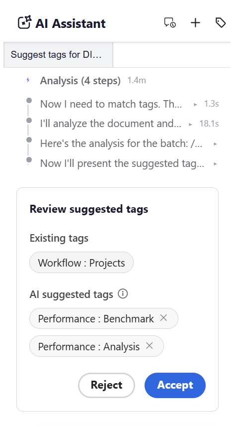
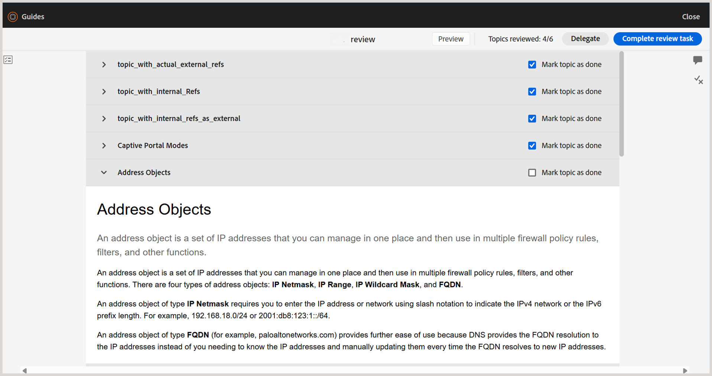

# What's new in the 2026.09.0 release (September 2026)

This article covers the new and enhanced features introduced with the 2026.09.0 release of Adobe Experience Manager Guides as a Cloud Service.

For the list of issues fixed in this release, view [Fixed issues in the 2026.09.0 release](fixed-issues-2026-09-0.md).

Learn about [upgrade instructions for the 2026.09.0 release](../release-info/upgrade-instructions-2026-09-0.md).

## Introducing AI-powered smart tagging in AI Assistant

Now, you can use AI Assistant to suggest and add tags to your content. With the new smart tagging capability, authors can ask AI Assistant to suggest tags for one or more topics, powered by the Smart Tagging skill powered by Adobe CX Enterprise Coworker. The skill reviews the content, generates tag recommendations, and presents them for your review. Once you confirm, the suggested tags are applied to the relevant topics within a map.

For more details, view [Get started with Agentic AI Assistant](../user-guide/guides-ai.md).

Currently, the smart tagging capability is available when AI Assistant is configured in **Agentic** mode. Administrators can choose to enable either the **Agentic** or **Standard** mode from **Workspace settings** for an instance. 

- **Agentic mode** provides authors with the smart tagging interface for tag recommendation and application.
- **Standard mode** provides the existing AI Assistant experience, with the **Help** and **Authoring** tabs in the AI Assistant panel.

## Editor enhancements

### Prevent content overwrites during concurrent editing

When two authors work on the same topic at the same time, one author may have the topic open while another author locks it, makes changes, and saves a newer version. The topic already open may then contain outdated content, and editing this version could overwrite the latest changes.

To prevent such conflicts, the latest saved version is now automatically loaded in the Editor when you lock a topic. This ensures that you work with the most recent content and prevents you from overwriting changes made by another author.

This applies when **Disable edit without locking the file** setting is enabled.

For more details, view [Prevent content overwrites during concurrent editing](../user-guide/web-editor-edit-topics.md#prevent-content-overwrite-during-concurrent-editing).

### Preview map content as of a selected static baseline

When a map has one or more static baselines, you can now preview the map based on a selected baseline instead of the current working copy in the Editor.

All versions of the topics, assets, images, and references associated with the selected baseline are displayed in the Preview, providing an accurate view of the map content at the time the baseline was created. For more details, view [Editor views](../user-guide/web-editor-views.md#preview-content-using-baseline).

## Review enhancements 

### Mark individual topics as done in a review task

Experience Manager Guides introduces topic-level progress tracking for reviewers, giving a better visibility into the review progress for tasks with multiple topics. As a Reviewer, you can now mark individual topics as done and distinguish between topics you have completed and those that still need attention. 

To support this, topics in the Document view of the Review UI are organized into accordions with a **Mark topic as done** checkbox. The topics you mark as reviewed using the checkbox are indicated in the **Topics** panel while the **Topics reviewed** counter at the top shows your progress against the topics assigned to you. Together, these give you a clear view of what you have covered and what remains, even when returning to a longer review task after a break.

For more details, view [Review topics](../user-guide/review-topics.md#mark-individual-topics-as-done-in-a-review-task).

### Identify users with roles when tagging in comments

Reviewers and authors can now view a user's role, such as Reviewer, Author, or Owner, along with their username and email address (if available), when tagging someone in a comment or reply. This makes it easier to quickly identify the right user to tag, especially in projects with a large number of participants.

Learn more about [tagging users in a comment](../user-guide/review-topics.md#tag-task-users-in-a-comment).

### View the map hierarchy while selecting topics for review

When selecting content for a review, as an Author or initiator of a review task, you can now view maps, submaps, and topics in their existing hierarchy on the **Content** page, instead of viewing all topics as a flat list. The hierarchical view makes it easier to understand the structure of your content and select individual topics or entire submaps for review.

For more details, view [View the map hierarchy while selecting topics for review](../user-guide/review-send-topics-for-review.md#view-the-map-hierarchy-while-selecting-topics-for-review).

## Publishing enhancements

### Publish Native PDF output using the language of your map

The Native PDF output preset page now includes a new **Use map language** option. When selected, output template variables resolve their language from the root map's `xml:lang` attribute instead of a language selected explicitly on the preset. This means you no longer need to maintain a separate output preset for each language when publishing translated maps. If the map has no `xml:lang` defined, the output defaults to English (en_US).

For more details, view [Native PDF preset configuration](../web-editor/native-pdf-web-editor.md) and [Use language variables in the output templates](../native-pdf/native-pdf-language-variables.md#use-language-variables-in-the-output-templates).

## Learning content enhancements

### Enable fullscreen view for H5P content in a learning course

Authors can now enable or disable full screen display for each H5P element used within a learning course. Use the **Enable fullscreen** toggle in the **Content properties** panel to control this setting. When enabled, learners can expand the H5P content to full screen. When disabled, the content stays inline within the standard view. This setting applies consistently across Preview mode and published output. 

Learn more about [Other options in the Insert menu](../learning-content/lc-other-insert-options.md) of Product Training and Learning content.

## Performance enancements

### Improved performance with paginated loading of files and folders

Experience Manager Guides now supports paginated loading of files and folders for an enhanced browsing experience, especially for folders with a large number of assets. Instead of loading all content at once, folders load progressively in batches of 50 assets, with additional assets retrieved as you scroll or select **Load more**, depending on the panel or dialog. 

Sorting is performed server-side, so applying a sort order fetches freshly sorted results rather than reordering data already loaded in the browser. Common operations, such as rename, delete, add, and move, no longer reload an entire folder. Instead, they update only the affected item or refresh the first page of results.  

Paginated loading is available across the Home Repository table, Collections, Explorer, Search and Template panels, and the Select path dialog.

For more details, view [Paginated loading of files and folders](../user-guide/paginated-loading-assets.md).

{width="650"}

