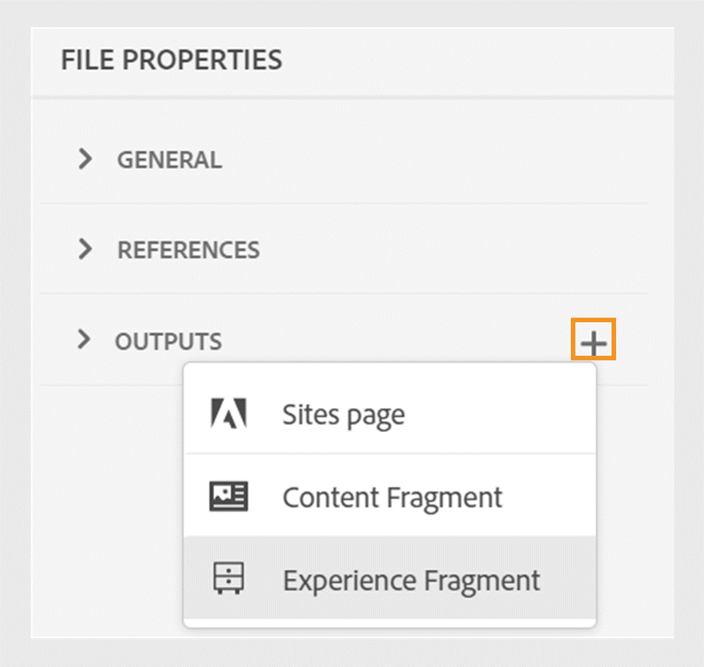
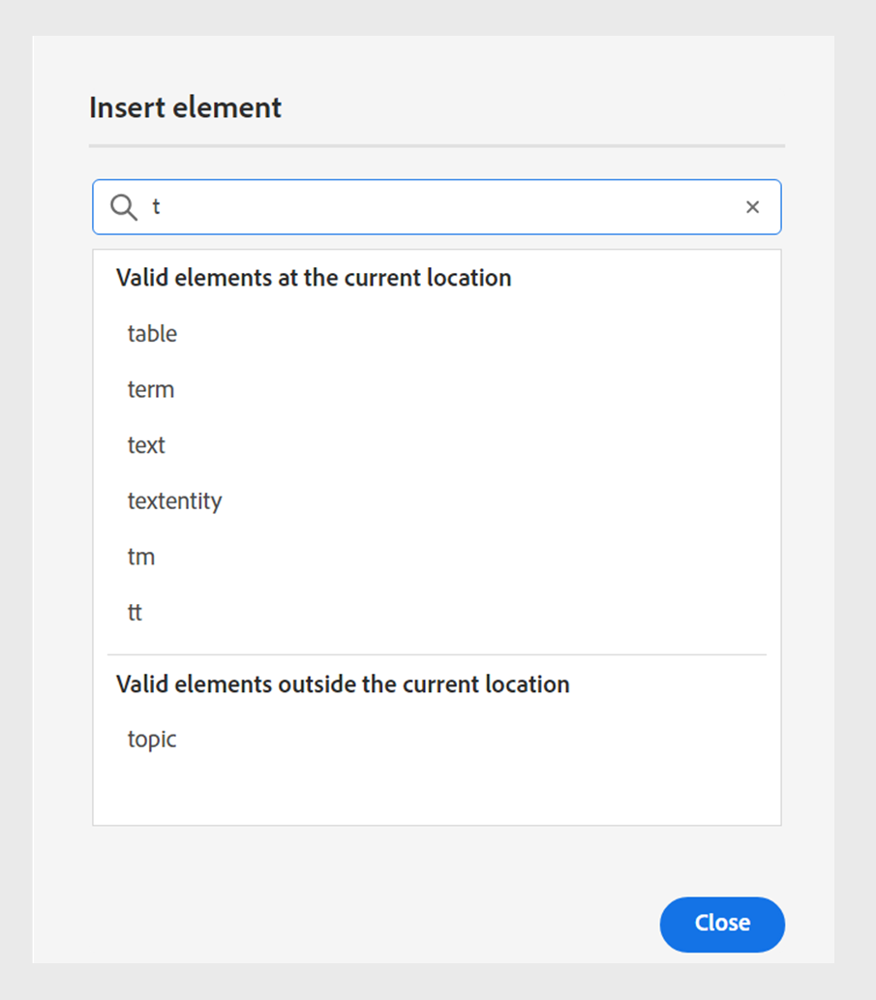

# What's new in the 4.6.0 release (September 2024)

This article covers the new and enhanced features in version 4.6.0 of Adobe Experience Manager Guides.

For the list of issues that have been fixed in this release, view [Fixed issues in the 4.6.0 release](../release-info/fixed-issues-4-6-0.md).

Learn about [upgrade instructions for the 4.6.0 release](../release-info/upgrade-instructions-4-6-0.md).

## Publishing enhancements 

The following content publishing enhancements have been made in the 4.6.0 release: 

### Publish a topic or its elements to an Experience Fragment

An Experience Fragment is a modular content unit within Adobe Experience Manager that integrates content and layout. Experience Fragments are instrumental in creating consistent and engaging experiences, which can be further reused across multiple channels. For example, you can create experience fragments for headers or footers with branding elements, promotional banners, customer testimonials, and event promotions.

    {width="300" align="left"}
*Publish and view the Experience Fragments of a topic from the **Outputs** section in the **File Properties**.*

Experience Manager Guides now allows you to publish a topic or its elements to an Experience Fragment. You can create a JSON-based mapping between a topic or its elements and an Experience Fragment template.  

  You can also create Experience Fragment variations by using the condtion filters. 
 Learn more about how to [publish Experience Fragments](../user-guide/publish-experience-fragment.md). 

### Enhancements in the Content Fragment publishing

Experience Manager Guides also provides some helpful enhancements in Content Fragments: 

- Experience Manager Guides allows you to publish a topic or its elements to a content fragment.

 - You can publish and view the Content Fragments of a topic from the **Outputs** section in the **File Properties**.

 - You can easily create Content Fragment variations by filtering content with conditions while publishing to a Content Fragment. 

Use the new mapping interface to easily select and publish the elements to a Content Fragment. 
Now, Content Fragment publishing only replaces the mapped content instead of overwriting the complete Content Fragment. This feature allows a Content Fragment to contain data from multiple sources, such as multiple topics or the Content Fragment editor.

   

   For more details, view [Publish Content Fragments](../user-guide/publish-content-fragment.md). 

### AEM Site preset reorganization

The settings have been reorganized to help you quickly configure the output preset and generate the AEM Site output. 
You can view the General, Content, and Cross map reference tabs.
- **General**: This tab contains the general configurations to generate the output. You can specify the site and output path, existing output pages, delete the previously generated pages for removed topics, select the design template, retain the temporary files, and specify the post-generation workflow.
**Content**: This tab contains the different content settings. You can filter the content for publishing and select the metadata properties.
**Cross map references**: This tab lists the topics containing cross map references or xrefs to topics available in other DITA maps. It also shows the parent maps and the available presets for the cross map references.

You can create the existing Adobe Experience Manager Site presets by selecting the **Use legacy component mapping** option in the New output preset dialog box.

### Cross map references from AEM Sites presets in the Web Editor

The latest enhancement to Experience Manager Guides introduces cross map references in the AEM Sites presets of the Web Editor. In the Web Editor, users can specify the publishing context for linked files from other maps by selecting the AEM Site output preset of the DITA map they wish to publish.  You can specify the publishing context for a list of cross map references or xrefs to topics available in other DITA maps. For example, Topic 1 in Map A contains an xref to Topic 2, whose parent is Map B.  You can select a specific preset or the most recently published output for each source topic to generate the output. 

You can also add the same topic with different publishing contexts as cross-references, providing greater flexibility and control over their content. For example, Topic 3 can be added as a cross map reference twice, and the parent map of the first link is Map B, while the parent map of the second link is Map C.

### Ability to pass metadata from topic file properties to Native PDF output

Now, Experience Manager Guides allows you to add the metadata from a topic's file properties to the page layouts while generating the Native PDF output. Use this feature to add topic-specific metadata such as the title, tags, and description to the page layouts. You can also customize your published PDF based on the topic's metadata, such as adding a watermark to the topic's background based on the topic's document state.

 {width="300" align="left"}

*Add metadata to the fields in your page layouts.*

Learn how to [add fields and metadata](../native-pdf/design-page-layout.md#add-fields-metadata) in a page layout.

### Support for Markdown documents in Native PDF publishing

Experience Manager Guides also supports Markdown documents in Native PDF publishing. This feature is handy and helps you generate PDFs for the Markdown files in your DITA map. Markdown support in Native PDF publishing helps you easily create, manage, and share your documents.

For more details, view [support for Markdown documents](../web-editor/native-pdf-web-editor.md#support-for-markdown-documents).

### Download the temporary file while generating the output through DITA-OT

You can also download the temporary files generated when you publish the AEM Site, HTML, Custom, JSON, or PDF output through DITA-OT. This feature helps you to analyze any issues that might occur during the output generation process and troubleshoot effectively.  
You can also download the metadata.xml file if you have selected any metadata properties that have been passed to the output generated using DITA-OT. 

For more details about the presets, view [Understanding the output presets](../user-guide/generate-output-understand-presets.md).

### Option to either choose flat or nested file hierarchy for HTML5 output

Now, Experience Manager Guides allows you to retain the flat folder hierarchy for the temporary files wherein the entire content is published in HTML5 output format and saved in a single folder.
If you don't choose to flatten the file hierarchy, the HTML5 output is generated in a nested folder hierarchy. This implies that the content's original folder structure, with files organized into subfolders, is replicated in the output. This nested folder hierarchy allows for more complex organization and categorization of files, making it easier to manage and navigate large volumes of data.

Learn more about how to [generate HTML5 output](../user-guide/generate-output-html5.md)

## Editor enhancements

The following editorial enhancements have been made to the 4.6.0 release:

### Read-only access to Author and Source mode for locked files

If a DITA or Markdown file is locked or checked out by another user, you cannot edit or change the content. Besides the Preview, you can also view it as a read-only file in the Author or Source mode. 
In read-only mode, you can view the content along with the tags and attributes within the **Author** or **Source** mode and edit the file properties.

You can also access the **Layout** view for read-only DITA maps. 
 >[!NOTE]
 >
 > Your folder-level administrative users must update *ui_config.json* so that you can harmoniously access the read-only files in the Author, Source, and Layout modes.

*View the locked files in Author and Source mode.*

Learn how to [open locked files in Author and Source modes](../user-guide/web-editor-edit-topics.md#open-locked-files-in-author-and-source-modes).

### Select partial content across elements for operations

Experience Manager Guides enhances your experience of selecting the content across the elements in the Web Editor. You can easily select content across different elements and perform operations like making it bold, italics, and underlined. This feature allows you to seamlessly apply or remove the formatting for partially selected content. You can also quickly delete the content that you have selected across elements. Once the content is deleted, if necessary, the remaining content is automatically merged under a single valid element.

You can also select partial content across elements and then surround the content under a valid DITA element.
 {width="300" align="left"}

*Surround the selected content with a valid element.*

Overall, these enhancements provide a better experience and help you improve your efficiency while editing your documents. 

For more details, view [Partial selection of content across element](../user-guide/web-editor-edit-topics.md#partial-selection-of-content-across-elements).

### Segregated list to view and insert valid elements according to their position

While editing a document in the Web Editor, you can now view a segregated list of elements that are valid at the current location and outside of the current location. Based on your requirements, you choose an element from the following options:

- **Valid elements at the current location** that you can insert at the current cursor location itself.
- **Valid elements outside the current location** that you can insert after any of the parents for the current element within the element hierarchy.

{width="300" align="left"}

*View the segregated lists of valid elements to insert an element at the current location.* 

This split list of valid elements helps you maintain the content structure and follow the DITA standards. 

Learn more about the **Insert Element** feature in the [Secondary toolbar](../user-guide/web-editor-features.md#2051ea0j0y4) section. 

### Revamped experience to search and filter files in the repository view

Now, you have an enhanced experience while filtering files. The revamped functionality to filter files provides an improved way to effortlessly search and navigate through files. 

{width="300" align="left"}

*Search for the files containing the text `general purpose.`*

Enjoy benefits such as quicker access to relevant files and a more intuitive user interface, making your search experience smoother and more efficient. 

 {width="300" align="left"}

*Use the quick filters to search for DITA and Non-DITA files.*

>[!NOTE]
>
> Your folder-level administrative users must update *ui_config.json* so that you can harmoniously access this feature.
 
Learn more about the **Filter Search** feature in the [Left Panel](../user-guide/web-editor-features.md#id2051EA0M0HS) section.

### Grouped condtions for enhanced content organization

Experience Manager Guides now allows you to group conditions and present them in a nested hierarchy, allowing you to add multiple conditions to a single group. By grouping conditions, you can better organize and apply them across your content.

{width="300" align="left"}

Learn more about the **Conditions** feature description in the [Left Panel](../user-guide/web-editor-features.md#id2051EA0M0HS) section.

### Customize your Web Editor experience with a new UI of user preferences

The **User Preferences** dialog box in the Web Editor now includes a new **Appearance** tab. This new tab allows you to conveniently configure the most common look-and-feel preferences in the Web Editor interface.

You can configure to view the files by title or filename, and change the theme of the application and the source view. It also helps you configure the settings to locate an open file in the repository view and to handle the non-breaking spaces.

{width="550" align="left"}

*Customize the appearance according to your preferences.*

Learn more about the **User preferences** feature description in the [Left Panel](../user-guide/web-editor-features.md#id2051EA0M0HS) section.

### Locate an open file in the repository view of the Web Editor

Select the **Always locate files in the repository** option in the **User Preferences** to navigate quickly and locate your file in the repository view. You don't have to search manually for it. 

While editing, this feature also helps you easily view the file's location within the repository hierarchy.

For more details, view [locate an open file in the repository view](../user-guide/web-editor-edit-topics.md#locate-an-open-file-in-the-repository-view).

### Improved handling of non-breaking spaces in the Web Editor

Experience Manager Guides allows you to show a non-breaking space indicator while editing documents in the Web Editor. It also improves the handling of non-breaking spaces. 
It converts multiple consecutive white spaces into a single space to preserve the WYSIWYG view of the document in the Web Editor. This feature also helps improve the overall appearance and professionalism of the document.

For more details, view the [other features of the Web Editor](../user-guide/web-editor-other-features.md).

### Ability to view properties of any element from the element hierarchy

Now, the Content Properties **Type** appears as a dropdown menu. You can view and select the tags of the complete hierarchy for the current tag from the dropdown.

This dropdown menu helps you quicly access the content properties for the selected tag.

 {width="300" align="left"}

 *Select a tag from the hierarchy for the current tag.*

Learn more about the **Content Properties** feature in the [Right Panel](../user-guide/web-editor-features.md#id2051eb003yk) section. 

### Improved performance while checking in the files in bulk from the Map Editor

Experience Manager Guides improves the performance and experience of the bulk files check-in feature from the Map Editor. This improvement helps you check in the files in bulk more quickly. 
You can also view the progress of the check-in operation for the files from the **Save As New Version and Unlock** dialog box. Finally, the success message appears after the operation is complete and all selected checked-out files are checked-in.

{width="300" align="left"}

*View the list and status of the files checked in bulk from the Map Editor.*

Learn how to [work with the Advanced Map Editor](../user-guide/map-editor-advanced-map-editor.md)

## Content lifecycle management enhancements

The content lifecycle management has been enhanced in the following ways:

### Ability to translate content into multiple languages using preconfigured language groups

Experience Manager Guides now allows you to create language groups and easily translate your content into multiple languages. This feature helps you organize and manage translations according to your organization's needs. 

For example, if you need to translate your content for some countries in Europe, you can create a language group for European languages like English (EN), French (FR), German (DE), Spanish (ES), and Italian (IT).

{width="300" align="left"}

*Select the language groups or languages you want to translate your documents.* 

>[!NOTE]
>
>If a language's target folder is missing or the target language is the same as the source, it's grayed out and shows a warning sign.

As an administrator you can create language groups and configure them to multiple folder profiles. As an author, you can view the language groups that are configured on your folder profile.

Overall, creating language groups enhances the efficiency and productivity of translation projects, ultimately improving the localization process across multiple languages.

Learn how to [translate documents from the Web Editor](../user-guide/translate-documents-web-editor.md).

### Improved Non-UUID to UUID content migration

The new UUID Migration script has been significantly optimized, making the migration from Non-UUID to UUID 30 times faster than the earlier script. It includes features such as resuming from checkpoints, live insights, estimated completion time, and detailed reporting, ensuring a harmonious migration process. Notably, the migration process preserves asset metadata without any changes. The script has been tested and verified on a large dataset of 3 million assets, confirming its efficiency and reliability for large-scale migrations.

Learn more about [non-uuid to UUID content migration](../install-guide/migrate-non-uuid-uuid-new.md).

### Improved performance and scalability for large translation projects

The translation feature is faster and more scalable than ever. It comes with a new architecture that provides enhanced performance. The project creation time is now faster than earlier, and the conflicts during the process are nearly nonexistent. This improved performance helps you with faster translations, ensuring smooth operation even for large translation projects.

This improvement is very beneficial as it enhances productivity and overall experience.

Learn more about how to [translate documents from the Web Editor](../user-guide/translate-documents-web-editor.md).

### Delete or disable the translation project automatically after the translation

Now, as an administrator, you can configure the translation projects to be disabled or deleted automatically after completing the translation. This feature helps you efficiently use resources and manage files after completing the translation. 

Deleting a project permanently removes all files and folders present in the project. Deletion of the translation projects also enables you to free up the occupied disk space. 

You can disable the translation projects if you want to use them later. 

{width="550" align="left"}

*Configure language groups and the cleanup settings for translation projects.*

Learn more about how to [automatically delete or disable the translation project](../user-guide/translate-documents-web-editor.md#automatically-delete-or-disable-a-completed-translation-project).

### Disable the postprocessing for selective folders on Adobe Experience Manager Assets

As an administrator, you can now disable the postprocessing and generation of UUIDs for selective folders on Experience Manager Assets. This configuration might be helpful, especially when dealing with many assets or complex folder structures. It also helps multiple users quickly upload the assets concurrently without interfering with each other.  

Disabling postprocessing for a folder also affects all its child folders. However, Experience Manager Guides now offers the ability to selectively enable postprocessing for individual child folders within the ignored folder.

Learn how to [disable postprocessing for a folder](../cs-install-guide/conf-folder-post-processing.md).

## Enhancements in the data source connectors

The following enhancements have been made to the data source connectors for the 2024.4.0 release:

### Connect to Salsify, Akeneo, and Microsoft Azure DevOps Boards (ADO) data sources

In addition to the existing out-of-the-box connectors, Experience Manager Guides also provides connectors for Salsify, Akeneo, and Microsoft Azure DevOps Boards (ADO) data sources. As an administrator, you can download and install these connectors. Then, configure the installed connectors.

### Copy and paste the sample query to create a content snippet or topic

You can easily copy and paste a sample data query in the generator to create a content snippet or topic. With this feature, you don't have to remember the syntax or create a query manually. Instead of manually typing the query, you can copy and paste a sample query, edit it, and use it to fetch the data per your requirements. 

{width="800" align="left"}

 *Copy and edit a sample query to create the content snippet.*

### Connect to JSON data files using a file connector 

Now, as an administrator, you can configure a JSON file connector to use JSON data files as a data source. Use the connector to import the JSON files from your computer or the Adobe Experience Manager Assets. Then, as an author, you can create content snippets or topics using the generators.

This feature helps you use the data stored in your JSON files and reuse it across various snippets. The content is also updated dynamically whenever you update the JSON files.

### Configure multiple resource URLs for a connector to create content snippets or topics

As an administrator, you can configure multiple resource URLs for some connectors like Generic REST Client, Salsify, Akeneo, and Microsoft Azure DevOps Boards (ADO).

Then, as an author, connect with the data sources to create content snippets or topics using the generators. This feature is handy as you don't have to create a data source for each URL. It helps you to fetch data quickly from any of the resources for a particular data source in a single content snippet or topic.

View more details about the data source connectors and how to [configure a data source connector from the user interface](../cs-install-guide/conf-data-source-connector-tools.md).

Learn how to [use data from your data source](../user-guide/web-editor-content-snippet.md).

