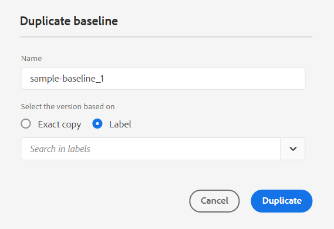

# What's new in 4.4.0 release of Adobe Experience Manager Guides (January 2024)

This article covers the new and enhanced features in version 4.4.0 of Adobe Experience Manager Guides (later referred as *Experience Manager Guides*).

For more details on the upgrade instructions, compatibility matrix, and the issues fixed in this release, see [Release notes](./release-notes-4.4.md).

## Native PDF enhancements

The following Native PDF enhancements have been done in the 4.4.0 release:

### Use variables in the PDF output 

You can use variables to dynamically insert and manage reusable information. Experience Manager Guides helps you create, edit, and preview variables while you generate the PDF output. You can quickly modify the values of variables and make your documents portable and easy to update.

{width="800" align="left"}

*Create and manage variables in the Web Editor.* 

You can also create variable sets that override the default values and assign alternate values to your variables. Insert these variables within the page layout and use the same PDF layout, you don't have to create separate layouts for every set of values. For example, you can create a variable set for each product release. This variable set can consist of variables for different product details like product name, version number, and release date. Then, you can add different values for these variables.

**Variable set 1: Adobe-set1**

* ProductName: Experience Manager Guides 
* VersionNumber: 2311
* ReleaseDate: 11/02/2023

**Variable set 2: Adobe-set2**

* ProductName: Experience Manager Guides 
* VersionNumber: 2310
* ReleaseDate: 09/27/2023
 

*Generate the PDF output using variables in the PDF layout.*

You can apply styles and use HTML markup to format the variables.  You can also quickly update the values for any variables whenever required and regenerate the output. For example, if you need to update the details for a version, you can edit the value of the version in the VersionNumber variable and regenerate the output.

Learn more about how to use [variables in the PDF output](../native-pdf/native-pdf-variables.md).

### Pass assets metadata to the PDF output

Experience Manager now provides the capability to pass the assets' metadata properties from the DITA map  to the PDF output. 
From the Native PDF output preset, you can choose the metadata that you want to pass to PDF publishing process. You can select both the custom and the default properties.  The selected metadata properties are passed to the PDF file generated using Native PDF.

This feature is handy as it helps you  keep your asset properties such as author, creation date, or document title consistent. This makes it easier to organize, search, and categorize your documents.

For more details, view the **Advanced** settings in the [Publish PDF output](../web-editor/native-pdf-web-editor.md).

### Use metadata added in the `topicmeta` element for the PDF output

Metadata feature in Native PDF publishing helps in content management and helps in searching files on the internet. 

*Select an option to add and customize metadata options.*

Now Experience Manager Guides provides the option to use the metadata that you have added in the `topicmeta` element of the DITA map to populate the metadata fields of the PDF output. This option is selected by default.

This feature helps in better document management, ensures consistency, and makes your documents searchable.

To know more, view the **Metadata** tab in the [Publish PDF output](../web-editor/native-pdf-web-editor.md).

### Use and duplicate out-of-the-box PDF templates 

Experience Manager Guides provides out-of-the-box  or factory PDF templates. Duplicate the factory PDF templates to create the custom PDF templates.

Now, you can also preview the thumbnail image for a template while creating and duplicating a template. You can also edit or delete this image. This feature is useful for branding or distinguishing templates with similar names.
Learn more about the [PDF template](../native-pdf/pdf-template.md).
 
{width="550" align="left"}

*Duplicate an existing PDF template.*

### Change the order of pages and publish multiple pages per sheet

Besides publishing the pages according to the source document, you can also change the order of pages in PDF while publishing a multi-page document.  This gives you the flexibility to publish the pages in various orders, like all odd, or all even pages first. You can also publish as a booklet and read the pages like a book. You can also decide the number of pages you want to publish on a single sheet of paper. For more details, view the [Page Organization](../native-pdf/components-pdf-template.md#page-organization) section. 

### Sort glossary terms based on sort keys

Now, you can also sort the glossary terms based on sort keys. You can use the tag ‘sort-as’ to define a sort key for the glossary terms. Then, you can sort them based on sort keys in place of the terms. This allows you to sort the glossary terms according to terms used in different languages. You can also define a single sort key for a glossary term with a phrase or a group of words. 
For more details, view the [Advanced PDF Settings](../native-pdf/components-pdf-template.md#advanced-pdf-settings).

### Improved resource management for Native PDF templates 

Experience Manager Guides now has improved the resource management for Native PDF templates. You can now share and reuse resources, like images, CSS files, and font files, across multiple Native PDF templates. With this improvement, managing the resources for a large set of templates is much simpler. You don't need to create duplicate resources for each template, and you can keep them in a shared folder and use them in all Native PDF templates.
For more details, view [PDF Template](../native-pdf/pdf-template.md). 

## View files by title or filenames 

You can now choose the default way to view the files in the Web Editor. You can view the list of files by the titles or the filenames from the various panels from the Author view.

{width="550" align="left"}

*Change the default way to view the files from the **User Preferences** dialog.*
 

## Manage condition presets 

You can define condition attributes in your DITA topics. Then, use the condition attributes in the condition preset to publish the content in a DITA map. Experience Manager Guides now also allows you to create and manage condition presets from the Web Editor. You can also easily edit, duplicate, or delete them.

{width="550" align="left"}

For more details, view [Use condtion presets](../user-guide/generate-output-use-condition-presets.md).

## Restore file tabs on refreshing the browser

Experience Manager Guides restores the state of the opened file tabs in the Web Editor when you refresh the browser. For more details, view the **Refresh browser while editing the files** section under [Edit topics in the Web Editor](../user-guide/web-editor-edit-topics.md).

## Unwrap an element easily 

Now you can easily unwrap an element using the option from the context menu of an element in the Web Editor. This helps you easily merge the element's text with its parent element. 
For more details, view the **Unwrap an element** section from the [other features in the Web Editor](../user-guide/web-editor-other-features.md). 

## Keyboard shortcuts to move the cursor 

Experience Manager Guides now also allows you to use keyboard shortcuts to move the cursor in the Web Editor. You can use the keyboard shortcuts to quickly move one word left or right. You can also move to the beginning or the end of the line with the help of the keyboard shortcuts.
Now, you can also use keyboard shortcuts to move the cursor to the beginning of the next element or the end of the previous element.
Learn more about the [keyboard shortcuts in the Web Editor](../user-guide/web-editor-keyboard-shortcuts.md).

## Revamped experience to edit the attributes 

Now, you get a revamped experience to add or edit the attributes for an element from the **Content Properties** panel in the Web Editor. 

{width="300" align="left"}

*Add attributes from the Content Properties panel.*

You can also easily edit and delete the attributes. 

For more details, refer to the **Content Properties** feature description within the [Right Panel](../user-guide/web-editor-features.md#id2051EB003YK) section.

## Ability to duplicate a baseline based on label

Experience Manager Guides now provides an enhanced user experience for creating the baselines from the Web Editor.  
 {width="300" align="left"}
*Create baseline from the Web Editor.*

It also allows you to duplicate a baseline based on the label. The reference version is picked based on the given label (if it exists) while duplicating, or else picks the version from the duplicated baseline.

 {width="300" align="left"}

*Duplicate a baseline based on a label or create an exact copy.*

Learn more about how to [create and manage baselines from the Web Editor](../user-guide/web-editor-baseline.md).

## Improved process for the creation of bulk activation map collection

The process of creating a bulk activation map collection is now more harmonious. Now, when the Activation Results page is displayed, you can view the results of activation and logs. 
For more details, refer to [Create a bulk activation map collection](../user-guide/conf-bulk-activation-create-map-collection.md).

## Edit metadata while authoring 

Now, while authoring, you can update the file metadata tags using the dropdown from the **File Properties** in the right panel. You can also select **Edit more properties** to update more metadata.

{width="300" align="left"}

*Update metadata and edit file properties from the right panel.*

For more details, refer to the **File Properties** feature description within the [Right Panel](../user-guide/web-editor-features.md#id2051EB003YK) section.

## Ability to publish content to the ServiceNow knowledge base

You can now also publish your content to the ServiceNow knowledge base platform.

With the December 2023 release, as an administrator, you can create a publish profile for the ServiceNow knowledge base server. Then, as an author or a publisher, you can choose that ServiceNow publish profile in the output preset to publish the output to the specified knowledge base.

This feature helps you publish content, like text, videos, and images, to the ServiceNow knowledge base platform and maintain a comprehensive repository.

{width="300" align="left"}

*Create an output preset for the ServiceNow knowledge base.*

Learn more about the [Knowledge Base](../user-guide/generate-output-knowledge-base.md) output presets.

## Enhanced Map collection dashboard

Experience Manager Guides provides an enhanced Map collection dashboard. In a map collection, you can quickly configure the metadata properties in bulk for the DITA maps. This feature is handy as you don’t have to update the metadata properties for each DITA map individually.
 
Now, you can view the filename of the DITA map. You can also view the Baselines. This helps you quickly find the baseline used for a preset.

{width="800" align="left"}

*View, edit, and generate output from the map collection dashboard.* 

Learn how to [use Map Collection for output generation](../user-guide/generate-output-use-map-collection-output-generation.md).

## View key attributes in the Map View

When you define key attributes for the topic or map references, you can also view the title, the corresponding icon, and the key in the left panel. The key is displayed as `key=<key-name>`.

For more details, refer to the **Map View** feature description in the [Left Panel](../user-guide/web-editor-features.md#id2051EA0M0HS) section.

 {width="300" align="left"}

*View the key attribute in the Map View.*

## Enhancement in the Translation UI

The **Translation** panel has been improved.  You can view the **Available Languages** list and quickly select the locale in which you want to translate your project. With a single selection, you can also choose **Select all** to translate your project into all the available languages.

{width="300" align="left"}

*Select the locales in which you want to translate your project. Choose the default, baseline, or the latest version of files for translation.*

Learn more about how to [translate content](../user-guide/translation.md).

## Split a list at the same level

Now, you can easily split your list in the Web Editor. Select the **Split List** option from the context menu of a list item to split the current list. A new list is created at the same level, starting with the list item you selected for the split.  

{width="300" align="left"}

*Select the option to split the current list.*

For more details, view the **Insert List** feature description in the [Left Panel](../user-guide/web-editor-features.md#id2051EA0M0HS) section. 

## Enhanced version history 

Now Experience Manager Guides provides an enhanced version history feature which allows you to track changes made to a document over time. You can easily compare the content and the metadata of the current version with any previous version of the same document. You can also view the labels and comments for the compared versions. As an administrator, you can control the version metadata of the topic and their values to be displayed in the **Version History** dialog box. 

{width="800" align="left"}
  *Preview the changes in the different versions of a topic.*

This feature facilitates content reviews by displaying the added and the deleted content. It also enhances collaboration by helping the authors and reviewers monitor the changes in the different versions of the document.

Learn more about the **Version History** feature description in the [Left Panel](../user-guide/web-editor-features.md#id2051EA0M0HS) section. 

## Enahanced search in the Insert Element dialog box

You can now easily find the elements in the Insert Element dialog box.  You can type a string in the search box and get a list of all the valid elements that begin with the entered string.

For example, while editing a paragraph you want to insert an element, then you can search a character 't' to get
all valid elements that begin with ‘t’.

{width="300" align="left"}

*Type a character to search for all valid elements that begin with the character.*

For more details, view the **Insert Element** feature description in the [Left Panel](../user-guide/web-editor-features.md#id2051EA0M0HS) section. 

## Access file properties in all modes of Web Editor

Now, you can access the right panel's **File Properties** feature in all four modes or views:  Layout, Author, Source, and Preview.  This helps you view your file's properties even when you switch between the different modes.

For more details, view the **File Properties** feature description in the [Right Panel](../user-guide/web-editor-features.md#id2051EB003YK) section. 

## Improved process for the creation of bulk activation map collection

The process of creating a bulk activation map collection is now more harmonious. Now, when the Activation Results page is displayed, you can view the results of activation and logs. 
For more details, refer to [Create a bulk activation map collection](../user-guide/conf-bulk-activation-create-map-collection.md).

## Resolve cross-map links in the AEM Site output 

Cross-map links (XREF with scope peer) getting rendered in the AEM Site output are now resolved as per the file title of the publishing context set for the generated map.

## Configure the URL of the AEM Site output to use the document title

Experience Manager Guides allows you, as an administrator, to configure the URL of the AEM Site output. If the filename doesn’t exist or contains all special characters, you can configure to replace them with a separator in the URL of the AEM Site output. You can also replace them with the first child topic’s name. Learn how to [configure the URL of the AEM Site output to use the document title](../cs-install-guide/conf-output-generation.md#configure-the-url-of-the-aem-site-output-to-use-the-document-title).

