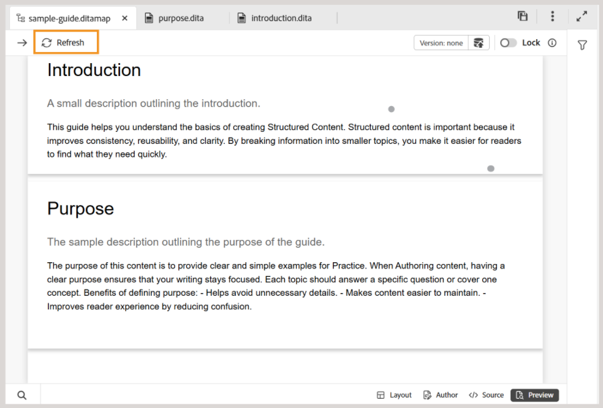
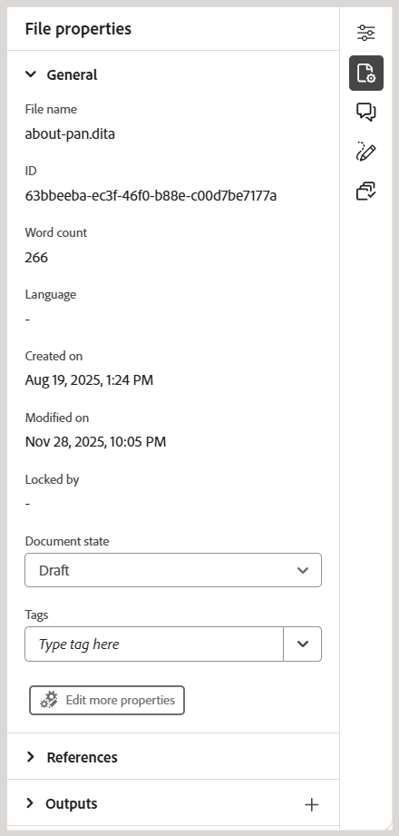
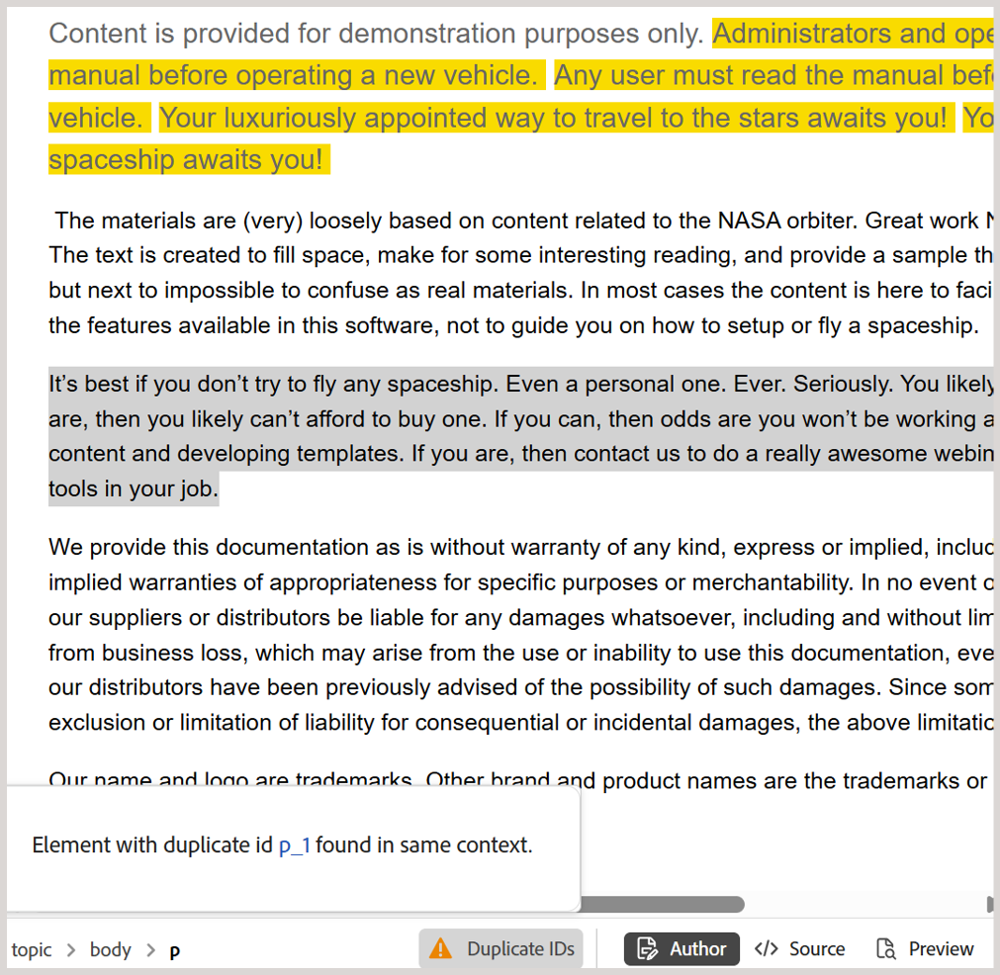

# What's new in the 5.2.0 release (May 2026)

This article covers the new and enhanced features introduced with the 5.2.0 release of Adobe Experience Manager Guides as a Cloud Service.

For the list of issues fixed in this release, view [Fixed issues in the 5.2.0 release](../release-info/fixed-issues-5-2-0.md).

Learn about [upgrade instructions for the 5.2.0 release](../release-info/upgrade-instructions-5-2-0.md).

## Introducing Editor 2.0

Editor 2.0 (aka New Editor) provides simplified authoring, enabling you to create content more efficiently across both tag and non-tag modes through a more intuitive experience. The release brings improved performance, with faster page loads and smoother editing even for large and complex topics. It also delivers enhanced stability by addressing key authoring gaps, particularly around navigation and cursor behavior. Additionally, a modern interface offers a refreshed and user-friendly UI that balances functionality with ease of use. For details, view [Introduction to the Editor](../user-guide/web-editor.md).

Here's an overview video highlighting the capabilities of Editor 2.0.

>[!VIDEO](https://video.tv.adobe.com/v/3484007)

<!-- >[!NOTE]
>
> Contact the AEM Guides Customer Success team to have the Editor 2.0 enabled on your environment. -->

Following are the enhancements that make authoring easier and more efficient.

### Redesigned user interface & experience

A refreshed interface improves overall usability, making navigation and content authoring more intuitive and consistent.

- **Richer CSS for elements in the Author and Preview mode**: Enhanced default CSS for elements provide improved styling and better visual consistency across both authoring and preview modes.

    {width="650"}

- **Dark theme support**: Support for a dark theme in the content editing area enhances the authoring experience for users who prefer working with a dark interface.

    {width="650"}

- **Consolidated user-level Editor settings**: A new centralized settings panel that gives Authors better control over editor behavior allowing users to manage preferences more easily from a single location. Configuration options include, ability to enable/disable: 

    - Non-breaking spaces in Author mode 
    - Tag visibility settings with attributes or without attributes 
    - XML comments in Author mode
    - Quick insert menu for element insertion in editor

    {width="350"}

    For more information about how to configure Editor settings, view [Editor settings](../user-guide/config-editor-settings.md).

- **Better representation of conditional content in Author mode**: Conditional content is more clearly displayed in Author mode, helping authors identify and manage variations more effectively. For details, view [Conditions](../user-guide/web-editor-left-panel.md#conditions) in Left panel of Editor.

    {width="650"}

### Enhanced authoring capabilities

Provides improved tools and flexibility to streamline content creation and editing workflows.

- **View attributes along with elements in tag mode**: Authors can now view element attributes with the tag mode, offering better visibility and control over structured content. To configure this feature, view [Editor settings](../user-guide/config-editor-settings.md).

    {width="650"}

- **Quick insert menu**: Enables adding elements directly while editing in Author mode at the cursor position without navigating to the toolbar. Frequently used elements can also be configured in the Favorites section through Editor settings for quicker access. For details, view [Edit topics](../user-guide/web-editor-edit-topics.md).

    {width="650"}

- **Ability to view, edit, and insert XML comments in the Author mode**: Enables authors to view, edit, and insert XML comments directly in Author mode, for better visibility within the content. To configure this feature, view [Editor settings](../user-guide/config-editor-settings.md).

    {width="650"}

- **Side-by-side mode**: Allows simultaneous viewing of Author and Source modes, with both views remaining in perfect sync for easier comparison, editing, and validation of content changes. For details, view [Editor views](../user-guide/web-editor-views.md).

    {width="650"}

- **Improved table authoring**: Enhances the overall table authoring experience with more intuitive and efficient interactions for creating and managing tables.

    - Fluid and intuitive interactions: Easily insert rows and columns, along with drag-and-drop support for reordering rows and columns.
    - Contextual toolbar: Access table-specific actions such as formatting, alignment, merging, and other additional actions directly within the table.
    - Configuring tables: Add multiple rows or columns in a single action, reducing repetitive steps and improving efficiency.

    {width="650"}

    For details, view [Work with tables](../user-guide/web-editor-other-features.md#work-with-tables-in-the-new-editor).

### Improved performance for large topics

The New Editor enhances the experience of working with large and complex topics by delivering faster content rendering, more reliable undo and redo functionality, and a dirty marker to clearly indicate unsaved changes.

## Introducing new Repository on Home page and enhanced search experience

The Repository, now accessible directly from the Home page, serves as a centralized space for improved discoverability of folders and files. It features dedicated **Folder navigation panel** and a customizable **tabular view of Repository**. The revamped Search and filter experience makes finding and locating files significantly easier. For more details, view [Know the Repository interface](../user-guide/home-page-repository-view.md).

{align="left"}

Within Editor, the Search and filter experience for files is now consistent with the Home page. A new [Search panel](../user-guide/search-panel-explorer.md) located at the bottom of the Editor interface is introduced to display search results. Additionally, the Repository is now renamed to **Explorer** in the Editor, allowing you to browse folders and files as before.

{align="left"}

### Support for Document state filter 

You can also filter your Repository search results based on the current document state of the files. With the Document state filter, you can narrow down your search using the available filter values defined in the `ui_config.json` file within your Folder profile.  

{align="left"}

The default filter values available for Document state are: Draft, Edit, In-Review, Approved, Reviewed, and Done. 

<!-- For details on customizing the default document state filters values, view [Configure document state filters](../install-conf-guide/conf-doc-state-filters.md).  -->

>[!NOTE]
>
> If you are using custom settings for `ui_config.json` ensure to take a back up of those before upgrading. After the update, review and adjust your settings to align with the changes introduced in the latest version.

### Thumbnail icon for multimedia

All multimedia files are displayed with thumbnail icons, making it easier to visually identify and locate images within the **Repository**. This enhancement also applies when searching for files in the **Search panel**, helping you quickly distinguish multimedia assets from other file types. 

{align="left"}

## Introducing Source mode search in Find and replace

Experience Manager Guides has introduced several enhancements to the Find and replace feature available in the Left panel of the Editor interface. Along with an improved UI for better usability, this release introduces a new **Use source mode** toggle in the **Find and replace** panel.

Enabling this mode, allows you to perform global search not only on the visible content but also the underlying source content (XML structure, including elements, tags, and attribute values) for the searched string. This mode ensures a comprehensive search across the entire content.

{width="650" align="left"}

In this mode, you can apply filters to narrow your search by File type, Document state, Last modified date, and more. You also have the option to download a detailed CSV report after performing Replace all operation, which provides a snapshot of all the replace actions performed along with their success and failure status.

For more details, view [Find and replace](../user-guide/web-editor-left-panel.md#find-and-replace) section in _Left panel in Editor_.

>[!NOTE]
>
> For **Use source mode** feature in the Find and replace panel, reindexing must first be completed. 

## Enhanced file and folder browsing experience 

This release introduces a cleaner, more intuitive interface for browsing files and folder paths in Experience Manager Guides. 

When browsing files, the revamped **Select file** dialog now features a tabbed layout with two views - **Repository** for navigating the entire content repository in a tabular format, and **Collections** for quick access to frequently used topics, maps, and images. 

{width="650" align="left"}

Key enhancements include:

- Tabular view of files and folders for organized navigation.
- Breadcrumbs and folder navigation panel to move easily through the folders.
- Support for multi-file selection for Reusable content, Topic references, Schematron, Output presets (using DITAVAL), and Workfront.  
- Preview selected files for easy review; for multiple selections, preview all files and remove any from the Preview panel as needed.
- Search and filtering options to narrow down results by name, title, file type, document state, and tags.

The **Select path** dialog also features an improved tree-structured view for folder navigation, ensuring a more organized and efficient way to select paths across the content repository. 

{width="350" align="left"}

For more details, view [Browsing files and folders in Experience Manager Guides](../user-guide/web-editor-other-features.md#browse-files-and-folders-in-experience-manager-guides) section in _Other features in the Editor_.

## Authoring enhancements

The following Authoring enhancements have been made as part of this release:

### Access the Path and UUID of references in files from the Content Properties panel

Now, you can use **Link path** to view the relative path of the selected reference, and **Link UUID** to view its unique identifier from the Content properties panel. You can also copy the complete absolute path and the associated UUID directly from the interface using the icons next to Link Path and Link UUID, making it easier to trace and reuse linked assets.

For details, view [Content properties](../user-guide/web-editor-right-panel.md#content-properties).

### Working copy indicator for metadata changes

Any changes to the metadata fields available under **File properties** or applied at the backend will also trigger the asterisk (*) on the document version. A document version is marked as _dirty (*)_ whenever you add, delete, or modify any default or custom metadata fields. To prevent system-generated metadata updates from affecting this indicator, administrators can configure an ignore list for metadata properties. For details on how to configure metadata properties, view [ Configure the ignore list of metadata properties](../install-conf-guide/conf-metadata-prop.md).

### Enhancements to the Schematron validation panel

The following enhancements have been made to the Schematron user interface for better clarity, usability, and validation outcomes: 

- In the Validation panel, an empty‑state message is displayed when no Schematron file is added, providing better clarity and direction for next steps.

    {width="350" align="left"}

- When multiple Schematron files are added, they are organized under a consolidated accordion, providing better visibility into the configured Schematron files.

    {width="350" align="left"}

- Based on the role attribute defined in the Schematron file, validation results are now categorized as: `Fatal`, `Error`, `Warn`, or `Info`. Each category includes a visible count along with a contextual tooltip for clearer interpretation. 

    {width="350" align="left"}

For more details on using Schematron files in Experience Manager Guides, view [Support for Schematron files](../user-guide/support-schematron-file.md).

### Translation language copies are now available in the Right panel of the Editor interface

A new **Translations** section is now available in the Right panel under *File properties* in the Editor. This section provides direct access to all available language copies for the currently opened asset (map, topic, image, etc.). You no longer need to navigate to the Assets UI to view or access these language copies. 

{width="350" align="left"}

For each language copy, you can hover-over the file to locate its path in the repository or simply select it to open in the Editor. In addition to opening files, you can also perform many actions using the **Options** menu. Some of the actions that you can perform include Edit, Preview, Copy UUID, Copy Path, Add to collections, and Properties.

For more details, view [Right panel in the Editor](../user-guide/web-editor-right-panel.md#file-properties).

### Refresh topics or map in the Preview mode

>[!NOTE]
>
>This behavior applies only to the Old Editor. In the New Editor, the Preview content is automatically refreshed.

Introducing the new **Refresh** functionality for maps that are already opened in the Preview mode. With this new feature, you can easily refresh the content of the entire map or individual topics present within it.

- To refresh the entire map (including all topics), a new **Refresh** button is introduced on the top-left corner of the Editor. 

    {width="600" align="left"}

- To refresh the content of individual topics, a new **Refresh topic** option is introduced in the context menu.

    {width="600" align="left"}

For more details, view [Map editor features](../user-guide/map-editor-advanced-map-editor.md). 

### Word count for topics and maps

You can now track the word count present within a map or topic file. The new **Word count** field in the Right panel would display the total number of words present within a topic (or map), where words separated by spaces are counted as individual words. It refreshes automatically each time you save changes. For cross-references, only the display text is included, while keys are excluded.

{width="350" align="left"} 

For details, view [Right panel in Editor](../user-guide/web-editor-right-panel.md#file-properties).

### Easily identify and fix duplicate IDs in topics and maps in the Author view 

Experience Manager Guides now includes a **Duplicate IDs** button in the Editor to help you quickly identify and fix duplicate IDs present within a single topic or map. When duplicate IDs are detected, this button appears at the bottom-left corner of the Editor interface in the **Author** view. Upon selecting the button, a list of all instances with duplicate IDs is displayed in a popover. Selecting an instance highlights the corresponding content in the topic or map, enabling you to locate and fix the duplicate IDs from the right panel.

For more details, view [Additional features in the Editor](../user-guide/web-editor-other-features.md). 

{width="350" align="left"}

### Enhancements to the Repository and Reports filters

The **Locked by** filter under the Advanced filters in the Repository and **Author** filter in the DITA map Reports now load user lists gradually as you scroll, instead of all at once. This paginated loading improves speed and makes working with large user datasets more efficient and seamless.

### Search citations across all Journal fields

Now, you can search citations across all Journal fields, such as *Title*, *Journal title*, *Author*, *Year*, *Volume*, *Number*, and *Pages*, using the **Any field** option in the **Add citation** dialog. The search returns the closest matching citation based on the entered text.

For more details on adding citations in Experience Manager Guides, view [Add and manage citations in your content](../user-guide/web-editor-apply-citations.md). 

{width="350" align="left"}

### Settings is now renamed to Workspace settings and accessible from the Homepage

To improve navigation and usability, the following enhancements have been introduced:

- **Settings** in the **More actions** menu in the Editor has been renamed to **Workspace settings**.
- The **More actions** menu (the three-dot menu), previously available only in the Editor and Map console interface, is now accessible from the [Homepage](../user-guide/intro-home-page.md).

    

### Enhanced indexing for Smart suggestions in AI Assistant

You can now easily track the status of each indexing attempt for Smart suggestions in AI Assistant with new status indicators: Indexing completed, Not in sync, In progress, and Indexing failed. The last indexing timestamp is now recorded at the folder profile level for better traceability. Additionally, parent-child folder restrictions are enforced when specifying a folder or file path for indexing.

For more details, view [Configure AI Assistant for smart help and authoring](../install-conf-guide/conf-profiles.md#configure-ai-assistant-for-smart-help-and-authoring-only-for-cloud-service).

## Review enhancements

The following Review enhancements have been made as part of this release:

### Automated reminders for Review tasks

You can now enable **Automated reminders** to schedule AEM notifications and email reminders for reviewers, both before a review task's due date and after it becomes overdue. You can configure multiple reminders in each case, with pre-due reminders sent in a defined sequence and overdue reminders triggered after the task is marked overdue, based on the configured reminder schedule. For details, view [Send topics for review](../user-guide/review-send-topics-for-review.md).

### Version history 

Reviewers can now access Version history for topics under review, allowing them to view and compare previously reviewed and updated versions of the same topic across previous review tasks. This helps reviewers validate changes made since earlier review cycles and maintain continuity by reviewing comments, labels, and other related details within the current review context. For details, view [Version history for the Reviewer](../user-guide/review-topics.md#version-history-for-the-reviewer).

### Access status of review tasks directly from the Review panel

As an initiator of a review task, you can now check the status of your review task directly from the Review panel. With the latest enhancements, the **Update task** dialog within the Review panel includes a new **Check review status** option. Selecting this option takes you directly to the review dashboard, where you can view the task status for each reviewer, enabling quicker access to task progress without needing to switch contexts.

For more details, view [Request a re-review or close a review task as an Author](../user-guide/review-close-review-task.md).

{width="350" align="left"}

### Reviewer assignment based on active project selection

- Assigning a Reviewer to a review task is now dependent on an active project selection. The **Assign To** field on the *Create Review Task* page remains disabled until an active project is selected. After a project is selected, the **Assign To** field is enabled and lists only the users and user groups associated with that project. This ensures that review tasks are assigned only to valid project members and prevents unintended Reviewer selection.

    

- The **Assign To** field now supports typeahead search, allowing you to quickly locate users or user groups by typing text. 

Together, these enhancements make Reviewer selection more accurate, efficient, and aligned with project-specific review workflows.

For more details, view [Send topics for review](../user-guide/review-send-topics-for-review.md). 

### Modify ongoing Review tasks

You can add new topics to an ongoing review task (if they were not previously sent for review) or remove topics from an ongoing review task without affecting the review workflow. On the **Task Details** page, you can simply select or unselect topics to modify the topic list. Reviewers are notified (via AEM and email) about any changes to their assigned topics through AEM and Email notifications. For more details, view [Send topics for review](../user-guide/review-send-topics-for-review.md).

{width="650" align="left"}

## Translation enhancements

The following Translation enhancement have been made as part of this release:

### Indicator for unversioned assets sent for translation 

When managing translations, it's important to ensure that all content is versioned before sending it for processing. To help with this, Experience Manager Guides now provides a clear indicator for topics that have saved changes but are not yet versioned.

If a file contains unversioned changes (not saved as a new version in your map), an _info_ icon appears next to the file, indicating that updates exist. To quickly focus on these files, enable the **Show assets with unversioned changes only** option in the Filters panel.

For more details, view [Translate documents from the Map Console](../user-guide/translate-documents-web-editor.md). 

{width="650" align="left"}

## Asset management enhancements

This release introduces the following enhancements to asset management:

### Use Flatten file hierarchy to download maps with original file names and associated metadata 

Now, you can use the Flatten file hierarchy option to download a map with its original file name. Additionally, the downloaded package includes a `metadata.json` file, making the associated metadata easily accessible and reusable outside Experience Manager Guides.

For more details on downloading files in Experience Manager Guides, view [Download files](../user-guide/authoring-download-assets.md).

### Metadata properties no longer editable for Read-only files

With this release, when the `Disable edit without locking the file` setting is enabled, file properties can no longer be edited if a file is in **Read-only** mode. 
 
This limitation applies across all entry points where properties can be modified for DITA and Markdown files, including:

- The **Right panel** of the Editor interface
- The **Properties** option in the file context menu
- The Metadata Report of a map
- The Assets UI

For non-DITA assets (such as images and multimedia), metadata properties remain editable even in read-only mode.

If a file is Read-only, you must first check out the file before making any changes to its properties. This change enforces stricter permission controls and ensures that property updates follow the same checkout and locking rules as content edits.

### Use regex to enable or disable post processing

You can now use regex to enable or disable post-processing for folders. This enhancement allows Administrators to define post-processing rules that apply to multiple folders or entire folder hierarchies using a single configuration, instead of specifying individual folder paths.

For more details, view [Use regex to enable or disable post processing](../install-conf-guide/conf-folder-post-processing.md).

- Run asset processing at both folder and individual file levels
- Filter assets by choosing specific asset types such as topics, maps, Markdown, HTML/CSS, DITAVAL, or other supported files, to process only the files you need. 
- Apply date based filters to limit processing scope for a specified timeframe.
- Reprocess assets directly using the new option (**Reprocess assets**) available in the context menu of files and folders within Repository view and Explorer panel. 

For more details on processing assets, view [Process assets](../user-guide/asset-processor.md).

### Automated B-tree cleanup for optimal performance

To maintain system efficiency and prevent resource congestion, a new background process  regularly cleans up the system-level B-trees. This ensures that assets which no longer exist or were added temporarily do not occupy unnecessary space. 

The system intelligently identifies candidates for cleanup and performs automated removal. Additionally, this feature is configurable, giving Administrators control over its behavior based on operational needs.

For more details, view [Configure B-tree clean up](../install-conf-guide/conf-btree-cleanup.md).

### Improved handling of DITA maps with large number of keys

You can now work seamlessly with DITA maps that contain large number of keys. This enhancement ensures faster loading and improved performance, making it easier to manage complex maps without interruptions.

After the build upgrade, the system may experience a temporary increase in load, causing a delay in post-processing of newly uploaded data. This is due to an automated one-time script (OTS) running in the background. Once the script completes, system performance will return to normal. 

### Improved asset processing

- An automated process is introduced to keep assets in the `/content/dam` up to date. The system triggers asset reprocessing every 15 minutes. During each cycle, assets that were newly added or remained unprocessed within the most recent 15-minute interval are picked up and reprocessed, improving efficiency and consistency across your content repository. 
- Run asset processing at both folder and individual file levels
- Filter assets by choosing specific asset types such as topics, maps, Markdown, HTML/CSS, DITAVAL, or other supported files, to process only the files you need. 
- Apply date based filters to limit processing scope for a specified timeframe.
- Reprocess assets directly using the new option (**Reprocess assets**) available in the context menu of files and folders within Repository view and Explorer panel. 

For details on processing assets, view [Process assets](../user-guide/asset-processor.md).

## Publishing enhancements

The following Publishing enhancements have been made as part of this release:

### Configure custom image renditions for specific output presets

You can now configure different image renditions for individual output presets under the same output type by using the `outputName` attribute in `renditionmapping.xml`. This enhancement gives you greater flexibility when publishing content that requires varying image resolutions for different scenarios. For example, you might want a high-resolution image for your main HTML5 output while using a smaller thumbnail for a lightweight preset.

For more details, view [Handle image rendition in output generation](../install-conf-guide/conf-output-generation.md#handle-image-rendition-during-output-generation).

### Download logs for generated output

When generating output through the Assets UI, a new **Download logs** button is now available that allows you to download log to your local device for easier access and review. 

### Language variables for cross references in Native PDF Output

When publishing Native PDF output, you can use [language variables](../native-pdf/native-pdf-language-variables.md) to translate static cross-reference text like _See in chapter_ or _See on page_. The variable uses the language defined in the topic through the `xml:lang` attribute. 

For details on configuring Native PDF output preset and cross-reference settings, view [Native PDF output preset](../web-editor/native-pdf-web-editor.md).

### Support for element-level component mapping in AEM Sites (using composite component mapping) publishing

Experience Manager Guides now supports element‑level component mapping in the AEM Sites output (using composite component mapping), giving teams precise control over how DITA elements render using `componentmapping.json`. By mapping `topicref`, titles, images, tables, and more to appropriate AEM Core Components, you get a cleaner structure instead of everything defaulting to the Text component. This results in better performance and unlocks richer, more modern Sites experiences. 

For more details, view [Component mapping for AEM Sites](../install-conf-guide/component-mapping.md).

## New baseline experience introduced in Experience Manager Guides

<!-- >[!NOTE]
>
> Contact the AEM Guides Customer Success team to have New baseline enabled on your environment. -->

Managing large, complex baselines is now faster, more stable, and easier to scale with the **new baseline experience**, built on a redesigned baseline architecture. This update addresses long‑standing performance and reliability challenges while preserving existing workflows.

Available as a beta enhancement, this update provides solution to common pain points such as slow loading, inconsistent baseline states, and limited manageability by delivering a faster, more stable, and more predictable baseline experience, with added support for automation and large‑scale baseline operations. The key improvements are:

- Improved performance and scalability
- Stronger UI and backend consistency
- Expanded filtering, navigation, and dependency visibility

For details, view [New baseline experience (Beta) in Experience Manager Guides](../user-guide/web-editor-baseline-v2.md).

## API enhancements

The following API enhancements have been made as part of this release:

- New APIs are introduced to create new translation project and track their status. These APIs help automate the translation process, reducing manual effort and improving efficiency. For details, view [Create translation project](../api-reference/translation-project.md)
- Enhanced asset processing APIs with improved filtering ability for files and folders. For details, view [Process assets](../api-reference/bulk-assets-processing.md).
- New API is available for tracking the post-processing status of individual assets and folders. This is especially useful for teams using automated workflows, where publishing needs to happen only after content is fully processed. The API offers a reliable way to confirm readiness, reducing the risk of publishing failures caused by incomplete processing. Also, with the introduction of this API, the asset post processing events won't fire automatically. Instead, Administrators can now enable this event through a setting in `fmdita config manager`. 
For details, view  [API to track post-processing status of individual assets and folders](../api-reference/track-post-processing-status.md) and [Post-processing event handler setting in fmdita config manager](../api-reference/post-process-event.md)

## Introducing Product Training and Learning content in Experience Manager Guides 

The **Product Training and Learning** content feature in Experience Manager Guides enables training teams and instructional designers to build interactive eLearning courses directly from the Experience Manager Guides interface. 

With template-driven authoring, interactive course components, and support for assessments, teams can develop high‑quality training content aligned with their organizational objectives.

>[!NOTE]
> 
> The Product Training and Learning content feature remains disabled by default for all instances of Experience Manager Guides as a Cloud Service. Administrators can enable this feature at the folder-profile level from **Workspace settings** > **General**.

The key capabilities are as follows:  

- Centralized learning content management 
- Template-driven authoring 
- Support for content reuse 
- Assessment creation and management  
- Web-based review workflows 
- Industry-leading translation management 
- Multi-channel publishing using out-of-the-box SCORM and PDF output formats

For more details, refer to [Getting started guide](../learning-content/course-overview.md) and [Configuration guide](../lc-config-guide/introduction.md).