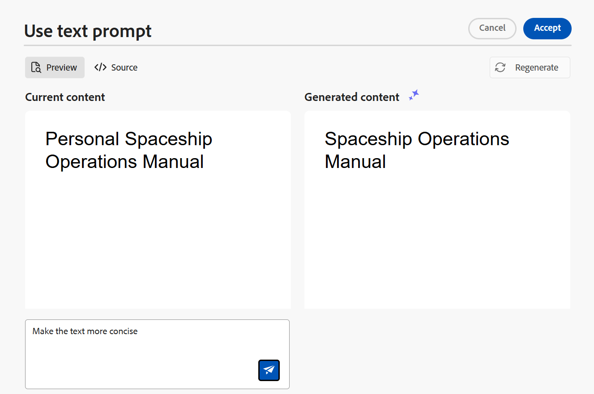
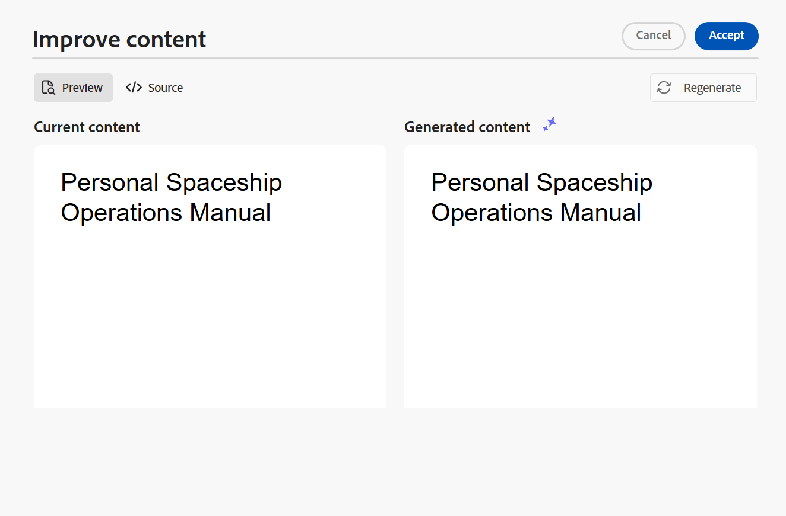
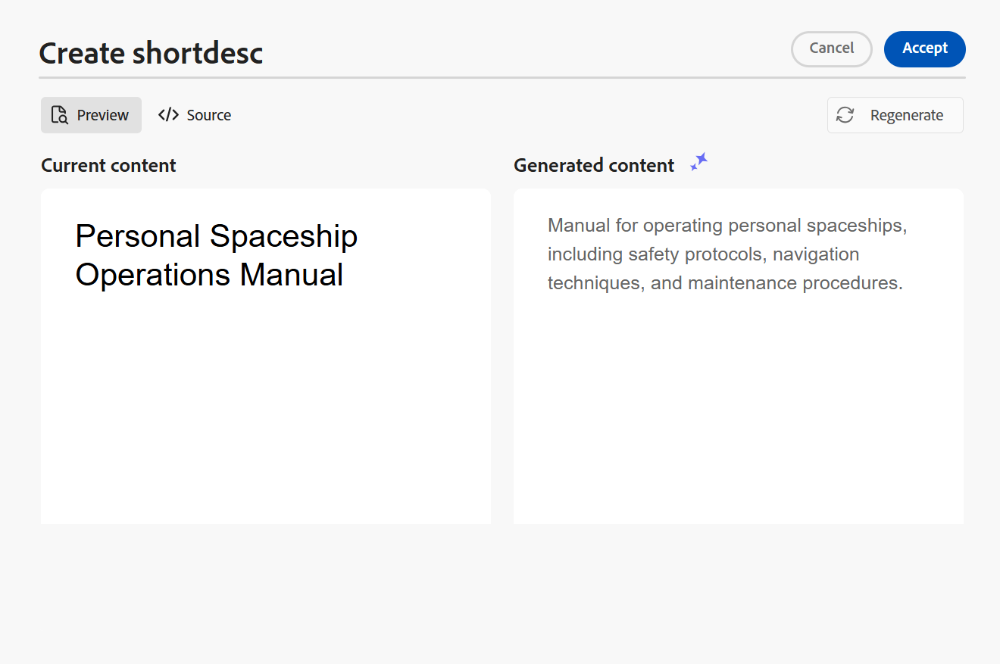
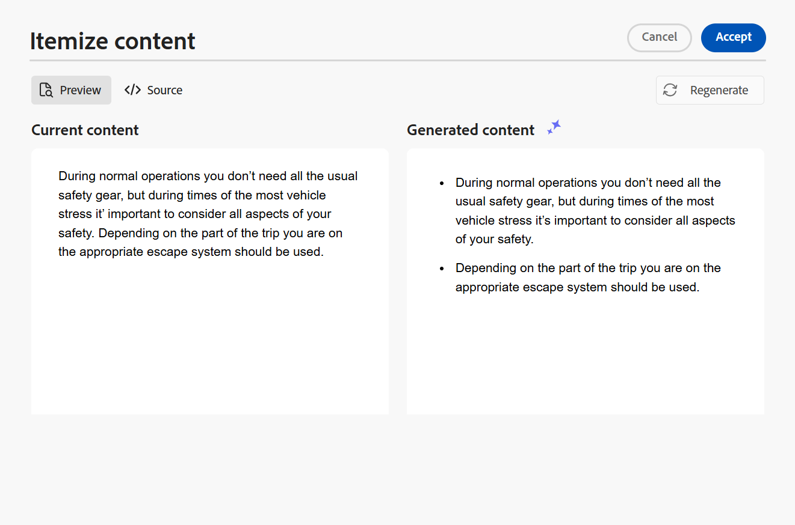

# AI Assistant to author documents with smart efficiency

Experience Manager Guides provides an AI Assistant tool that helps you make your authoring smarter and faster. You experience simplified document handling through intelligent suggestions and optimization. Using this tool, view the smart suggestions to reuse the content from the existing content repository. Use text prompt feature  for providing a prompt or instructions to change the content and generate an output. Use the AI Assistant to smartly convert a paragraph to a list. You can create a short description for the current topic. This feature also helps you to easily improve and translate the selected content.

>[!NOTE]
>
> To add the AI Assistant feature in the right panel, your system administrator must select the **AI Assistant** option under the **Panels** tab in the **Editor Settings** .
> Also, you must check out your document to view the AI Assistant icon.  

This feature is available for DITA topics only. After selecting the text in a topic, you can choose to perform any of the AI Assistant actions:

## Suggest reusable content 

Use the **Suggest reusable content**  feature to author content consistently and accurately. You can select the content, and Experience Manager Guides provides suggestions about how to reuse the existing content in your repository. 
Learn more about using [AI-powered smart suggestions to author content](authoring-ai-based-smart-suggestions.md).

## Use text prompt 

A text prompt is an instruction, question, or statement that guides the AI Assistant in generating a specific response or output.

You can use a text prompt to change the content and generate an output.  For example, you can generate a summary of the features of a product and use it in your report to showcase the product. You can also use this feature to compare two products. For example, you can also create a comparison table for the features of two products.

1. Select the text for which you want to use the text prompt.
1. Select **Use text prompt** from the **AI Assistant**  panel.
1. Give a prompt in one of the following ways:

    - Choose a prompt from the suggested prompts. 
    - Revise or edit a suggested prompt to create a custom prompt as per your requirements.

        >[!NOTE]
        >
        > The suggested prompts are configured in the `ui_config.json` by your administrator. 

    - Enter your prompt in the text box. 
  

1. Select **Regenerate**  for another response or output based on your prompt, like the AI tools.

1. (Optional) Select **Expand**   to open the **Use text prompt** editor. It displays the current and the generated content. You can edit the source layout content and check the preview.
 

    >[!NOTE]
    >
    > The responses are generated based on the selected content.

1. You can also edit the prompt in the editor and regenerate the response. For example, you can change the prompt to make the text more concise to approximately 40 words.
 
    

1. You can verify the source of the generated content and edit it if required.

1. Select **Accept** to replace the selected content in the topic with the generated content.  
1. **Cancel**: Cancels the text prompt action. Returns to the initial state of the panel.

    >[!NOTE]
    >
    > Selecting the **Cancel** icon in the feature panel also returns you to the initial state.

## Improve content 

Improves the selected content. Check the spelling, language, and grammatical structure and suggest a better version of the content. It also enhances the quality of sentences.

1. Select the content. 
1. Select **Improve content**  to find the suggestions for the improved content. 
1. Select **Regenerate** for another suggestion of improved content. 

1. (Optional) Select **Expand** to open the improved content editor. It displays the current and generated content. You can edit the content in the source layout and also check the preview.

Accept the suggestion, or regenerate for a different response, or cancel the action to go back to the previous state.

## Create shortdesc 

Create a short description for the topic based on the selected content in around 30-50 words. The short description helps users search for and find relevant content. 
For example, you can list the system requirements and generate a short description accordingly. 
 

1. Select the content. 
1. Select **Create shortdesc ** to create a short description for the current topic. 
1. Select **Accept** to create a new short description if the short description isn't already present. If a short description exists, you need to confirm it before replacing it with the new short description.

You can also perform the following actions: 
- Select **Regenerate** to generate another short description for your topic, like the AI tools.

- Select **Expand** to open the **Create shortdesc** editor. 

## Itemize content 

This feature intelligently converts a selected paragraph into a list.  It analyzes the content and creates a logical list of items. You don’t have to manually create the items. For example, if you have a paragraph detailing the steps to create a user account, the tool can transform this into a step-by-step list, eliminating the need to manually create items one by one.

1. Select the content. 
1. Select **Itemize content**  to convert the selected content into a list. 
The AI Assistant tool converts the content smartly into a list of items. 
1. (Optional) Select **Expand** to open the **Itemize content** editor. 
 1. Once your list is ready, accept the changes in the generated content. The generated content then replaces the selected content.  

## Translate content 

Use this intelligent feature to translate the selected content to the target language. For example, you can add content in English and quickly translate it into German.
Perform the following steps to translate the content:

1. Select the content that you want to translate.
1. Select **Translate content**  from the AI Assistant panel.
1. Select the target language from the dropdown. The translated content appears in the AI Assistant panel.

1. (Optional) Select **Expand** to open the **Translate content** editor. 
1. You can also select another language from the dropdown menu and regenerate the content in the chosen language. For example, if you select French and then select **Regenerate**, the content is translated into French.

