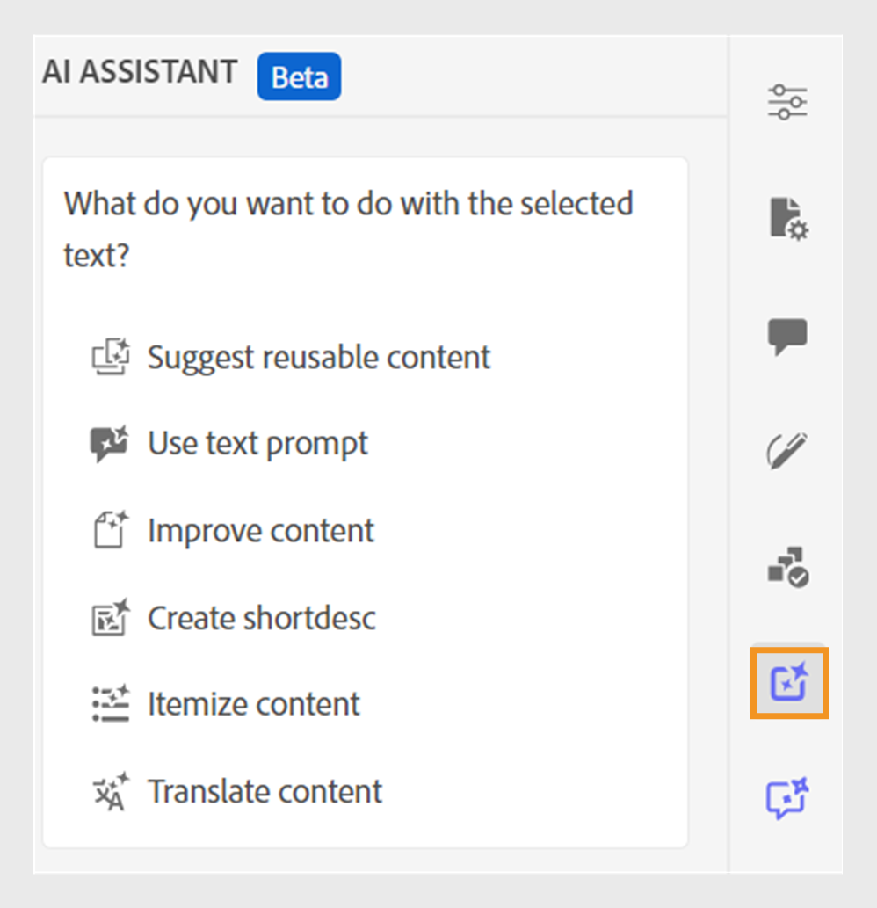
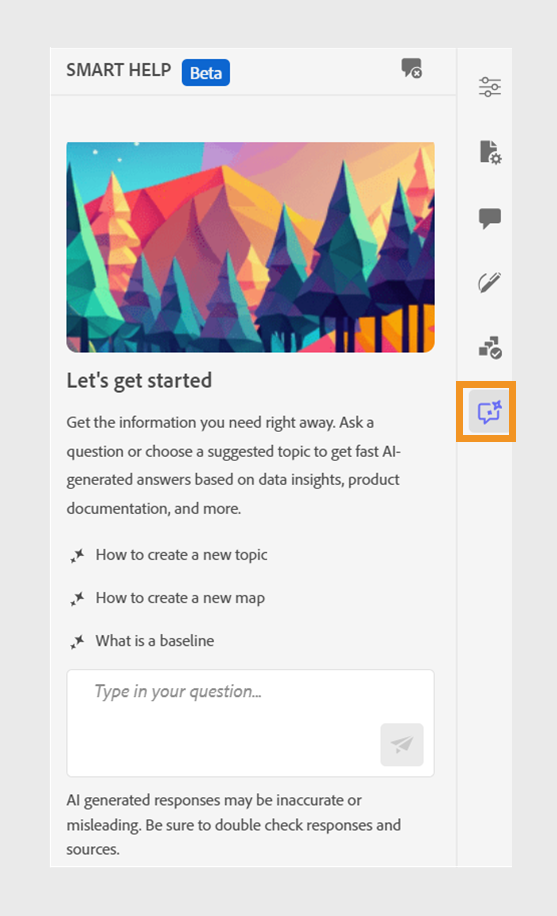

# AI Assistant (Beta)  

The **AI Assistant** in Adobe Experience Manager Guides is a powerful, AI-driven tool designed to enhance your productivity through smart help, authoring, and tagging features. In **Standard** mode, it brings together two robust AI features; **Authoring** and **Help** into the Experience Manager Guides interface, enabling you to author content and access information from Experience Manager Guides documentation faster and more efficiently. In **Agentic** mode, AI Assistant instead offers **Smart tagging**, letting you ask, through a conversational prompt window, for tag recommendations for your content and apply them across one or more topics.

>[!NOTE]
>
> The AI Assistant feature is currently available for Adobe Experience Manager Guides as a Cloud Service. 

## AI Assistant modes

>[!NOTE]
>
>To enable the AI Assitant in Agentic mode for your environment, contact the Customer Success Team.
 
AI Assistant is available in two modes: **Agentic** and **Standard**. Administrators can choose between the two modes from the **AI Assistant** section of **General** tab in **Workspace settings**. The AI Assistant panel remains the same in both modes in the Editor, but the capabilities available within it differ:

* **Agentic** mode uses the **Smart tagging** skill from Adobe CX Enterprise Coworker to analyze your content and recommend relevant tags based on your organization’s taxonomy.
* **Standard** mode provides the existing AI Assistant experience, with the **Help** and **Authoring** tabs in the AI Assistant panel.

## Agentic mode

### Smart tagging 

AI Assistant in Agentic mode makes tagging your content faster and easier through a conversational prompt window. Using the agentic Smart tagging skill from Adobe CX Enterprise Coworker, AI Assistant recommends relevant tags for your content when you ask it to. You stay in control by reviewing the suggested tags and choosing to apply them to one or more topics, including multiple topics within a map.

For more details, view [Get started with Agentic AI Assistant](./guides-ai.md).

## Standard mode

### Authoring 

When AI Assistant is configured in **Standard** mode, the **Authoring** feature in AI Assistant makes your authoring process smarter and faster. It offers capabilities such as generating intelligent suggestions for content reuse, translating content, improving content quality, and more, all based on your selected content. This feature enhances the overall authoring experience and the productivity of authors. 

For more details, view [Authoring](./ai-assistant-right-panel.md).

### Help

When AI Assistant is configured in **Standard** mode, the **Help** feature provides an intuitive, chat-based experience that helps you understand Experience Manager Guides, troubleshoot issues, and find information in the Adobe Experience Manager Guides documentation. Instead of searching through user guides and reference documents, you can use the **Help** feature to quickly find relevant answers to your queries. This helps save time and allows you to focus on content creation, resulting in enhanced productivity and efficiency.

For more details, view [Help](./ai-based-smart-help.md).

## Get started with AI Assistant in Standard mode

When you use the **AI Asistant** in Standard mode for the first-time, you are prompted to submit your consent before you use the Experience Manager Guides Generative AI features. 

Perform the following steps to launch AI Assistant: 

1. Login to Experience Manager Guides.
1. On the Home page, select **AI Assistant** from the top. Ensure that your Administrator has enabled the AI Assistant feature in the desired mode. 

The AI Assistant displays the key fetaures, user guidelines link, and a **Get started** button.

  

  Read the user guidelines carefully and then select  **Get started** to launch the AI Assistant. 

**Related topics**

[AI Assistant security FAQ](./ai-assistant-faq.md)

[Adobe Experience Manager Guides Generative AI disclosures](./adobe-generative-ai-disclosures.md)

[Configure AI Assistant for smart help and authoring](../cs-install-guide/conf-smart-suggestions.md)
