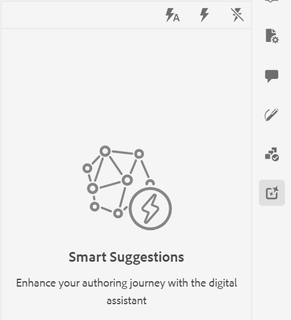
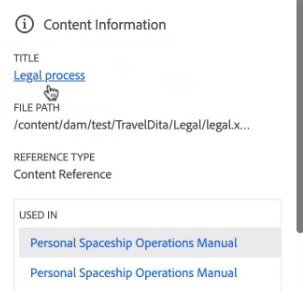

# AI-powered Guides Assistant to search content

While authoring your documents in the Web Editor, you can use the GenAI-based **Guides Assistant**, a conversational search feature that helps you find relevant content from the Experience Manager Guides documentation. 

You can ask your queries and find the relevant content. You get the appropriate content from authentic documentation, not from any Web-based search.  This search is entirely conversational. You can ask questions, and then, based on the response, you can also ask further questions. 
The response also includes links to the articles, which you can refer to for details. 
For example, you need to create a topic for your documentation. You can ask a query,  How to create a topic. You get a response and the links for the relevant article. Then, if you want to learn how to generate the PDF output for the document, you can ask the query for it.

When you open the Web Editor, the **Guides Assistant** panel appears on the right.

NOTE
Your administrator must configure the Guides Assistant feature. For more details, view the [Configure the AI-powered Guides Assistant](../cs-install-guide/conf-guides-assistant.md) section in the Installation and Configuration Guide for Cloud Services.

When you open a topic in the Web Editor, the **Smart Suggestions** panel appears on the right. 

>[!NOTE]
>
> Your administrator must configure the **Smart Suggestions** feature. For more details, view the [Configure the AI-powered smart suggestions for authoring](../cs-install-guide/conf-smart-suggestions.md) section in the Installation and Configuration Guide for Cloud Services. 

{width="300" align="left"}

*View the **Guides Assistant** panel.*

Perform the following steps to view the conversational search for finding appropriate content to resolve your queries:

1. Select **Smart Suggestions**  to open the panel.

    >[!NOTE]
    >
    > In the [global or folder-level profiles](../cs-install-guide/conf-folder-level.md#conf-ai-smart-suggestions), your administrator needs to define the files or folders to index for smart suggestions, the minimum number of characters you need to enter to view the suggestions, and the maximum number of suggestions you can view in the list.

  1. Type in the query to find the related content in the Experience Manager Guides documentation. You can either select the default queries that appear in the panel or type your query in the text box. .

  1. Select **Suggestions for the current tag**  to view the authoring suggestions for the current tag where you place your mouse pointer.  The suggestions to view and add content references from the indexed files are displayed based on the content in the current tag.
  
      Keyboard shortcut: **Windows** (*Ctrl* + *K*),  **macOS** (*Command* + *K*)
  1. Select **Suggestions for the complete document**   to view the suggestions based on the content present in the complete document.  The smart suggestions icon is displayed next to the content where a suitable match is found. 

      Keyboard shortcut: **Windows** ( *Ctrl* + *Shift* +  *K* ),  **macOS** (*Command* + *Shift* + *K* )

        >[!NOTE]
        >
        > You can only view the suggestions for the current viewport (the content visible on the screen). To view suggestions for any other content in the document, scroll up or down to display it in the viewport and then select the  icon .
   
   1. Select the **Smart Suggestions**  icon near the tags you have added to your document to view the smart suggestions. 
  1. You can view the smart suggestions  in the **Content Reuse** suggestions box.  Experience Manager Guides provides suggestions for exactly matching content and content with the same meaning. For example, you can search for the topic that contains the exact version number, like "release version 2023.03.12". You can also search for "Adobe is headquartered in San Jose, California," and find similar content like "San Jose has the quarters of many software companies like Adobe."
  1. Select **Content Information**  to view the details.
        {width="300" align="left"}

        *View the detailed information about the content reference.*

        1. The title of the topic that contains the content reference is displayed as a hyperlink. 
        1. The path of the file that contains the content reference.
        1. The type of reference where the content is referred.
        1. The names of DITA files where the topic is referred to are displayed as hyperlinks.
1. Select **Suggested content preview**  to compare the current content with the suggested content. This helps you compare the differences and determine if you want to add the content reference for the suggested content and make it consistent or retain your current content.

     {width="800" align="left"}

    *Preview the comparison between the current content and the suggested content.*
 
1. Click **Accept** to add the suggested content reference in the **Suggested content preview** dialog box.
1. You can also select **Accept** or **Decline** in the **Content Reuse** suggestions box for the appropriate recommendations.

   
This intelligent feature is handy and minimizes the effort of manual content searching, allowing you to concentrate more on generating new content. It also facilitates better team collaboration and helps maintain consistency in the content created by various authors.
