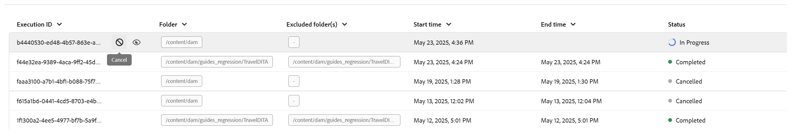

# Process assets

In data-intensive workflows such as publishing, efficient asset management is crucial for maintaining performance and reliability. The asset processing workflow is designed to manage user-specific assets requiring intensive data operations. It primarily addresses two cases: when initial processing fails due to errors or when files remain unprocessed because no asset processing trigger was initiated. By enabling targeted, folder-level processing, users can isolate and process only the necessary assets, thereby avoiding the overhead of unnecessary computations. This selective approach significantly enhances performance, reducing the time required for critical operations like publishing and report generation. Overall, it contributes to greater efficiency and speed in handling complex data tasks.

>[!NOTE]
>
> - For large datasets, it's best to run processing during off-peak hours to avoid impacting system performance. After the processing task completes, you can review the details to analyze the results. 
>- The system triggers asset processing for the `/content/dam` folder every 15 minutes. During each cycle, assets that were newly added or remained unprocessed within the most recent 15-minute interval are picked up and reprocessed. To configure the automatic asset processing feature view, [Configure asset processing feature](../cs-install-guide/configure-asset-processing-cs.md).
 
## Processing the assets

Follow the below mentioned steps to process the assets:

1. Select the Adobe Experience Manager logo at the top and choose **Tools**.
1. In the **Tools** panel select **Guides**.
1. Select the **Bulk Processor** tile.

    {align="left"}

1. The Guides Bulk Processor window opens with the details shown below. Also, only the information pertaining to the last five migrations are displayed on this window. 

    - **Feature type**: Shows the feature of the process that is being executed.

    - **Execution ID**: It is the unique Id for each processing task that you perform.

    - **Folder**: Shows the folder selected for processing.

    - **Excluded Folders**: Shows the folder that is excluded from processing.

    - **Created by**: Shows who created the task or process. It can be you as well as the system.

    - **Start time:** Shows the date and time the processing process is initiated.

    - **End Time**: Shows the date and time the processing process ends.

    - **Status**: Shows the status of processing as In progress, Completed or Cancelled.

    {align="left"}

1. Select **New Process** tab on the top right corner of the window to start a new processing task.

    The **New process** dialog opens. 

    {width="350" align="left"}

1. Provide the following details in the dialog:

    1. **Feature Type**: Select **Asset processing** from the drop drown.
    1. **Select folders and files**: Navigate and choose one or multiple folders and files to process. 
    1. **Select folders to ignore**: Optionally, select subfolders within the chosen parent folder to exclude from processing.
    1. **Asset Type**: From the dropdown, select the specific asset type to process (e.g., DITA Topic, DITA Map, Markdown, HTML/CSS, DITAVAL, or other media files). Only the selected asset type will be processed from the folder(s) you specified earlier.
    Example: Selecting DITA Topic will process only DITA topics within the selected folder, enabling targeted filtering.
    1. **Created after/Created before**: Apply date filters to process assets created   within the specified timeframe.

    >[!NOTE]
    >
    > If a process is already running for a folder, you cannot start a new process for the same folder until the current task is complete.    

1. Select **Create**. You get a pop-up showing **Success and the Process triggered successfully**. You can see the status of the processing task on the window.

    {width="350" align="left"}

## Additional options for asset processing tasks   

Additional options are available for the processing task once it has been initiated. You can access these options by hovering over the Execution ID of your task. Details of these options are provided below:

- **Restart** : Restarts the previously successful asset processing task.

    {width="650" align="left"}

- **Resume** : Resumes the previously cancelled or failed asset processing task.

    {width="650" align="left"}

- **Cancel** : Cancels the currently in-progress asset processing task.

    {width="650" align="left"}

- **View logs**: Shows the logs for the asset processing task. For in-progress tasks, the  log shows detailed processing info, including estimated time remaining and asset status. This log list displays up to the latest 500 entries. The full log can be downloaded.

    {width="650" align="left"}
