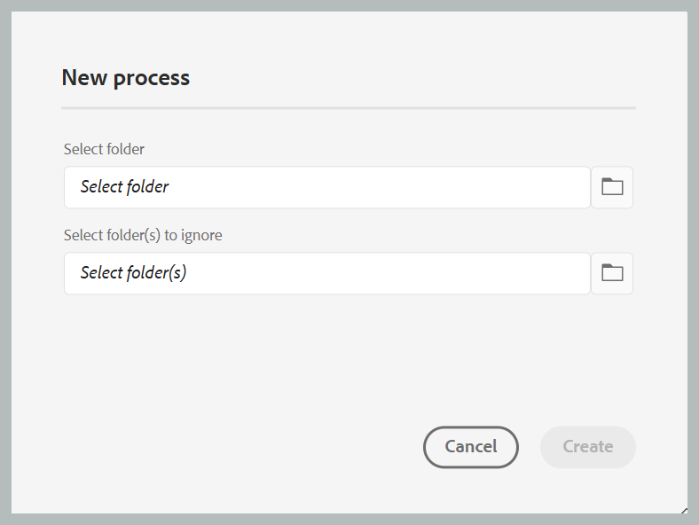

# Processing or reprocessing assets

In data-intensive workflows such as publishing, efficient asset management is crucial for maintaining performance and reliability. The process of processing or reprocessing assets is specifically designed to handle user-specific assets that require intensive data operations. This approach addresses two primary scenarios: when the initial processing of assets encounters errors, or when files were not processed at all due to the absence of a post-processing trigger. By enabling targeted, folder-level processing, users can isolate and process only the necessary assets, thereby avoiding the overhead of unnecessary computations. This selective approach significantly enhances performance, reducing the time required for critical operations like publishing and report generation. Overall, it contributes to greater efficiency and speed in handling complex data tasks.

>[!NOTE]
>
> For large datasets, it's best to run processing during off-peak hours to avoid impacting system performance. After the processing task completes, you can review the details to analyze the results.
 
## Processing the assets

Follow the below mentioned steps to process or reprocess the assets:

1. Select the Adobe Experience Manager logo at the top and choose **Tools**.
1. In the **Tools** panel select **Guides**.
1. Select the **Asset Processor** Tile.

    {width="550" align="left"}

1. The Guides Asset Processor window opens with the details shown below. Also, only the information pertaining to the last five migrations are displayed on this window. 

    -   **Execution ID**: It is the unique Id for each reprocessing task that you perform.

    -   **Folder**: Shows the folder selected for reprocessing.

    -   **Excluded Folders**: Points to the folder that is excluded from reprocessing.

    -   **Start time:** Shows the date and time the reprocessing process is initiated.

    -   **End Time**: Shows the date and time the reprocessing process ends.

    -   **Status**: Points to the status of reprocessing as In progress, Completed or Cancelled.

    {width="550" align="left"}

1. Select **New Process** tab on the top right corner of the window to start a new processing task.

    {width="550" align="left"}

1. Select the folder you want to process or reprocess. You can also select the folders (within the parent selected folder) which you want to exclude or ignore.

    >[!NOTE]
    >
    >Only one folder can be selected at a given time for processing. For specific operations, you can exclude multiple folders.
    <!-->> * The system supports adding multiple requests for processing but processes them one at a time to manage memory usage efficiently.-->

1. Select **Create**. You get a pop-up showing **Success and the Process triggered successfully** as shown in the snippet. The same is reflected in the list. You can see the status of the reprocessing task on the window.

    {width="550" align="left"}

## Additional options for the processing tasks   

Additional options are available for the processing task once it has been initiated. You can access these options by hovering over the Execution ID of your task. Details of these options are provided below:

- **Restart** : Restarts the previously successful asset processing task.

    {width="550" align="left"}

- **Resume** : Resumes the previously cancelled or failed asset processing task.

    {width="550" align="left"}

- **Cancel** : Cancels the currently in-progress asset processing task.

    {width="550" align="left"}

- **View logs**: Shows the logs for the asset processing task. For in-progress tasks, the  log shows detailed processing info, including estimated time remaining and asset status. This log list displays up to the latest 500 entries. The full log can be downloaded.

    {width="550" align="left"}

