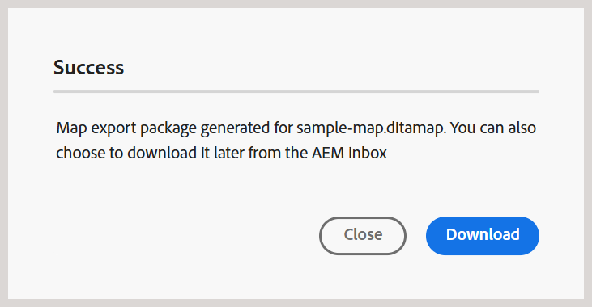

# Download files {#id216MC0H0BE8}

You can download assets including DITA and non-DITA files. There are multiple ways in which you can download assets, some methods are native to Adobe Experience Manager and others are supported by Adobe Experience Manager Guides. For native Adobe Experience Manager assets download information, view [Download assets from Adobe Experience Manager](https://experienceleague.adobe.com/docs/experience-manager-cloud-service/assets/manage/download-assets-from-aem.html) in Adobe Experience Manager documentation. The following section explains the mechanism of downloading files in Experience Manager Guides.

## Download a DITA map file from the Editor 

Perform the following steps to download a DITA map file from the Editor:

1. Navigate to the DITA map that you want to download.
1. Select the DITA map to open it in the Editor.
    
1. In the Map view, select the **Options** icon and choose **Download map** from the list.  

    

    The **Download map** dialog is displayed. 

    {width="300" align="left"}

1. In the Download Map dialog, you can choose the following options:

    -   **Use baseline**: Select this option to get a list of Baselines created for the DITA map. If you want to download the map file and its contents based on a specific Baseline, select the Baseline from the drop-down list. For more details about working with Baselines, view [Work with Baseline](generate-output-use-baseline-for-publishing.md#).
    
    - **Use GUID file name**: Select this option to download the map file with the GUID file name. This option is available for both **Retain file hierarchy** and **Flatten file hierarchy**.
    - **Use actual file name** Select this option to download the map file with its actual file name. This option is available only for the **Retain file hierarchy**.

    >[!NOTE]
    >
    > You can also download the map file without selecting any option. In that case, the last persisted version of the referenced topics and media files are downloaded.
1. Select **Download**.

    The map download request is queued. 
    
    

    You will receive the following notification once the map is ready to download.

    {width="550" align="left"}

1. Select **Download** to download the map file in `.zip` format. Or, download it later from the AEM inbox. 

    >[!NOTE]
    >
    > By default, the downloaded maps remain for five days in the Adobe Experience Manager notification Inbox.

## Download a DITA map file from the Map dashboard 

Once you have the DITA map file in the Adobe Experience Manager repository, you can download the map file along with its dependents. This gives you the flexibility to share the complete map file for offline editing, validation, review, or simply creating a backup.

Perform the following steps to download a DITA map file along with its dependent files:

1.  In the Assets UI, navigate to the DITA map that you want to download.

1.  Select the DITA map to open it in DITA map console.

1.  Select the **Topics** tab to view the list of topics available in the DITA map.

1.  In the main toolbar, select **Download Map**.

    The Download Map dialog appears.

    {width="300" align="left"}

1.  Select **Download**. In the Download Map dialog, you can choose the following options:

    -   **Use Baseline**: Select this option to get a list of Baselines created for the DITA map. If you want to download the map file and its contents based on a specific Baseline, select the Baseline from the drop-down list. For more details about working with Baselines, view [Work with Baseline](generate-output-use-baseline-for-publishing.md#).
    
    -   **Flatten File Hierarchy**: Select this option to save all referenced topics and media files in a single folder.     

    >[!NOTE]
    >
    > You can also download the map file without selecting any option. In that case, the last persisted version of the referenced topics and media files are downloaded.

1.  After you select the **Download** button, the map download request is queued. You will receive the following notification once the map is ready to download.

    {width="550" align="left"}

    -   Select **Download** to download the map file in.zip format.

    -   Select **Download Later** to download the map file at a later time. The download link can be accessed from the Adobe Experience Manager notification Inbox. Select the generated map notification in the Inbox to download the map in .zip format.

    >[!NOTE]
    >
    > By default, the downloaded maps remain for five days in the Adobe Experience Manager notification Inbox.

{width="300" align="left"}

Once the map is downloaded, you can select the map and use the Open icon on the top to open the selected report.

**Parent topic:**[Manage content](authoring.md)
