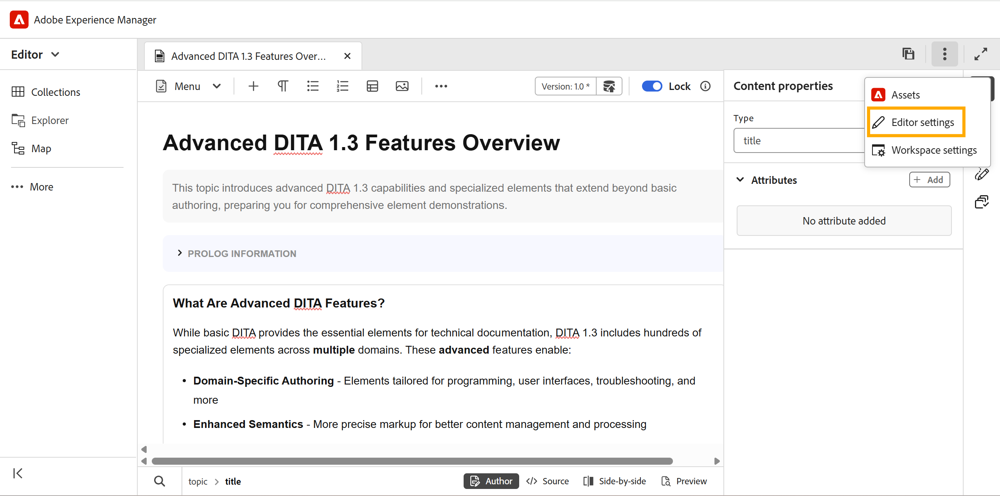
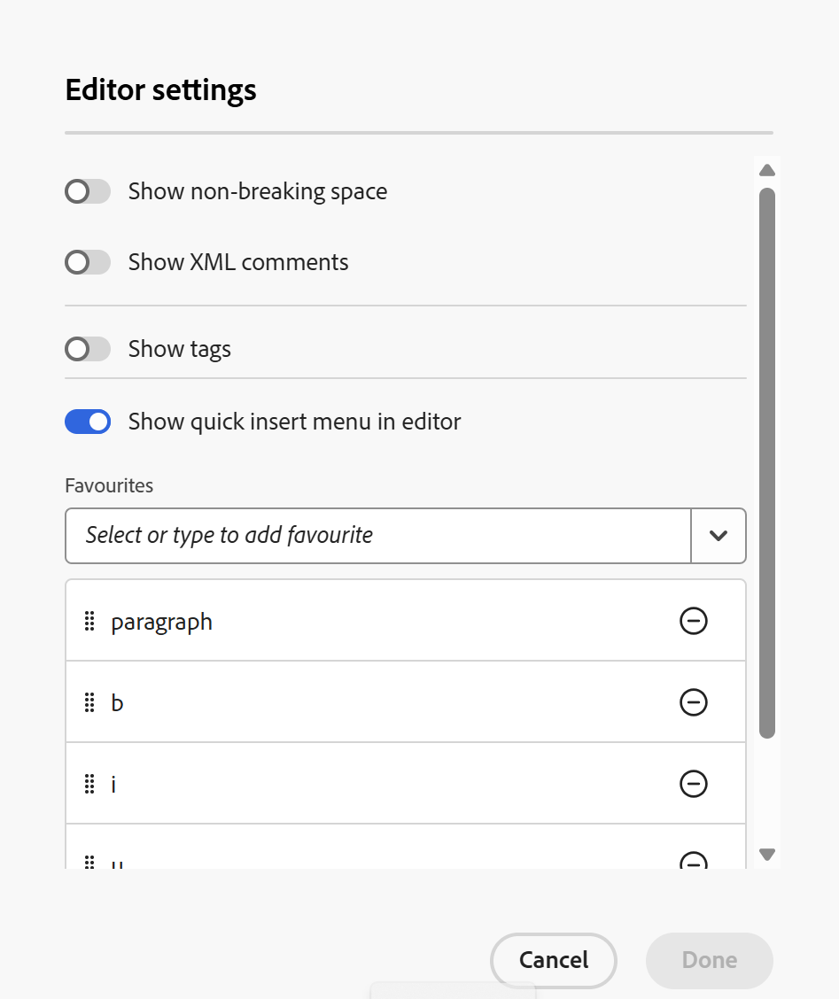
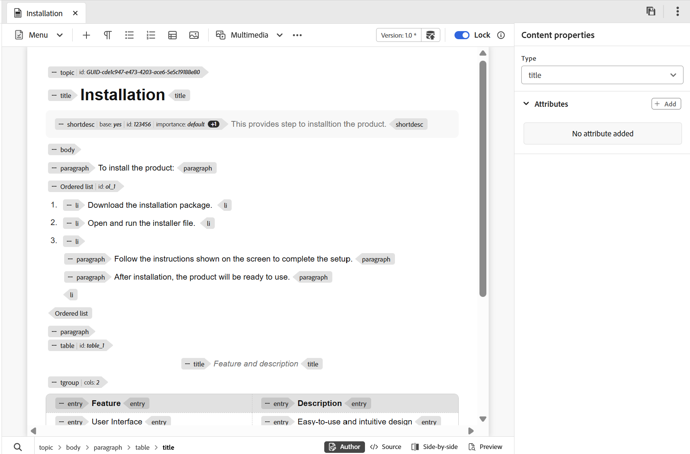

# Editor settings

The Editor settings provides a centralized configuration panel that allows you to customize Editor behavior at an individual author level. It provide greater flexibility, consistency, and control during the authoring process.

This centralized settings panel enables you to manage key Editor preferences from a single location, reducing the need for scattered or manual configurations. The Editor settings can be accessed from the **More actions** on the Tab bar.

{width="650" align="left"}

## Supported configuration options

You can enable or disable the following options based on your preferences:

{width="350" align="left"}

- **Non breaking spaces**: Enable this option to show an indicator for the non-breaking spaces while editing it in the Editor. It is visible only in the Author view for DITA topic and DITA maps
- **XML comments**: Enables the visibility of XML comments in Author view to reduce visual clutter or aid in structured authoring. When enabled, authors can render, insert, edit, and delete XML comments directly within the content in the Author view itself, making it easier to add contextual notes for collaborators. When disabled, XML comments are completely hidden and cannot be inserted or modified, ensuring a cleaner authoring experience for users who do not require them.

    {width="650" align="left"}

- **Tags**: Controls the visibility of DITA elements in the Editor. When enabled, structural tags are displayed within the content, allowing authors to view and manage the underlying DITA structure. When disabled, these tags are hidden to provide a cleaner and more focused authoring experience.

    {width="650" align="left"}

    You can also enable Display attributes to view and validate the attributes associated with an element. When an element has multiple attributes, a count indicator is shown. Hovering over the indicator displays the complete list of attributes applied to that element.

     {width="650" align="left"}

- **Quick insert menu in editor**: Allows you to configure and customize the **Quick insert menu** for quick element insertion during authoring in editor. You can search for and add the available elements to the **Favorites** of the Quick insert menu in the Editor settings using the dropdown. These favorite elements are available directly in the Editor when you press **Control + /** on Windows or **Command + /** on macOS.

    {width="650" align="left"}

