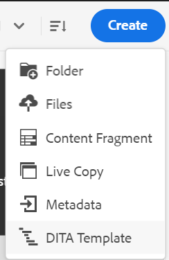

# Create maps based on customized templates {#id225VF0808MP}

You can create customized map templates and use them to create DITA maps along with the topic templates and map templates referenced in the map template

You can refer to other map templates and topic templates from the customized map template. The referred map templates can refer to various map templates, topic templates, topics, maps, images, videos, and other assets. The customized map template can help you very easily replicate the map templates and the entire referred folder structure. These customized templates are especially useful to create and recreate multiple maps which have recursive structures and references.

>[!NOTE]
>
> Topic templates are not created recursively. Only topic templates that are directly inside the map template are generated and any topic template inside a topic template is simply referred in the parent directly.

## Create customized templates

Adobe Experience Manager Guides allows you to create customized maps and topics from the dita-templates folder. You can use these customized templates to create your map and topic. You can also share these templates with your authors, and they can use them to create their files. Using these templates, you can allow the authors to keep separate copies of certain resources which are inside the templates folder.

>[!NOTE]
>
> Any resources which are only to be referred to and maintained across must be kept outside the templates folder.


You can create map and topic templates in the following ways:
- [Create customized templates from the Editor](#create-customized-templates-from-the-editor)
- [Create customized templates from the Assets UI](#create-customized-templates-from-the-assets-ui)


### Create customized templates from the Editor

The **Templates** feature is present in the [Left panel of the Editor](./web-editor-features.md#left-panel) interface, and is only available for administrators. Using this panel, administrator can easily create and manage templates that can then be used by the authors. By default, the templates are categorized under *map* and *topic* type templates.

{width="550" align="left"}

By default, you can view the files by titles. As you hover over a template, you can view the file title and the file name as a tooltip.   

>[!NOTE]
>
> As an administrator, you can also choose to view the list of files in the Editor. Select the **File name** option of the **Editor files display configuration** section in **User preferences**.

Perform the following steps to create a topic or map template from the Editor:

1.  Open the **Templates** panel in the Editor and select the **Create DITA template** icon.

    {width="500" align="left"}

1. Choose **Topic template** or **Map template** from the dropdown menu based on the type of template you want to create.   
1. If you select **Topic template**, then the **New topic template** dialog box is displayed.

    {width="500" align="left"}

    If you select **Map template**, then the **New map template** dialog box is displayed.

    {width="500" align="left"}

    You can also select **Folder** from the dropdown list if you want to first create a folder within the **topic** or **map** folder.  

1. In the **New topic template**/ **New map template** dialog, provide the **Title**, which appears in the **Templates** panel. The **Name** of the template is auto suggested based on the title, however, you can provide a different file name. 
Also, choose the type of template that you want to create from the **Template** drop-down list.

    >[!NOTE]
    >
    > In case your administrator has enabled automatic file names based on UUID setting, then you will not view the Name field.

1. Select **Create**. 

Once the template is created, you need to add it to your global or folder-level profile. After the template is added, your authors will start viewing the new template in the topic/map creation process.

Using the **Options** menu on an existing template, you can choose to **Edit** or **Duplicate** it. In case of duplication, the template's structure and type \(of document\) is retained and you can reuse it to create another template from it.

{width="500" align="left"}

### Create customized templates from the Assets UI

Peform the following steps to create a map or topic template from the Assets UI:

1.  In the **Assets UI**, navigate to the dita-templates folder.

    {width="800" align="left"}

1.  Open the **topics** folder if you want to create a **Topic** template. Open the **maps** folder if you want to create a **Map** template. 
1. Select **Create \> DITA Template**.

    {width="300" align="left"}
1.  On the Blueprint page, select **Topic \> Next** to create a topic template. Else, select **Map \> Next** to create a map template.
1.  On the Properties page, specify the template **Title**.
1.  Specify the file **Name**.

    >[!NOTE]
    >
    > The file name must have the .dita extension.

1.  \(Optional\) Add a description.
1.  Select **Create**. 

    The topic template created message appears. You can then open the template and edit it. For a map template, you can also add the references for the topic templates, map templates, and also other assets in the map template.


**Options menu in Assets UI**

To create a map or topic template using the Options menu in the Assets UI, perform the following steps:

1. Select the **Map** or **Topic** folder in the current templates folder. For example, `dita-templates` folder. 
1. From the **Options** menu, select **Create Map Template** or **Create Topic Template**. 

    The **Create New Map Template** or the **Create New Topic Template** dialog opens.
1. Enter the title and the name of the new template. 
1. Choose the type of template that you want to create from the **Template** drop-down list.

The map template created message appears. You can add the template to your global or folder-level profile. The new template then appears in the topic or map creation process, and you can create maps or topics using it.

Your administrator can also create a folder and configure it to be the folder wherein you can create and save the templates. 

Based on your setup learn how to configure custom DITA template folder path:
<details>
    <summary> Cloud Services </summary>

 Learn how to [configure custom DITA template folder path](../install-guide/conf-template-tags-custom-dita-topic-template.md#configure-custom-dita-template-folder-path-id191lcf0095z) in the  Cloud Services Installation and Configuration Guide. 
 </details>

<details>
    <summary> On-premise  Software</summary>
     
Learn how to [configure custom DITA template folder path](../cs-install-guide/conf-template-tags-custom-dita-topic-template.md#configure-custom-dita-template-folder-path-id191lcf0095z) in the  On-premise Installation and Configuration Guide.
     </details>

## Pass on the title defined in the templates

If you want to pass on the title of the topic or map used inside your template to the DITA maps created using that template, use curly brackets around the title.

Example
 
 ```XML
 <pubtitle>
    <mainpubtitle outputclass="booktitle">
    {title}
    </mainpubtitle>
    <subtitle>Subtitle</subtitle>
 </pubtitle>

 The resultant DITA map with title "Rootmap1" will look like as follows:
 <pubtitle>
    <mainpubtitle outputclass="booktitle">Rootmap1
    </mainpubtitle>
    <subtitle>Subtitle</subtitle>
 </pubtitle>
 ```

>[!NOTE]
> Only the first occurrence of curly bracket will be replaced with title.

If you do not use curly brackets around the title the resultant DITA map only the first element will be picked and the nesting of the title will not be picked from the template and it will look as follows:

```XML
<pubtitle> Rootmap1 </pubtitle>
```

>[!NOTE]
> You can also use the curly brackets around the text to pass on its nested structure from the custom templates to your DITA maps.

Example

```XML
<title>    
    <sub>        
        <b>{title}</b>    
    </sub>
</title>
```

## Use the map template to create new maps 

>[!NOTE]
>
> The map template must be configured and made available for authoring by your administrator. For more details, view *Configure authoring templates* section in the Install and configure Adobe Experience Manager Guides as a Cloud Service.

In the **Editor**, perform the following steps to create a map using the custom map template:

1.  In the **Editor**, navigate to the folder where you want to create the map.
1. From the Options menu of the folder, select **New \> DITA Map**. 

    {width="500" align="left"}
1.  The **New map** dialog is displayed.
1.  In the **New map** dialog, specify the map **Title**, file **Name**, and select the map template you want to use. 

    For example, if you have created a map template 'test-template', select it.

1. Select **Create**. 

    The map created message appears.

In the **Assets UI**, perform the following steps to create a map using the custom map template:

1.  In the **Assets UI,** navigate to the folder where you want to create the map.
1.  Select **Create \> DITA Map**.
1.  On the Blueprint page, select the map template you want to use and select **Next**. For example, if you have created a map template 'test-template', select it.
1.  On the Properties page, specify the map **Title**.
1.  Specify the file **Name**.

    >[!NOTE]
    >
    > The file name must have the .ditamap extension.

1. Select **Create**. The map created message appears.

## Additional notes for DITA maps created using custom templates


The map generates all assets which are referred to inside the template folder. Some types of assets that are referred in a map can be as follows:

-   If the map contains the reference to a topic template, a copy of it is created inside the folder, in the same hierarchy as in the topics folder in the `dita-templates` folder.
-   If the map contains the reference to a map template, a copy of it is created inside the folder, in the same hierarchy as in the maps folder in the `dita-templates` folder.
-   If the map contains the generic reference to a topic or map outside the `dita-templates/topics` or `dita-templates/maps` folder, the same is only referred to, and no copy is created.

    >[!NOTE]
    >
    > `dita-templates/topics` and `dita-templates/maps` are the default paths in Guides and are configurable.


    If there is a topic template key definition inside the map template, a new key \(therefore new topic\) is created and referred to in the map.

-   If another map or topic is created at the same level in the folder, then the names of the newly created assets are appended with 0,1,2, and so on. You can choose to open the map for editing or save the map file in the repository.

**Parent topic:**[Work with the Map Editor](map-editor.md)
