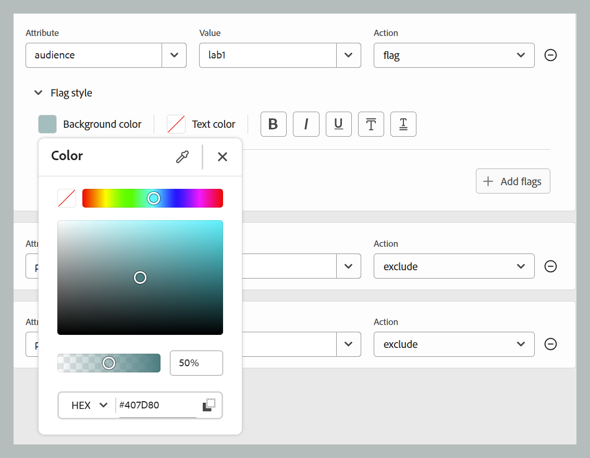
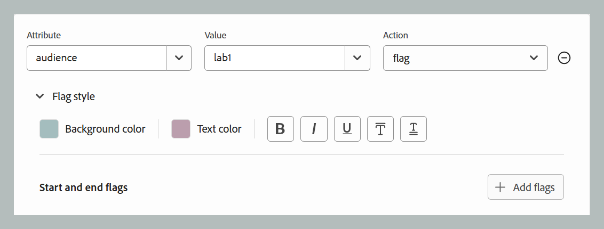

# DITAVAL editor {#ditaval-editor}

DITAVAL files are used to generate conditional output. In a single topic, you can add conditions using element attributes to conditionalize content. Then, you create a DITAVAL file wherein you specify the conditions that should be picked up to generate content, and which condition should be left out from the final output.

Adobe Experience Manager Guides allows you to easily create and edit DITAVAL files using the DITAVAL editor. The DITAVAL editor retrieves the attributes \(or tags\) defined in your system, and you can use them to create or edit DITAVAL files. For more details about creating and managing tags in Adobe Experience Manager, view [Administering Tags](https://experienceleague.adobe.com/docs/experience-manager-cloud-service/sites/authoring/features/tags.html?lang=en) section in Adobe Experience Manager documentation.

The following sections cover the options available for a DITAVAL file in Experience Manager Guides.

- [Create DITAVAL file](#create-ditaval-file)
- [Edit DITAVAL file](#edit-ditaval-file)
- [DITAVAl file editor views](#ditaval-editor-views)
- [Working with DITAVAL file in the Assets UI](#working-with-ditaval-files-in-the-assets-ui)

## Create DITAVAL file 

Perform the following steps to create a DITAVAL file:

1. In the Repository panel, select the **New file** icon and then select **Topic** from the dropdown menu. 

    {width="300" align="left"}

    You can also access this option from the [Experience Manager Guides Home page](./intro-home-page.md) and the options menu of a folder in the Repository view. 

2. The **New topic** dialog box is displayed.
    
3. In the **New topic** dialog box, provide the following details:
    - A Title for the topic.
    - \(Optional\)* The file name for the topic. The file name is auto-suggested based on the topic Title. In case your administrator has enabled automatic file names based on UUID setting, then you will not view the Name field.
    - A template on which the topic will be based. For a DITAVAL file, select **Ditaval** from the dropdown list.
    - Path where you want to save the topic file. By default, the path of currently selected folder in the repository is shown in the Path field.

    {width="300" align="left"}

    
4. Select **Create**. 
    
The topic is created at the specified path. Also, the topic is opened in the Editor for editing.

{align="left"}

## Edit DITAVAL file

When you create a DITAVAL topic, it opens in the Editor for editing. To edit an existing DITAVAL topic, navigate to the folder or map where the DITAVAL topic is located, and then select **Edit** from the **Options** menu.

The DITAVAL editor allows you to perform multiple tasks as listed below using the options in the Editor Toolbar.

### Editor Toolbar options

#### Menu dropdown

The Menu dropdown provides access to the editing actions, Find and replace, Version history, Version label, Merge, Create review task, Track changes, and Tags feature.
For more details, view [Menu dropdown options](./web-editor-toolbar.md#menu-dropdown)

#### Version information and Save as new version

The Version information & Save as new version feature combines version tracking and content saving into a single functionality.
For more details, view [Save as new version](./web-editor-toolbar.md#version-information-and-save-as-new-version)

#### Lock/unlock

Locks or unlocks the current file. Locking a file gives you an exclusive write access to the file. 
For more details, view [Lock unlock the file](./web-editor-toolbar.md#lockunlock)

#### Add Prop
    
Add a single property in your DITAVAL file.

{width="650" align="left"}

The first drop-down lists the allowed DITA attributes that you can use in the DITAVAL file. There are five attributes that are supported - `audience`, `platform`, `product`, `props`, and `otherprops`.

The second drop-down list shows the values configured for the selected attribute. Then, the next drop-down list shows the actions that you can configure on the selected attribute. The allowed values in the action drop-down are - `include`, `exclude`, `passthrough`, and `flag`. For more information about these values, view the definition of [prop](http://docs.oasis-open.org/dita/dita/v1.3/errata01/os/complete/part3-all-inclusive/langRef/ditaval/ditaval-prop.html#ditaval-prop) element in OASIS DITA documentation

#### Add All Props

If you want to add all conditional properties or attributes defined in your system with a single click, use the Add All Props feature.

>[!NOTE]
>
> If all defined conditional properties already exist in the DITAVAL file, you cannot add more properties. You get an error message in this scenario.

{width="650" align="left"}

#### Add Rev Prop

To add a specific revision number to a tag in XML, you can use use the Add rev prop option. This adds a rev attribute to the tag, with the value defined in the Value field along with the selected action for the property. This revision attribute can later be used to filter relevant XML content based on the specified revision number when generating the output.

{width="650" align="left"}

### Actions for property

There are majorly four actions available for a given property that can be used which are listed as follows:

**Include:** Include the content in output. This is the default behavior unless otherwise set.

**Exclude:** Exclude the content from output (if all values in the particular attribute are excluded).

**Passthrough:** Include the content in output, and preserve the attribute value as part of the output stream for further processing by a runtime engine, for example runtime filtering based on individual user settings.

**Add Flags:** To flag the content in the output, you can add flag as the action for a given attribute in the file. Additionally you can also add various Flag styles to it using the **Flag style** as mentioned below.

{width="650" align="left"}

   
- **Background Color**: Select the hue, saturation, contrast from the Background color. The corresponding HEX value will update automatically based on your selection. You can also switch the color space format using the dropdown to choose between HEX, RGB, and HSB.

{width="650" align="left"}

- **Text Color**: Select the hue, saturation, contrast from the Text  color. The corresponding HEX value will update automatically based on your selection. You can also switch the color space format using the dropdown to choose between HEX, RGB, and HSB.

{width="650" align="left"}

- **Styling options**: You can add some styling options as well to the flag like Bold. Italics, Underline, Overline, Double underline.

{width="650" align="left"}

- **Start and End Flags**: You can add images as start and end flags using the **Add Flag** button. To select images, use **Browse Assets** to pick from the Guides repository or **Add File** to upload from your local system. You can also provide alternate text for the images.

{width="650" align="left"}

- **Style conflict**: It resolves the conflicts that occur when a single element contains multiple properties with different Flag styles. In such cases, the value defined in the style conflict properties is selected, effectively acting as a default value picker for background and text colors.

{width="650" align="left"}

Once you have finished editing your DITAVAL file, select **Save**.

>[!NOTE]
>
> If you close the file without saving, the changes will be lost. If you do not wish to commit changes into Adobe Experience Manager repository, select **Close**, and then select **Close Without Saving** in the **Unsaved Changes** dialog.

## DITAVAL editor views 

Adobe Experience Manager Guides' DITAVAL editor supports viewing DITAVAL files in two different modes or views:

**Author**:   This is a typical What You See is What You Get \(WYSISYG\) view of the DITAVAL editor. You can add or remove properties using the simple user interface, which presents the properties, its values, and actions in drop-down list. In the Author view, you have the options to insert an individual property and insert all properties with a single click.

You can also find the version of the DITAVAL file that you are currently working on by hovering your pointer over the filename.

**Source**:   The Source view displays the underlying XML that makes up the DITAVAL file. In addition to making regular text edits in this view, an author can also add or edit properties using the Smart Catalog.

To invoke the Smart Catalog, place the cursor at the end of any property definition and enter "<". The editor will show a list of all valid XML elements that you can insert at that location.

## Working with DITAVAL files in the Assets UI

You can also create a DITAVAL file from the Assets UI. The steps to create a new DITAVAL topic are as follows:

1.  In the Assets UI, navigate to the location where you want to create the DITAVAL file.

1.  Select **Create** \> **DITA Topic**.

1.  On the Blueprint page, select DITAVAL file template and select **Next**.

1.  On the Properties page, specify the **Title** and **Name** for the DITAVAL file.

    >[!NOTE]
    >
    > The name is automatically suggested based on the Title of your file. If you want to manually specify the file name, then ensure that the Name does not contain any spaces, apostrophe, or braces and ends with .ditaval.

1.  Select **Create**. 

    The Topic Created message appears.

You can choose to open the DITAVAL file for editing in the DITAVAL editor, or the save the topic file in the Adobe Experience Manager repository.

Perform the following steps to edit an existing DITAVAL file:

1.  In the Assets UI, navigate to the DITAVAL file that you want to edit.

1.  To get an exclusive lock on the file, select the file and select **Check Out**.

1.  Select the file and select **Edit** to open the file in Adobe Experience Manager Guides DITAVAL editor.

