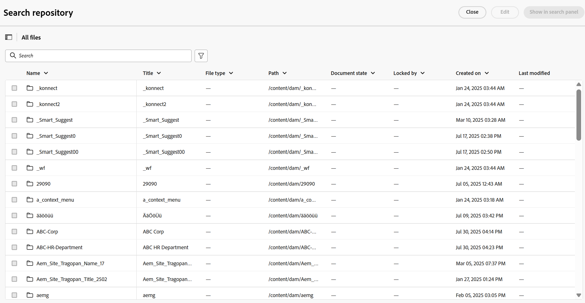
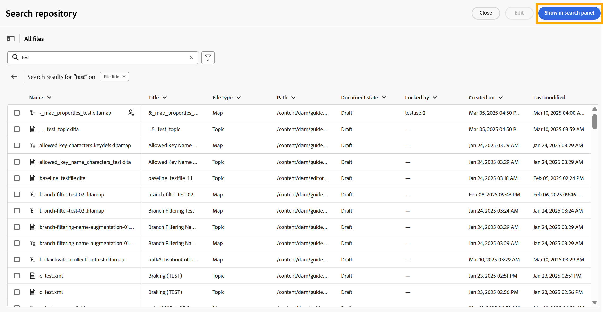
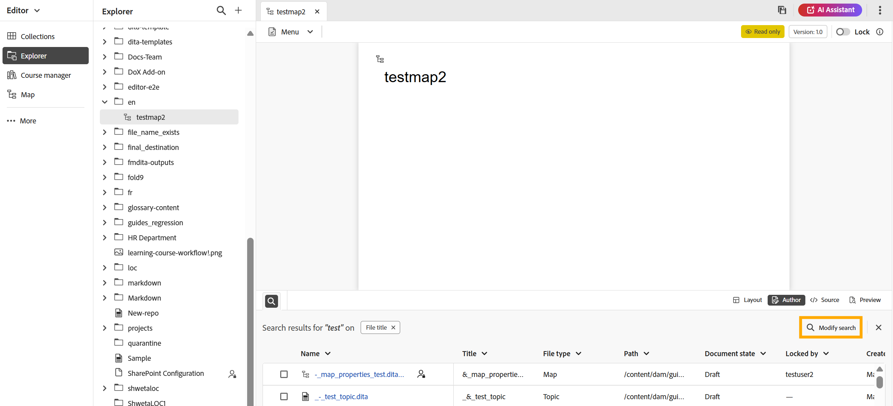

# Search panel

The Search panel in the Editor is a feature that enhances productivity by allowing quick access to relevant files and references while editing content. It helps streamline your workflow by enabling you to search, filter, and insert references without leaving the Editor interface. You can locate the Search panel at the bottom of the Editor. 

The Search panel can be accessed from two locations:

- **Home page** : Using the **Show in search panel** option when navigating from the Repository view on the Home page. For details view, [Search from the Repository view](#search-from-the-repository-view).

- **Editor interface**: Selecting the **Search icon** at the top of the Explorer panel. For details view, [Search from the Explorer panel](#search-from-the-explorer-panel).

## Key Benefits

- Centralized view of all search results for easy reference.
- Drag-and-drop functionality to insert references directly into your current topic.
- Flexible options to modify or refine searches without leaving the Editor.

## Search from the Repository view 

When you perform a search and apply filters in the Repository view on the Home page, selecting **Show in Search Panel** redirects you to the Editor interface. All your search results will be mirrored in the Search Panel at the bottom of the Editor interface.

You can easily drag and drop topics from the Search Panel into your current topic in the Editor to attach references. Also you can alter your search results by using **Modify search** option on the Search panel

{align="left"} 

## Search from the Explorer panel

When working in the Editor interface and you need to find relevant files:

1. Select the **Search** icon located at the top-right corner of the Explorer panel.
    This opens the **Search repository** dialog, which offers the same search and filtering experience as the Repository view on the Home page.

    {align="left"}

2. Perform your search and apply filters as needed. For detailed instructions on search and filter options, view [Search and filtering experience](./home-repository-view.md#search-and-filtering-experience).
3. Once your search is complete, select **Show in Search panel**. Your recent searches will then appear in the Search panel at the bottom of the Editor.

    {align="left"}    

4. Use the **Modify search** option on the Search panel to refine your results further.

    {align="left"}

    
    

