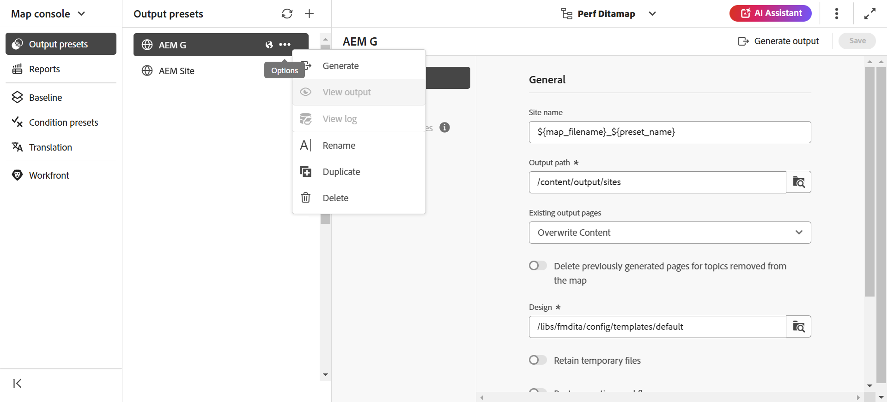
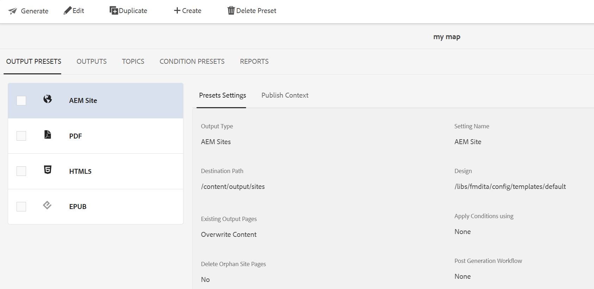

# Edit, duplicate, or remove an output preset {#id205BEH0K09Z}

You can manage output presets from the Map console and Map dashboard. Both ways, you get options to edit, duplicate, and remove an output preset as illustrated in the following section. 

## Using Map console 

You can edit the selected output preset by directly changing the required fields to the needed preset settings. 

Additionally, you can duplicate or delete an output preset using the **Options** dropdown menu as shown below.

{width="800" align="left"}

## Using Map dashboard

You can edit, duplicate and delete an output preset using the map dashboard by selecting the required tab from the top bar as shown below. 

{width="800" align="left"}

**Parent topic:**[Output generation](generate-output.md)
