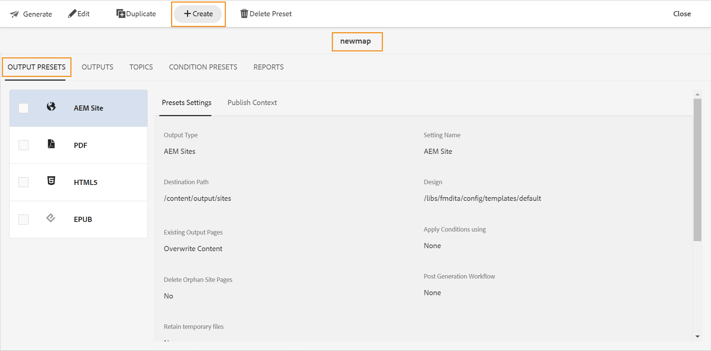

# Create, edit, duplicate, or remove an output preset {#id205BEH0K09Z}

You can create, configure, and manage output presets from the Map console and Map dashboard. Both ways, you get options to create, edit, duplicate, and remove an output preset. 

The following sections exaplain how to create or manage a preset from map console or map dashboard. 

- [Create a new output preset](#create-a-new-output-preset)
- [Edit an output preset](#edit-an-output-preset)
- [Duplicate an output preset](#duplicate-an-output-preset)
- [Delete an output preset](#delete-an-output-preset)   

## Create a new output preset 

Perform the following steps to create a custom output preset from the **Map console**:

1. [Open a DITA map file in the Map console](./open-files-map-console.md).
1. In the **Output presets** tab, select the + icon to create an output preset. 
1. Select the output type and enter the required details in the **New output preset** dialog box. 

    {width="300" align="left"}
   
   A new output preset is created. 
1. Configure the output preset, and then select **Save** to save the preset settings.

    {width="300" align="left"}

Perform the following steps to create a custom output preset from the **Map dashboard**:

1.  In the Assets UI, navigate to and select the DITA map to open it in map dashboard.
1.  Ensure that the **Output Presets** tab is selected.
1.  Select **Create** in the toolbar.

    {width="300" align="left"}

    A new output preset creation form is displayed.

1.  Enter the required details for the type of preset you want to create.
1.  Select **Done** to save the preset settings.

Learn how to create and configure a specific [ouput preset type](./generate-output-understand-presets.md#output-preset-types-supported-in-experience-manager-guides) in Experience Manager Guides. 

## Edit an output preset 

Perform the following steps to edit an existing output preset from the **Map console**:

1. [Open a DITA map file in the Map console](./open-files-map-console.md).
1. In the **Output presets** tab, navigate to and select the output preset that you want to edit. 

    An editable output preset fields are displayed with values of the selected output preset.
1. Change the required details.
1. Select **Save** to save the preset settings.

Perform the following steps to edit an existing output preset from the **Map dashboard**:

1.  In the Assets UI, navigate to and select the DITA map to open it in map dashboard.
1.  Ensure that the **Output Presets** tab is selected.
1.  Select the output preset that you want to edit, and then select **Edit** in the toolbar.

    An editable output preset form is displayed with values of the selected output preset.

1.  Change the required details.
1.  Select **Done** to save the edited preset settings.

## Duplicate an output preset 

Perform the following steps to duplicate an existing output preset from the **Map console**:

1. [Open a DITA map file in the Map console](./open-files-map-console.md).
1. In the **Output presets** tab, navigate to and hover over the output preset that you want to duplicate. 
1. Select the **Duplicate** option from the **Options** dropdown menu.

    {width="300" align="left"}
1. In the Duplicate preset dialog box, provide a new name to the preset and select **Add**. 

    A duplicate preset with a new name is added to the Output Presets list.

Perform the following steps to duplicate an existing output preset from the **Map dashboard**:

1.  In the Assets UI, navigate to and select the DITA map to open it in map dashboard.
1.  Ensure that the **Output Presets** tab is selected.
1.  Select the output preset that you want to duplicate, and then select **Duplicate** in the toolbar.

    An editable output preset form is displayed with values of the selected output preset.

1.  Change the required details.
1.  Select **Done** to save the preset settings.

## Delete an output preset 

Perform the following steps to delete an existing output preset from the **Map console**:

1. [Open a DITA map file in the Map console](./open-files-map-console.md).
1. In the **Output presets** tab, navigate to and hover over the output preset that you want to delete. 
1. Select the **Delete** option from the **Options** dropdown menu.

    {width="300" align="left"}
1. Select **Delete** on the confirmation prompt.

    The preset is removed from the Output Presets list.
    
Perform the following steps to delete an existing output preset from the **Map dashboard**:

1.  In the Assets UI, navigate to and select the DITA map to open it in map dashboard.
1.  Ensure that the **Output Presets** tab is selected.
1.  Select the output preset that you want to delete, and then select **Delete Preset** in the toolbar.
1.  Select **Delete** on the confirmation prompt.

    The preset is removed from the Output Presets list.

**Parent topic:**[Output generation](generate-output.md)
