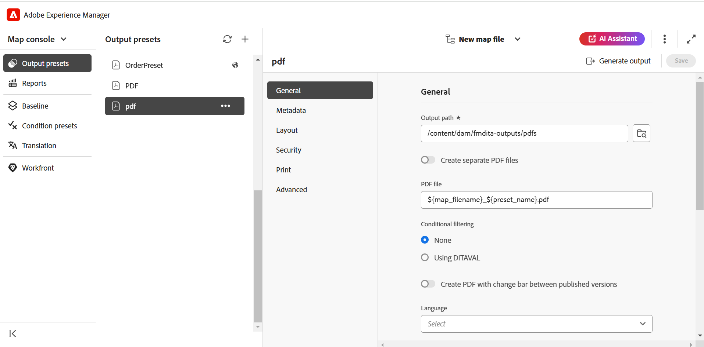
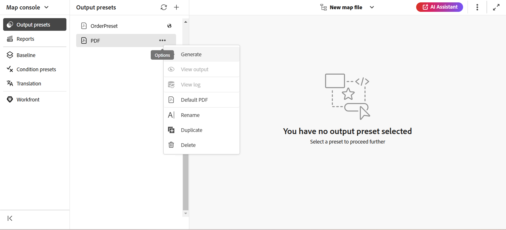

# Generate output  

There are two ways to generate ouput for a DITA map:

- [Generate output for a DITA map from the Map conosle](#generate-output-for-a-dita-map-from-the-map-console) 
- [Generate output for a DITA map from the Map dashboard](#generate-output-for-a-dita-map-from-the-map-dashboard)

## Generate output for a DITA map from the Map console 

Perform the following steps to generate output for a DITA map using Map conosle:

1. [Open a map file in the Map console](./open-files-map-console.md).
2. The DITA map console is displayed with the list of **Output presets** available to generate output.

3. Open the preset that you want to use for generating the output, and select **Generate output** to start the generation process.

    

    Or, hover over the preset and select **Generate** from the preset context menu.
    
    
    

Once the output generation is complete, select **View output** to view the output.  
    
A **Success** dialog box is visible at the lower-right corner of the screen.
    
If an output is not successful, the below error message is displayed.
    

    
To view the error log, select **Dismiss**, hover over the selected preset tab, and select **View log** from the preset context menu.

>[!NOTE]
>
> If your map uses a DITAVAL file, any flagged images referenced in the DITAVAL file are copied to a location related to the published map in the output.  Also, if you are using multiple DITAVAL files for filtering within the same map, ensure that you use unique `.ditaval` file names to avoid duplicate filename issues during publishing.

## Generate output for a DITA map from the Map dashboard 

Perform the following steps to generate output for a DITA map using Map dashboard:

1.  In the Assets UI, navigate to and select the DITA map file that you want to publish.

    The DITA map console appears with the list of Output Presets available to generate output.

1.  Select one or multiple Output Presets that you want to use for generating the output.

    

1.  Select the **Generate** icon to start the output generation process.

You can view the current status of the output generation request in the **Outputs** tab. For more information, view [View the status of the output generation task](./generate-output-manage-process.md#view-the-status-of-the-output-generation-task).

>[!IMPORTANT]
>
> If an output generation process for a preset is either in the queue or in progress, you cannot initiate another output generation task for the same preset.

You can also generate the AEM Sites output for one or more topics, or the entire DITA map from the Map console. For more details, view [Generate Knowledge Base output](web-editor-article-publishing.md#id218CK0U019I).

## Merging different topics within a DITA map using the `chunk` attribute

A DITA map can include different topic types such as reference, concept, and task. The `chunk=to-content` attribute allows you to merge these topics to generate a single page output on AEM Sites. However, to publish the merged topic properly, ensure that your Administrator has configured the correct XML catalog in the DITA Profiles. 

The system requires a Public ID with the `composite` keyword in the XML catalog to correctly identify and apply the appropriate DTD rule.
This configuration is included by default in the standard XML catalog. However, if you're using a custom XML catalog, ensure your Administrator has added this public ID to the configuration. Without it, the merged topic may not publish properly. 

For details on how to use Public ID and System ID in your custom DTDs/XSDs, view [Integrate DITA specialization](../cs-install-guide/dita-ot-specialization.md#integrate-dita-specialization-id211mb0e00xa).

**Parent topic:**[Output generation](generate-output.md)
