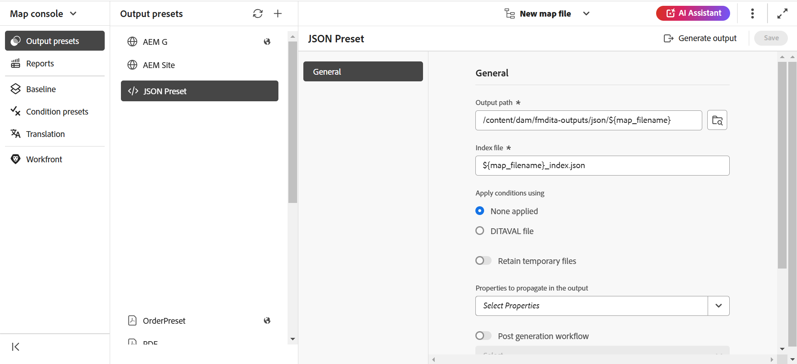

# JSON {#id231KK0180T4}

Perform the following steps to create the JSON preset from the Map console:

1. [Open a DITA map file in the Map console](./open-files-map-console.md). 

    You can also access the map file from the **Recent files** widget in the [Overview section](./intro-home-page.md#overview). The selected map file would open in Map console. 
1. In the **Output presets** tab, select the + icon to create an output preset. 
1. Select **JSON** from the Type dropdown in the **New output preset** dialog box. 
1. In the **Name** field, provide a name to this preset.
1. Select the **Add to current folder profile** option to create an output preset within the current folder profile. The  indicates a folder-profile-level preset.  

   Learn more about [Manage Global and Folder profile output presets](./web-editor-manage-output-presets.md).

 1. Select **Add**.   

    The JSON preset is created.

    {width="300" align="left"}

Once the preset is created, you can configure the following preset configurations that are available under the the General tab. 

-   Output path
-   Index file
-   Apply conditions using \(If the conditions are defined for a map\)
-   Use Baseline \(If a baseline is created for a map\)
-   Retain temporary files
-   Properties to propagate in the Output
-   Post generation workflow

For details, refer to [JSON configuration](#json-configuration).

{width="800" align="left"}

## JSON configuration

The following options are available for the JSON preset:

>[!NOTE]
>
> You can also edit the JSON file in the Editor.

| JSON options | Description |
| --- | --- |
| Output path | The path within your AEM repository where the JSON output is stored. |
| Index file | You can give a name for the index file you're creating for the JSON output. By default, it picks the DITA map's file name and adds a suffix (like `map_filename_index.json`).  You can also use variables while setting the Index File. For more details about using variables, view [Use variables for setting the Destination Path, Site Name, or File Name options](generate-output-use-variables.md#id18BUG70K05Z). |
| Apply conditions using | Select one of the following options:  * **None applied**: Select this option if you do not want to apply any condition on the published output. * **DITAVAL file**: Select DITAVAL file(s) to generate personalized content. You can select multiple DITAVAL files using the browse dialog or by typing file path. Use the cross icon near the file name to remove it. DITAVAL files are evaluated in the order specified, so the conditions specified in the first file take precedence over the matching conditions specified in later files. You can maintain the file order by adding or deleting files. If the DITAVAL file is moved to some other location or is deleted, it is not automatically deleted from the map dashboard. You need to update the location in case files are moved or deleted. You can hover over the file name to view the path in the AEM repository where the file is stored. You can only select DITAVAL files and an error is displayed if you have selected any other file type. * **Condition preset**: Select a condition preset from the drop-down to apply a condition while publishing the output. The option is visible if you have added a condition present in the Condition Presets tab of the DITA map console. To know more about condition preset, view [Use condition presets](generate-output-use-condition-presets.md#id1825FL004PN). |
| Use Baseline | If you have created a Baseline for the selected DITA map, select this option to specify the version that you want to publish.  View [Work with Baseline](generate-output-use-baseline-for-publishing.md#id1825FI0J0PF) for more detail. |
| Retain temporary files | Select this option to retain the temporary files generated by DITA-OT. If you are experiencing errors while generating output through DITA-OT, select this option to retain the temporary files. You can then use those files to troubleshoot output generation errors.     After generating the output, select the **Download temporary files**  icon to download the ZIP folder containing the temporary files.    **Note**:  If file properties are added during generation, the output temporary files also include a *metadata.xml* file containing those properties. | 
| Properties to propagate in the Output | Select the properties that you want to process as metadata. These properties are set from the Properties page of the DITA map or bookmap file. The properties that you select from the drop-down list are listed below the Properties field.  **Note**: You can also define custom properties and pass on the metadata to the output using DITA-OT publishing. For more details view, [Work with metadata](metadata-dita.md#id21BJ00QD0XA). |
| Post generation workflow | When you choose this option, a new Post Generation Workflow drop-down list is displayed containing all workflows configured in AEM. You must select a workflow that you want to execute after completion of the output generation workflow.  **Note**: For more information about creating a custom post-output generation workflow, view _Customize post-output generation workflow_ in the Install and configure Adobe Experience Manager Guides as a Cloud Service guide. |

**Parent topic:**[Understanding the output presets](generate-output-understand-presets.md)
