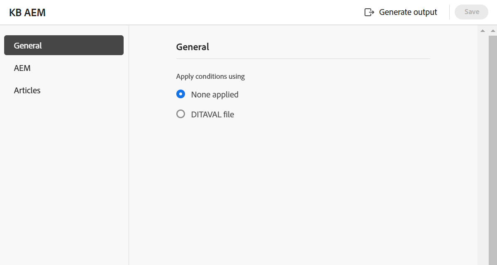

# Knowledge Base {#knowledge-base}

Perform the following steps to create the **Knowledge Base** preset from the Map console:

1. [Open a DITA map file in the Map console](./open-files-map-console.md). 

    You can also access the map file from the **Recent files** widget in the [Overview section](./intro-home-page.md#overview). The selected map file would open in Map console. 
1. In the **Output presets** tab, select the + icon to create an output preset. 
1. Select **Knowledge Base** from the Type dropdown in the **New output preset** dialog box. 
1. In the **Target** field, select a target for the generated output. The available options are; **Adobe Experience Manager**, **Salesforce**, and **ServiceNow**.

    {width="350" align="left"}

1. Select the **Add to current folder profile** option to create an output preset within the current folder profile. The  indicates a folder-profile-level preset.  

   Learn more about [Manage Global and Folder profile output presets](./web-editor-manage-output-presets.md).

 1. Select **Add**.   

    The preset for Knowledge Base is created.

## Knowledge Base configuration{#knowledge-base-configuration}

The Knowledge Base preset configuration options are organized under the **General**, **Articles**, and the selected target (**AEM**/ **ServiceNow**/ **Salesforce**) tabs. 

{width="550" align="left"}

### General

The following configuration options are available under the **General** tab:

| Knowledge Base options | Description |
| --- | --- |
| Apply conditions using | Select one of the following options:  * **None applied**: Select this option if you don't want to apply any condition on the published output. * **DITAVAL file**: Select DITAVAL file(s) to generate personalized content. You can select multiple DITAVAL files using the browse dialog or by typing the file path. Use the cross icon near the file name to remove it. DITAVAL files are evaluated in the order specified, so the conditions specified in the first file take precedence over the matching conditions specified in later files. You can maintain the file order by adding or deleting files. If the DITAVAL file is moved to another location or deleted, it's not automatically deleted from the preset. You need to update the location in case files are moved or deleted. You can hover over the file name to view the path in the Adobe Experience Manager repository where the file is stored. You can only select DITAVAL files, and an error is displayed if you select any other file type. * **Condition preset**: Select a condition preset from the dropdown to apply a condition while publishing the output. The option is visible if you have added a condition present in the Condition Presets tab of the DITA map console. To know more about condition presets, view [Use condition presets](generate-output-use-condition-presets.md#id1825FL004PN). |
| Use Baseline | If you have created a Baseline for the selected DITA map, select this option to specify the version that you want to publish.  View [Work with Baseline](generate-output-use-baseline-for-publishing.md#id1825FI0J0PF) for more details. |
| Post Generation Workflow | When you choose this option, a new Post Generation Workflow drop-down list containing all workflows configured in Adobe Experience Manager is displayed. You must select a workflow you want to execute after the output generation is complete.  **Note**: Learn more about how to [customize post-output generation workflow](../cs-install-guide/customize-workflows.md#id17A6GI004Y4) section in the Installation and Configuration Guide for Cloud Services. |

### Articles

This tab displays the tree or hierarchical view of the map. Choose the topics you want to publish to a knowledge base. Expand a TOC node and choose the topics that you want to publish. 

### Target - Adobe Experience Manager/ServiceNow/Salesforce

The configuration options change based on the target that you select.

**Adobe Experience Manager**

The following configuration options are displayed for **Adobe Experience Manager** as target:

>[!NOTE]
>
>You can use Adobe Experience Manager Knowledge Base preset only if your administrator has configured it. 

| Adobe Experience Manager options | Description |
| --- | --- |
|Use article path|Select this option to view the **Article path** of the folder that contains the Knowledge Base templates.|
| Article Path| This field appears if you select the option **Use article path**. Browse to select the  Knowledge Base Site within your Adobe Experience Manager repository where the output is stored. |
|Site| Use this field to select the required Adobe Experience Manager Knowledge Base. You can configure knowledge bases in the Adobe Experience Manager site to store the content based on the permissions. The articles from this DITA map can be published to these knowledge bases.  |
|Category| Select a category from the dropdown to publish the topics of the TOC  in that category on the Adobe Expereince Manager site. |
|Section Template and Article Template| These are the structural components used to organize the content of your output. These are predefined in the Adobe Experience Manager Site template. |
| Post Generation Workflow | When you choose this option, a new Post Generation Workflow dropdown list containing all workflows configured in Adobe Experience Manager  is displayed . You must select a workflow that you want to execute after completion of the output generation workflow. Learn more about how to [customize post-output generation workflow](../install-guide/customize-workflows.md#id17A6GI004Y4) section in the Installation and Configuration Guide. |

>[!TIP]
> 
>Select the **Refresh** icon to populate the respective templates in the fields as per the Knowledge Base template that you have selected.

**ServiceNow**

The following configuration options are displayed for **ServiceNow** as target:

| ServiceNow  options | Description |
| --- | --- |
| Publish Profile | Use the dropdown to select from the ServiceNow connection profiles your administrator configures. To learn more about how your administrator can create a publish profile, view the **Editor Settings** feature description in the [Left Panel](./web-editor-features.md#id2051EA0M0HS) section. |
|Knowledge Base|Use this field to select the required ServiceNow Knowledge Base. You can configure knowledge bases in the ServiceNow site to store the content based on the permissions. The articles from this DITA map can be published to these knowledge bases. |
|Category and Sub-category|Categories are like hierarchical trees used to find and classify ServiceNow Knowledge Base articles. Add a category and sub-category to publish the topics and sub-topics of the TOC to that category and sub-category on the ServiceNow site.|

**Salesforce**

The following configuration options are displayed for **Salesforce** as target:

| Salesforce  options | Description |
| --- | --- |
| Publish Profile | Use the drop-down to select from the Salesforce connection profiles your administrator configures. To learn more about how your administrator can create a publish profile, view the **Settings** feature description in the [Tab bar](./web-editor-features.md#tab-bar) section. |
|Record Type| Use the dropdown to select among the record types set up in Salesforce as per the visibility settings based on your user profile. Salesforce Record Types are a way of grouping many records of one type for that object. They define how your publication is organized. For example, you can select FAQ Record Type and publish as per the FAQ page layout and fields.|
|Article Content Field|You can have different fields and a unique layout for each record type template. Use these fields to enter specific information depending on the type of article. For example, you can view a FAQ article's title, answer, and equation.|
|Categories| Select a category from the dropdown to publish the topics of the TOC  in that category on the Salesforce site.|

**Some more options**

You can also view the following options in the Salesforce and ServiceNow presets:

| Options | Description |
| --- | --- |
|Remove the topic heading from the article body.|Select this option to remove the topic heading from the article in the published output. |
|Upload as draft | Select this option to upload the topic to share it as a draft before making it available to the users.|
|Upload images| Select this option if you want any images in topics to be included in the published output.|
|Upload linked documents| Select this option to include the documents linked in topics in the published output.|     

**Parent topic:** [Understanding the output presets](generate-output-understand-presets.md)
