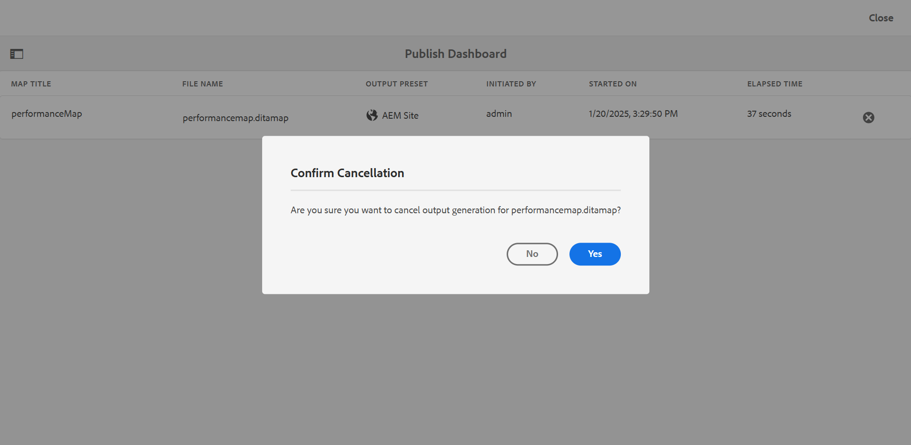

# Manage output generation process

Adobe Experience Manager Guides allows you to perform the following actions on the generated output:

- [View the status of the output generation task](#view-the-status-of-the-output-generation-task) 
- [Cancel an output generation task](#cancel-an-output-generation-task)
- [Delete an output task](#delete-an-output-task)

## View the status of the output generation task 

Once you initiate the output generation task for a map or regenerate selected topics, Experience Manager Guides sends this task to the output generation queue. This queue is updated in real time, showing the status of each output generation task in the queue.

1.  In the Assets UI, navigate to and open the map file for which you want to check the output generation status.

1.  Select **OUTPUTS**.

    {width="800" align="left"}

    The Outputs page is divided into two parts:

    -   **Queued Outputs:**

        Lists the outputs that are either waiting to be generated or are under generation process. The queued or in progress tasks are shown with a blue color icon before the preset name. You can also find the output generation setting or preset used for the queued task, the type, user who initiated the task, time since when the task is queued, and the current status.

        Select the link to access the **Publish Dashboard** and view the current running status. A list of all active publishing tasks is available in the Publish Dashboard. The **Queued Outputs** and the **Publish Dashboard**link are displayed only when there are outputs that are either waiting to be generated or are under generation process. They don't appear when the output tasks have been completed.For more details on Publish Dashboard, view [Manage publish tasks using the Publish Dashboard](generate-output-publish-dashboard.md#).

    -   **Generated Outputs**

        Lists the output tasks that have been completed. Again, the information shown here is similar to the Queued Outputs section with a few differences. You have new set of information in the form of output result icon and the output generation time.

        In this list, you could have tasks that have executed successfully, tasks that have executed with message, or failed tasks. The successful tasks are shown with green color icon, the tasks with a message have an orange color icon, and the failed tasks are shown with red color icon.

        For all the tasks, the publishing process creates a log file \(logs.txt\) that can be accessed by selecting the link in the Generated At column. For tasks that have failed or have messages, you can check the log file, which is explained in the section [View and check the log file](generate-output-basic-troubleshooting.md#id1822G0P0CHS).

        >[!NOTE]
        >
        > When you select the link of the generated PDF output, you are asked to download the PDF. 

## Cancel an output generation task 

Experience Manager Guides gives publishers a simple and easy way to cancel any ongoing publishing task. As a publisher, you can cancel an ongoing publishing task from the DITA map console or the [Publish Dashboard](generate-output-publish-dashboard.md#).

Perform the following steps to cancel an output generation task from the DITA map console:

1.  In the Assets UI, navigate to and open the map file for which you want to cancel an ongoing output generation task.

1.  Select **OUTPUTS**.

1.  In the **Queued Outputs** list, hover the pointer over a task that you want to cancel.

1.  Select the **Cancel This Job** icon.

    {width="800" align="left"}

1.  Select **Yes** on the **Confirm Cancellation** message prompt.

    {width="800" align="left"}

    If the task has not yet started, the cancel command is executed on the task. For a task that is being canceled, the Status is set to Canceling.

    Once the task is successfully canceled, it is moved to the **Generated Outputs** list with a **Cancelled** status. When you hover over the canceled task, it shows the name of the user who has canceled the task. In the following screenshot, the *HTML5* task is canceled.

    {width="800" align="left"}

## Delete an output task 

When you generate multiple outputs for a DITA map, over a period of time the Generated Outputs list for such a map becomes very long. As a publisher you can clean the output history of any map file by removing the outdated tasks from the *Generated Outputs* list. Note that the output is not removed from the system, only the entry of the generated output is removed from the *Generated Outputs* list.

Perform the following steps to remove an output task from the Generated Output list:

1.  In the Assets UI, navigate to and open the map file from which you want to delete the tasks.

1.  Select **OUTPUTS**.

1.  In the **Generated Outputs** list, hover the pointer over a task that you want to delete.

1.  Select the delete icon.

    {width="800" align="left"}

1.  Select **Yes** on the **Confirm Delete** message prompt.

    The task is deleted from the Generated Outputs list.
