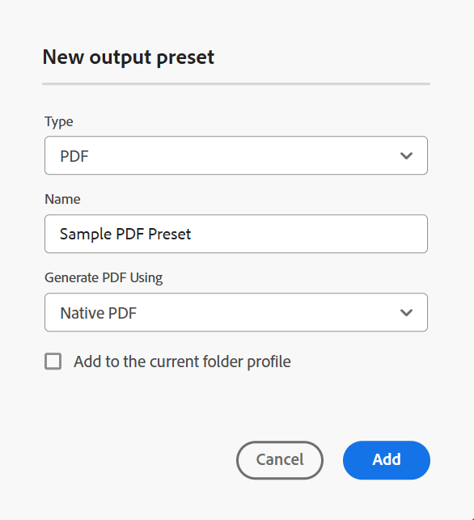
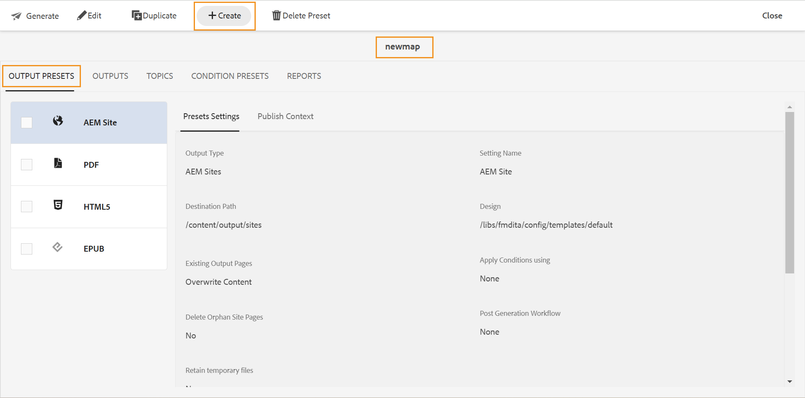

# PDF {#id205BE600HAH}

You can create the PDF preset in two ways:

- [From the Map console](#from-the-map-console)
- [From the Map dashboard](#from-the-map-dashboard) 

## From the Map console

Perform the following steps to create the PDF preset from the map console:

1. [Open a DITA map file in the Map console](./open-files-map-console.md). 

    You can also access the map file from the **Recent files** widget in the [Overview section](./intro-home-page.md#overview). The selected map file would open in Map console. 
1. In the **Output presets** tab, select the + icon to create an output preset. 
1. Select **PDF** from the Type dropdown in the **New output preset** dialog box. 
1. In the **Name** field, provide a name to this preset.
1. In the **Generate PDF Using** field, select a method to generate PDF. The available options are; DITA-OT, Native PDF, or FMPS \(if your system administrator has configured it\).  
1. Select the **Add to current folder profile** option to create an output preset for the current folder profile.  icon indicates a folder profile level preset.  

   Learn more about [Manage Global and Folder Profile output presets](./web-editor-manage-output-presets.md).

 1. Select **Add**.   

    The preset for PDF is created.

    {width="350" align="left"}

### PDF configuration in Map console

For Native PDF Output configuration, view [Publish PDF output](../web-editor/native-pdf-web-editor.md).

For the DITA-OT output, the preset configuration have been organized under General and Advanced tabs:

{width="350" align="left"}

**General**

The **General** tab contains the following configurations:

-   Output Path
-   DITA-OT Command Line Arguments
-   Transformation Name
-   PDF Filename
-   Apply Conditions Using \(If the conditions are defined for a map\)
-   Use Baseline \(If a baseline is created for a map\)
-   Post Generation Workflow

**Advanced**

The Advanced tab contains the following configurations:

-   Enable Versioning
-   Retain temporary files

For details, view [PDF configuration](#pdf-configuration).

## From the map dashboard

Perform the following steps to create the PDF preset from the map dashboard:

1. In the Assets UI, navigate to and select the DITA map to open it in map dashboard.
1. Ensure that the **Output Presets** tab is selected.
1. Select **Create** in the toolbar.

    {width="300" align="left"}

    A new output preset creation form is displayed.

1.  Enter the required configuration details for the PDF preset. 
1.  Select **Done** to save the preset settings.

## PDF configuration

The following options are available for the PDF output:

| PDF options | Description |
| --- | --- |
| Output Type | The type of output you want to generate. To generate PDF output, choose the PDF option. |
| Setting Name | Give a descriptive name for the PDF output settings you are creating. For example, you can specify _Internal customers output_ or _end-users output_. |
| DITA-OT Command Line Arguments | Specify the additional arguments that you want DITA-OT to process while generating output. For details about the command-line arguments supported in DITA-OT, see [DITA-OT documentation](https://www.dita-ot.org/). |
| Apply conditions using | Select one of the following options:  * **None applied**: Select this option if you do not want to apply any condition on the published output. * **DITAVal file**: Select DITAVal file(s) to generate personalized content. You can select multiple DITAVal files using the browse dialog or by typing file path. Use the cross icon near the file name to remove it. DITAVal files are evaluated in the order specified, so the conditions specified in the first file take precedence over the matching conditions specified in later files. You can maintain the file order by adding or deleting files. If the DITAVal file is moved to some other location or is deleted, it is not automatically deleted from the map dashboard. You need to update the location in case files are moved or deleted. You can hover over the file name to see the path in the AEM repository where the file is stored. You can only select DITAVal files and an error is displayed if you have selected any other file type. FrameMaker Publishing Server doesn't support multiple DITAVAL files. * **Condition preset**: Select a condition preset from the drop-down to apply a condition while publishing the output. The option is visible if you have added a condition present in the Condition Presets tab of the DITA map console. To know more about condition preset, see [Use condition presets](generate-output-use-condition-presets.md#id1825FL004PN). |
| Generate PDF Using | Select DITA-OT to generate the PDF. |
| Run Post Generation Workflow | When you choose this option, a new Post Generation Workflow drop-down list is displayed containing all workflows configured in AEM. You must select a workflow that you want to execute after completion of the output generation workflow.  **Note**: For more information about creating a custom post-output generation workflow, see Customize post-output generation workflow in Install and configure Adobe Experience Manager Guides as a Cloud Service. |
| Transformation Name | Specify the type of output you want to generate. This is required if you want to generate output using your own custom plug-in, which is integrated in the DITA-OT plug-in. For example, if you want to generate XHTML output, specify `xhtml`. For a list of transformations available in DITA-OT, see [DITA-OT transformations (output formats)](http://www.dita-ot.org/2.3/user-guide/AvailableTransforms.html) in OASIS DITA-OT User Guide. |
| File Name | Specify the file name with which you want to save the PDF.  You can also use variables while setting the PDF File Name. For more details about using variables, see [Use variables for setting the Destination Path, Site Name, or File Name options](generate-output-use-variables.md#id18BUG70K05Z).  **Note**: If you do not provide a file name, then the DITA map's title is used to generate the final PDF's file name. If the map does not have a title, then the DITA map's file name is used to name is the final PDF. The file name is sanitized using the rules configured in the system to handle any invalid character. |
| Destination Path | The path within your AEM repository where the PDF is stored.  You can also use variables while setting the Destination Path. For more details about using variables, see [Use variables for setting the Destination Path, Site Name, or File Name options](generate-output-use-variables.md#id18BUG70K05Z). |
| Retain temporary files | Select this option to retain the temporary files generated by DITA-OT. If you are experiencing errors while generating output through DITA-OT, select this option to retain the temporary files. You can then use those files to troubleshoot output generation errors.     After generating the output, select the **Download temporary files**  icon to download the ZIP folder containing the temporary files.    **Note**:  If file properties are added during generation, the output temporary files also include a *metadata.xml* file containing those properties.| 
| Use Baseline | If you have created a Baseline for the selected DITA map, select this option to specify the version that you want to publish.  See [Work with Baseline](generate-output-use-baseline-for-publishing.md#id1825FI0J0PF) for more detail. |
| File Properties | Select the properties that you want to process as metadata. These properties are set from the Properties page of the DITA map or bookmap file. The properties you select from the dropdown list appear under the **File Properties** field. Select the cross icon next to the property to remove it.   Note: You can also pass on the metadata to the output using DITA-OT publishing. For more details see, [Pass on the metadata to the output using DITA-OT](pass-metadata-dita-ot.md#id21BJ00QD0XA). |

**Parent topic:**[Understanding the output presets](generate-output-understand-presets.md)
