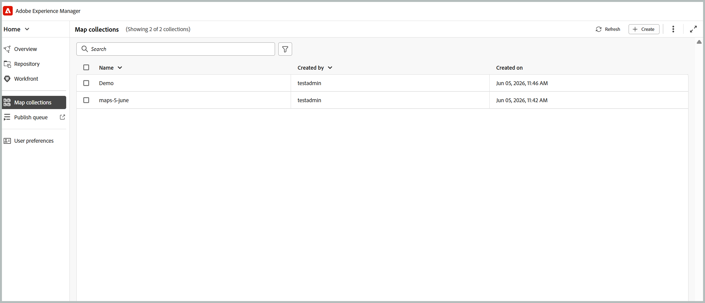
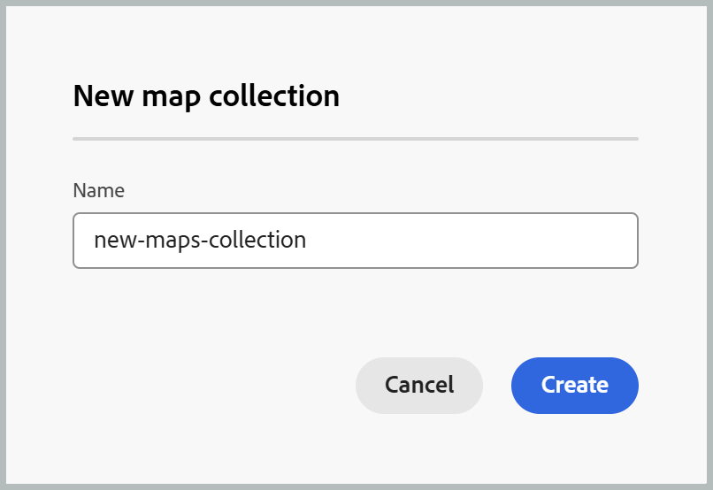

# Use New Map Collection for output generation (Beta){#id1723F20G0HS}

>[!IMPORTANT]
>
>New map collections is available in Experience Manager Guides as a Cloud Service starting with 2026.06.0 release. Contact your Customer Success team to enable this feature.

Map collection in Adobe Experience Manager Guides enables publishing specialists to organize multiple documents into a single collection, control the output generated for each document, and efficiently generate and publish outputs in batches from a centralized dashboard. It also provides visibility into output generation progress and highlights changes made to maps since their last published output, allowing you to review updates and republish content when needed. 

The New map collection (Beta) consolidates the functionality previously spread across the legacy Map Collection, and Bulk Publishing into a single unified interface. Once the beta feature flag is enabled, you can manage maps, presets, generation history, publishing history, metadata, and collection membership from one location.

## Create a map collection and add DITA maps 

To create a map collection and add maps to them, perform the following steps:

1.  Open the [Experience Manager Guides Home page](./intro-home-page.md#map-collections) and select **New Map collections**. 

    The **Map Collections** page opens.

    {width="350"}

    
1.  On the **Map Collections** page, select **Create** on the top-right, and provide a **Name** for your new map collection.

    {width="350"}

1.  Select **Create**.

    A Success message is displayed on creation of the map collection.

1. Open the desired map collection. 

    

    While hovering over the map collection title, you can perform the following actions:

    - Generate history: Navigates you directly to the Generated history tab listing all the maps with generated outputs for the defined presets.
    - Publish history: Navigates you directly to the Published history tab listing all the maps with published output for the defined presets.
    - Remame: Reanames the map collection.

1.  Select **Edit collection** and then select **Add Maps**.

    

1.  Select the map and enable the **Select available translations** toggle to automatically add all available translation copies of that map to the map collection.

    

1.  Select **Add**.

    The DITA map files listed along with all the translated copies.

    

1. Select all the maps listed and select **Fetch Presets**.

    You will see a list of all available presets for the selected maps, grouped under two categories: **Folder profile presets** and **Other presets**. **Folder profile presets** are common to all the selected maps, while **Other presets** are specific to individual maps. For presets under **Other presets**, the associated map is indicated next to the corresponding toggle.

    

1. Select **Enable all presets** or **Enable all folder profile presets**, depending on your requirement. You can also use the Filter icon on the right to narrow down the list. The filter provides two levels of filtering: **Preset types** and **Map status**.

    

1. Select **Save**.

You get a list of all the desired maps and presets.

The **Maps and Presets** tab presents information on the baseis on the selected maps for specific language in the following columns:
    
-  **Preset**: Shows the output preset type configured on the map file.
- **Baseline**: Shows the baseline which is used by the output preset.  If no baseline is used, then it shows a hyphen '-' 
- **Modified since generation**: Indicates if the DITA map is updated after generation. Based on this information, you can decide if you want to publish the output for this DITA map or not.
- **Modified since published**: Indicates if the DITA map is updated after last publising. Based on this information, you can decide if you want to republish the output for this DITA map or not.
- **Last Generated**: Shows the date and time of the last generated output.    
- **Last published**: Shows the date and time of the last generated output. 

**Filtering options**

The following filtering options are available in the right panel on the Maps and presets page:

- **Modified since generation**: You can select Yes, No or Not yet generated. If you select yes, only the maps that have been modified since generation will be shown in the Maps and Presets tab.
- **Modified since publishing**: You can select Yes, No or Not yet generated. If you select yes, only the maps that have been modified since publishing will be shown in the Maps and Presets tab.
- **Presets**: Select a preset for which you want to filter out the map files. For example, if you choose *AEM Site* preset, then only those maps are shown that have the *AEM Site* output preset configured on them.
- **Language**: You can select any of the available language codes and display only the selected language in the Maps and Presets tab.

    

## Generate the output using a Map Collection 

To generate the output using a Map Collection, perform the following steps:

1. Open the Map Collection. You can view the various output presets like the AEM Sites, PDF (including Native PDF),  HTML5, EPUB, and Custom presets as per your configuration. 
    
1. To generate output for the selected maps, select the required map files and the specifc presets, and then select **Generate**.

    >[!IMPORTANT]
    >
    > If an output generation process for a preset or DITA map is either in the queue or in progress, you cannot initiate another output generation task for the same preset or map.

1. Once the output has been generated, switch to the **Generated history** tab to view the list of all generated maps. You can track the generation progress in the **Status** column, which indicates whether a generation is Executing or Finished. 

    

1. Select Refresh to view the latest status of the generation process. The Status column is updated to reflect the current state of each map and its associated presets:

    - Finished (Green): Generation completed successfully.
    - Finished (Red):Generation completed with errors. Error details can be viewed in the logs.
    - Executing (Blue):Generation is currently in progress.

    

1. You can also cancel the output generation task till the ststus of the task is executing by selecting the **Cancel generation** icon.  

    

1. Additionally, you can view the generated output for maps whose output generation has been completed by selecting the **Open Output** icon that appears when you hover over the map name, or view the generation logs by selecting the adjacent **Logs** icon.

    

## Publish the output using a Map Collection   

To publish the output using a Map Collection, perform the following steps:

1. Select the desired maps from the Maps and Presets tab or the Generated History tab and select **Publish to**.
1. Select the target environment where you want to publish the output: **Preview** or **Publish** instance.
1. Switch to the **Published history** tab to monitor the status of the publishing task.

     

1. Select **Refresh** to view the latest status of the task.
1. Once the status changes to **Successful**, verify the published content in the selected target instance.

## Configure the metadata properties

In the map collection, you can configure the metadata properties in bulk for the DITA maps. Select **Configure Metadata** icon from the **Maps and presets** tab to open the **Asset Metadata** page. On the **Asset Metadata** page, all the maps present in the collection are listed on the left. 

Perform the following steps to configure the metadata properties:

1. You can choose the maps you wish to update the metadata for. By default, all the DITA maps present are selected. 

1. Once you select the DITA maps, you can view properties like metadata, schedule (de)activation, references, document state, and more.

1. Update the metadata properties.  

1. Select **Save & Close** on the top to save the updates.
1. (Optional) When you update the tags, you can also select Append in the **Save & Close** dropdown to append the new tags to the existing list.
1. Select **Submit** from the **Save & Close** dropdown.
The metadata properties are updated for the DITA maps you select in bulk from the map collection.

>[!NOTE]
> 
>For the **Document State** dropdown, you can select only those document states that are allowed in common for all the selected DITA maps. To learn more, view [**Document State**](./web-editor-document-states.md).

The metadata properties are in sync with the file properties. Once you update them, you can view them from the **File Properties** panel in the Editor. 

**Parent topic:**[Output generation](generate-output.md)
