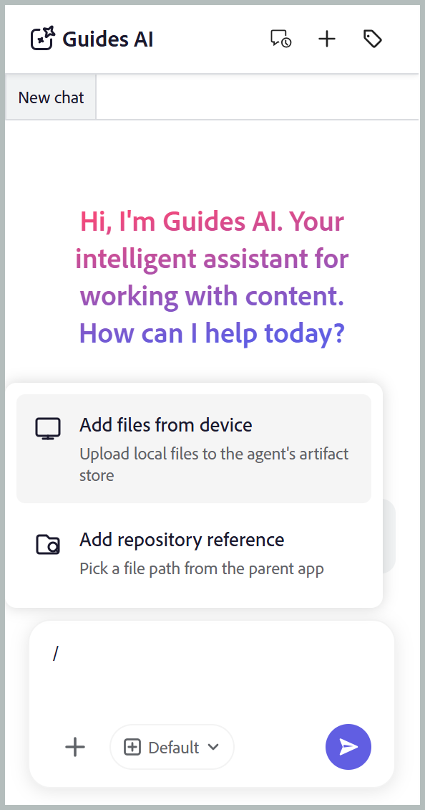
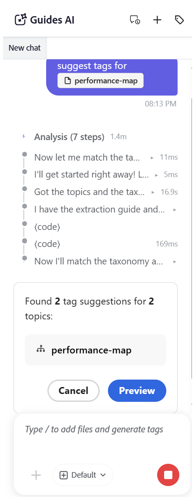
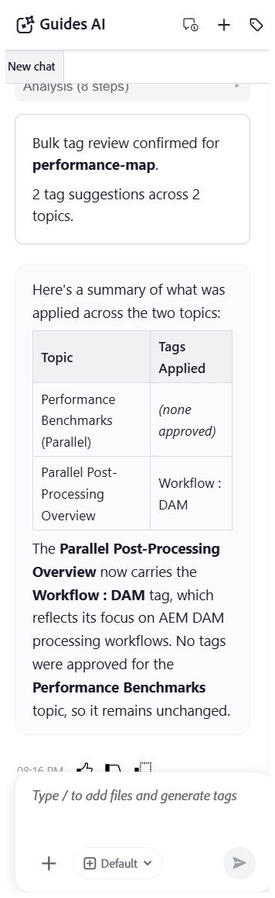

# Get started with Guides AI

>[!NOTE]
>
> Guides AI is available in Experience Manager Guides as a Cloud Service starting with 2026.08.0 release. Contact your Customer Success team to enable this feature.

Guides AI makes tagging your content faster, easier, and more consistent. Instead of manually reading through your content and deciding which tags to apply, Guides AI analyzes the content for you and recommends relevant tags based on your organization's taxonomy. You stay in control by reviewing and applying the suggested tags, while significantly reducing manual effort, improving tagging accuracy, and ensuring consistent metadata across your documentation.

## Guides AI panel

The Guides AI panel provides all the tools you need to generate, review, and apply AI suggested tags. 

{width="650"}

The following components of Guides AI help you add files, configure tag recommendations, and manage your tagging workflow: 

- **(A)** Conversation history: View and reopen previous conversations to review earlier tag recommendations and actions.
- **(B)** New chat: Start a new tagging session for a different topic, map, or set of files.
- **(C)** Tag namespace: Select the taxonomy namespaces from where Guides AI should generate tag recommendations. Only tags from the selected namespaces are considered.
- **(D)** Response space: Review AI-generated tag recommendations and choose to accept, reject, or modify them before applying the tags.
- **(E)** Prompt space: Enter a prmpt request to generate tag recommendations for the selected content.
- **(F)** Attach files or add context: Add topics, maps, or external files from your local system to provide the content that Guides AI should analyze for tag recommendations.
- **(G)** Model: Displays the AI model that will be used to analyze the content and generate tag recommendations.
- **(H)** Send: Submit your prompt and attached content to generate AI-powered tag recommendations.

## 	Generate AI suggested tags for a topic

Perform the following steps to use Guides AI for tagging files: 

1. Log in to Experience Manager Guides.
1. On the Home page, select **Guides AI** from the Tab bar. Ensure that the Guides AI feature is enabled by your administrator. 
1. Add the topic for which you want to generate tag recommendations using one of the following methods:

    - **Using Suggested prompts**: For the first chat in the Response area, select **Suggest tags for the file** prompt. The prompt is automatically added to the Prompt space. Select `[file]`, then choose the file from the Repository or a Collection in the **Select file** dialog.

        {width="650"}

    - **Drag and drop**: Drag and drop a topic into the Prompt space, and type the prompt *Suggest tags for this file*.

        {width="650"}

    - **Using shortcut**: 
        - Type `/` in the Prompt space.
        - Select either **Add file from device** or **Add repository reference** to select the topic from local system or Guides Repository respectively.

            {width="650"}

        - When choosing from **Add repository reference**, select the topic from the Select dialog.   

               {width="650"} 

        - Type the prompt *Suggest tags for this file*.        

1. Select **Send**.        

1. Guides AI analyzes the content of the topic and generates tag recommendations.

    {width="650"}

1. Review the suggested tags. **Accept** the recommendations to apply them, or **Reject** them if they are not required.

    >[!NOTE]
    >
    > For topics that already contain tags, Guides AI displays the existing tags. These tags are read-only and cannot be modified or removed.

    {width="650"}

After you complete the review, Guides AI displays a summary of the tags applied to the topic and any rejected tag recommendations.

{width="650"}

## Generate AI suggested tags for multiple topics in a map

Use Guides AI to generate tag recommendations for multiple topics in a map in a single operation. After you add a map, Guides AI prompts you to select the topics to analyze, allowing you to generate recommendations only for the required topics. You can select up to **25 topics** in a single request.

Perform the following steps to generate tag recommendations for multiple topics of a map in a single operation:

1. Add the map for which you want to generate tag recommendations using any one of the following methods as dicussed for topics:

    - **Using Suggested prompts**: For the first chat in the Response area, select **Suggest tags for the file** prompt. The prompt is automatically added to the Prompt space. Select `[file]`, then choose the map from the Repository or a Collection in the **Select file** dialog.        

    - **Drag and drop**: Drag and drop a topic into the Prompt space, and type the prompt *Suggest tags for this file*.

    - **Using shortcut**: Type **/** in the Prompt field, then choose either Add file from device or Add repository reference to select the topic, and enter the suggested prompt: Suggest tags for this file.        

3. Select **Send**.
    A message indicates that the selected map contains multiple topics. Select **Select topics** to choose the topics for which you want tag recommendations.

    {width="650"}

4. In the **Select topics** dialog, select the topics for which you want tag recommendations.   
   The **Select topics** dialog provides the following:

    - **Topics list:** Displays all topics in the selected map. Select the topics for which you want to generate tag recommendations.
    - **Preview pane:** Displays a preview of the selected topic along with its existing tags.
    - **Filter:** Filter the topics to display only those with **Tags added** or **No tags added**.   

        {width="650"}  
        
5. Select **Confirm**. Guides AI analyzes the selected topics and displays the number of tag recommendations generated for each topic.

6. Select **Preview** to review the AI-generated tag recommendations.

    {width="650"}

7. Review the suggested tags for each topic, and then choose one of the following actions:
   - **Accept all** to apply all suggested tags for all the topics.
   - **Reject all** to discard all suggested tags for all the topics.
   - **Clear all suggestions** to remove all the suggested tags for a specific topic.
   - Select the **X** icon next to a tag to remove an individual tag suggestion.

        >[!NOTE]
        >
        > For topics that already contain tags, Guides AI displays the existing tags. These tags are read-only and cannot be modified or removed.

    {width="650"}

8. After you complete the review, Guides AI displays a summary of the tags applied to each topic and any rejected tag recommendations.

    {width="650"}
