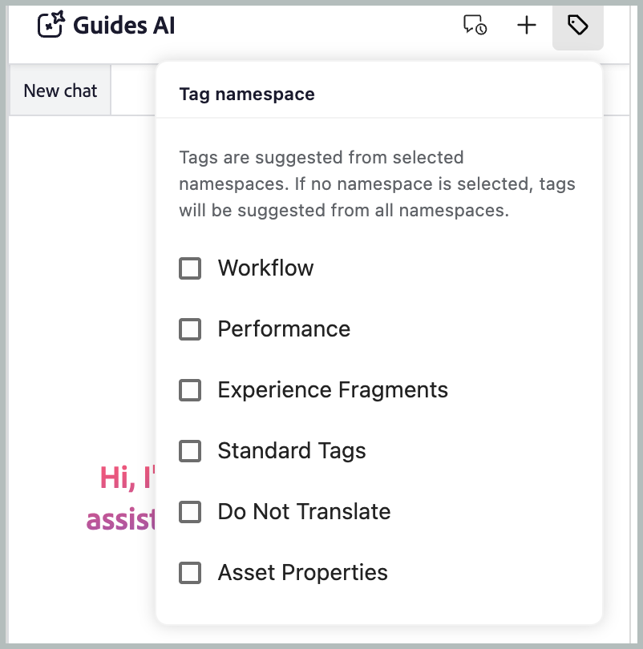
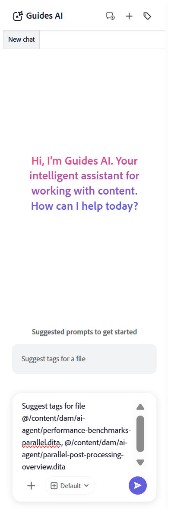
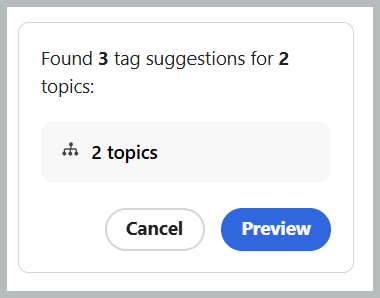
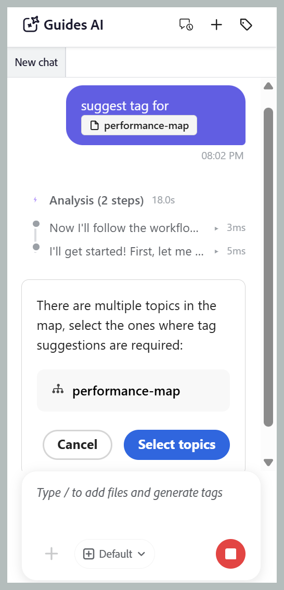

# Get started with Guides AI

>[!NOTE]
>
> Guides AI is available in Experience Manager Guides as a Cloud Service starting with 2026.08.0 release. Contact your Customer Success team to enable this feature.

Guides AI makes tagging your content faster, easier, and more consistent. Using the agentic Smart Tagging skill from Adobe CX Enterprise Coworker, Guides AI analyzes your content and recommends relevant tags based on your organization's taxonomy, instead of you manually reading through content to decide which tags apply. You stay in control by reviewing the suggested tags and choosing to apply or reject them before confirming your selection, significantly reducing manual effort, improving tagging accuracy, and ensuring consistent metadata across your documentation.

## Guides AI panel

The Guides AI panel provides all the tools you need to generate, review, and apply AI suggested tags. 

{width="650"}

The following components of Guides AI help you add files, configure tag recommendations, and manage your smart-tagging workflow: 

- **(A)** Conversation history: View and reopen previous conversations to review earlier tag recommendations and actions.

    {width="350"}

- **(B)** New chat: Start a new tagging session for a different topic, map, or set of files.
- **(C)** Tag namespace: Select the taxonomy namespaces from where Guides AI should generate tag recommendations. Only tags from the selected namespaces are considered.

    {width="350"}

- **(D)** Response space: Review AI-generated tag recommendations and choose to accept, reject, or modify them before applying the tags.
- **(E)** Prompt space: Enter a prompt request to generate tag recommendations for the selected content.
- **(F)** Attach files or add context: Add topics, maps, or external files from your local system to provide the content that Guides AI should analyze for tag recommendations.
- **(G)** Model: Displays the AI model used to analyze content and generate tag recommendations. Multiple OpenAI and Anthropic Claude models are available for selection. By default, the **Use manifest default** option is selected, which uses the model configured for the selected assistant.
- **(H)** Send: Submit your prompt and attached content to generate AI-powered tag recommendations.

## Apply tags to single or multiple topics with the smart-tagging skill

Perform the following steps to use Guides AI for applying tags to single or multiple topics with the smart-tagging skill: 

1. Log in to Experience Manager Guides.
1. On the Home page, select **Guides AI** from the Navigation bar. Ensure that the Guides AI feature is enabled by your administrator. 
1. Add the topic for which you want to generate tag recommendations using one of the following methods:

    - **Using Suggested prompts**: For the first chat in the Response area, select **Suggest tags for a file** prompt. The prompt is automatically added to the Prompt space. Select `[file]`, then choose the topic from the Repository or a Collection in the **Select file** dialog. You can select one topic from the **Select file** dialog.

        {width="650"}

    - **Using shortcut**: Type `/` in the Prompt field, then choose **Add repository reference** to choose a topic from the Repository (or **Add files from device** to upload a topic from your computer), and enter the suggested prompt *Suggest tags for a file*.    

    - **Drag and drop**: Drag and drop a single topic or multiple topics into the Prompt space, and type the prompt *Suggest tags for a file*.

        {width="650"}

    - **Specify topic paths**: Type `@` followed by the comma-separated paths for multiple topics from the same or different maps, then enter the prompt: *Suggest tags for a file*.

        {width="650"}              

1. Select **Send**.        

1. Guides AI analyzes the content of the topic and generates tag recommendations.

    {width="650"}

1. Review the suggested tags, as follows:

    >[!NOTE]
    >
    > For topics that already contain tags, Guides AI displays the existing tags. These tags are read-only and cannot be modified or removed.

    - For single topic, you can simply **Accept** the recommendations to apply them, or **Reject** them if they are not required.

        {width="650"}

    - For multiple topics: 
        1. Select **Preview** to review the AI-generated tag recommendations.

            {width="650"}

        1. Review the suggested tags for each topic, and then choose one of the following actions:
            - **Accept all** to apply all suggested tags for all the topics.
            - **Reject all** to discard all suggested tags for all the topics.
            - **Clear all suggestions** to remove all the suggested tags for a specific topic.
            - Select the **X** icon next to a tag to remove an individual tag suggestion.

                {width="650"}

1. When you accept the suggested tags, the Smart Tagging skill adds the AI-generated tags to the tags already applied to the content.                

After you complete the review, Guides AI displays a summary of the tags applied to the topic and any rejected tag recommendations.

{width="650"}

## Apply tags to multiple topics of a map using smart-tagging skill

Perform the following steps to use Guides AI for applying tags to multiple topics of a map with the smart-tagging skill: 

1. Log in to Experience Manager Guides.
1. On the Home page, select **Guides AI** from the Navigation bar. Ensure that the Guides AI feature is enabled by your administrator.
1. Add the map for which you want to generate tag recommendations using any one of the following methods as discussed for topics:

    - **Using Suggested prompts**: For the first chat in the Response area, select **Suggest tags for a file** prompt. The prompt is automatically added to the Prompt space. Select `[file]`, then choose the map from the Repository or a Collection in the **Select file** dialog.   

    - **Drag and drop**: Drag and drop a map into the Prompt space, and type the prompt *Suggest tags for a file*.

    - **Using shortcut**: Type `/` in the Prompt field, then choose **Add repository reference** to choose a map from the Repository (or **Add files from device** to upload a map from your computer), and enter the suggested prompt *Suggest tags for a file*. 

        {width="650"} 

1. Select **Send**.
    A message indicates that the selected map contains multiple topics. Select **Select topics** to choose the topics for which you want tag recommendations.

    {width="650"}

1. In the **Select topics** dialog, select the topics for which you want tag recommendations.   
   The **Select topics** dialog provides the following:

    - **Topics list:** Displays all topics in the selected map. Select the topics for which you want to generate tag recommendations.
    - **Preview pane:** Displays a preview of the selected topic along with its existing tags.
    - **Filter:** Filter the topics to display only those with **Tags added** or **No tags added**.   

        {width="650"}  
        
1. Select **Confirm**. Guides AI analyzes the selected topics and displays the number of tag recommendations generated for each topic.
1. Select **Preview** to review the AI-generated tag recommendations.  
1. Review the suggested tags for each topic, and then choose one of the following actions:
   - **Accept all** to apply all suggested tags for all the topics.
   - **Reject all** to discard all suggested tags for all the topics.
   - **Clear all suggestions** to remove all the suggested tags for a specific topic.
   - Select the **X** icon next to a tag to remove an individual tag suggestion.

        >[!NOTE]
        >
        > For topics that already contain tags, Guides AI displays the existing tags. These tags are read-only and cannot be modified or removed.

    {width="650"}

1. When you accept the suggested tags, the smart-tagging skill adds the AI-generated tags to the tags already applied to the content.     

After you complete the review, Guides AI displays a summary of the tags applied to each topic and any rejected tag recommendations.

