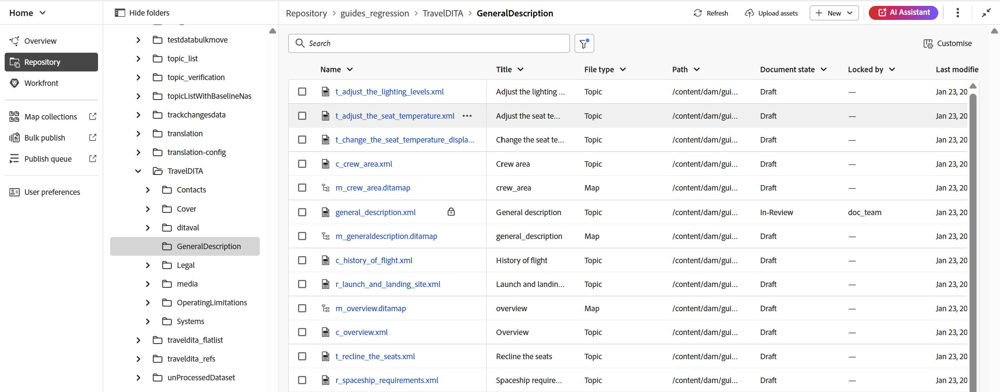
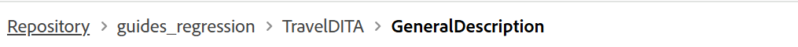
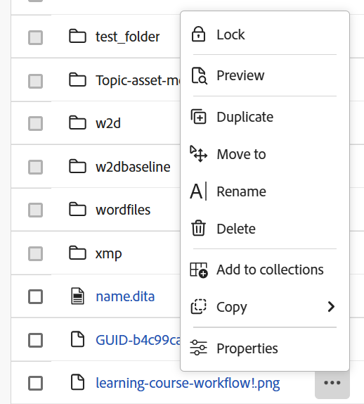
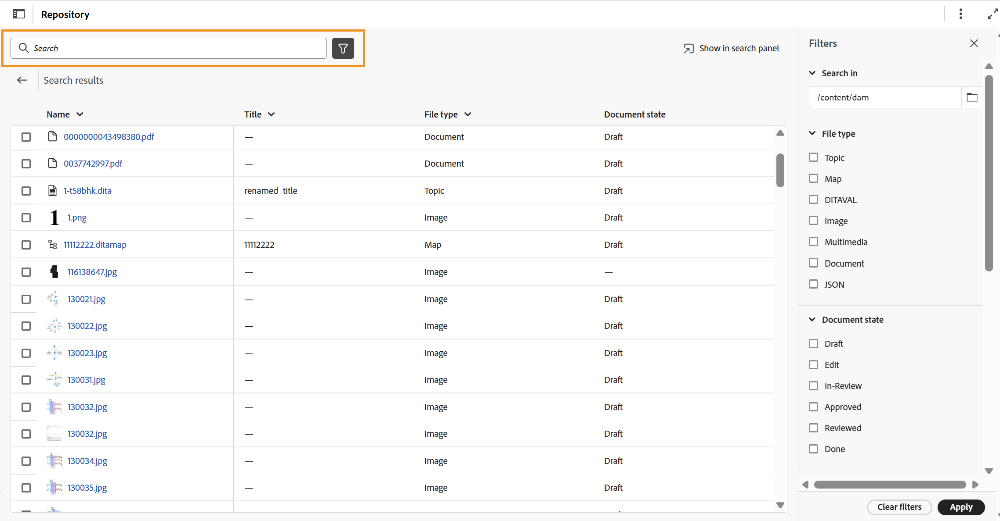
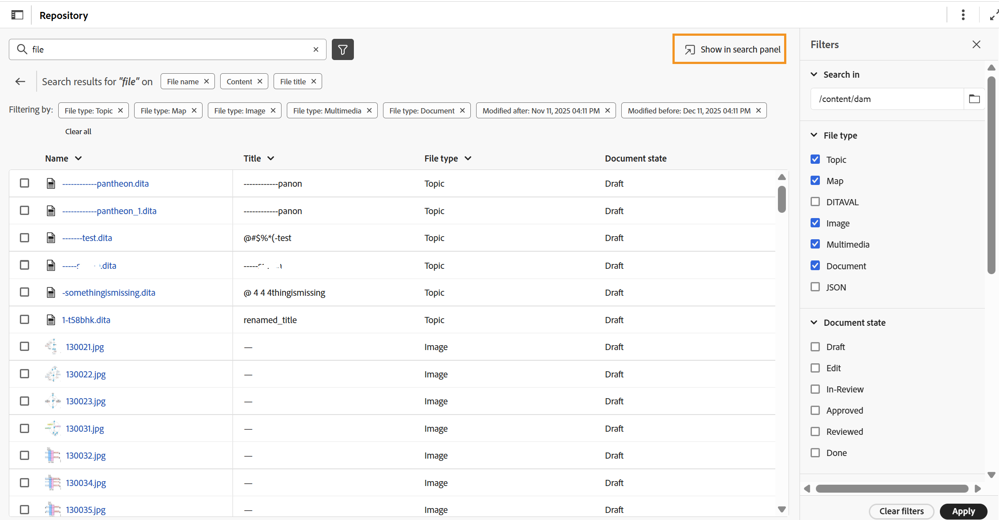

# Know the Repository interface

The Repository serves as a centralized space for improved discoverability of folders and files. It provides a comprehensive tabular list view of folders and files with multiple columns, offering contextual details for all files and assets.

This unified interface streamlines multiple functions, including creating new files or folders, uploading assets, editing files, and searching files with robust filtering options, thereby ensuring efficiency and ease of use.

{align="left"}

The Repository interface is divided into the following sections:

- Repository navigation bar
- Tabular view of Repository

## Repository navigation bar

The Repository navigation bar, located at the top of the Repository interface, provides quick access to essential actions as listed.

{align="left"}

- **Folder navigation panel**: Displays a hierarchical, tree view of folders within the Repository, enabling seamless navigation. This panel shows only folder-level information. When a folder is selected from here, its contents, files, and sub-folders are displayed in the Repository view. You can show or hide this panel using the icon highlighted below.

    {align="left"}

- **Breadcrumbs**: Indicates the current path within the repository, showing the hierarchy of folders leading to your current folder. You can select it to go back to a specific folder within the hierarchy.

    {align="left"}

- **Refresh**: Updates the Repository to reflect the latest changes.
- **Upload Assets**: Allows to upload assets directly to the current folder, as highlighted in the breadcrumb.
- **New**: Enables the creation of new topics, maps, and folders inside the current folder as highlighted in the breadcrumbs.
- **AI Assistant**: A powerful, AI-driven tool designed to enhance your productivity through smart help features. The [AI Assistant](./ai-assistant.md) feature is currently only available for Adobe Experience Manager as Cloud Service.
- **More actions**: Provides access to additional options. Selecting this button opens a menu with the following options:
    - **Assets**: Takes you to a destination based on your setup.
        - **Cloud Services**: If you are using Cloud Services, selecting the **Assets** option takes you to the AEM Navigation page.
        - **On-premise Software**: If you are using Adobe Experience Manager Guides (4.2.1 and later), selecting the **Assets** option takes you to your current file path in the Assets UI.
    - **Workspace settings**: Takes you to the **Workspace settings** dialog. For details, view [Configure Workspace settings](../cs-install-guide/workspace-settings.md).
- **Expand view**: Allows you to expand the page view using the **Expand** icon. In this view, the header bar is hidden, maximizing the content space. To return to the standard view, use the Exit the expanded view icon.

## Tabular view of Repository

The Repository serves as the central space providing a tabular list of all the folders and files within the repository. It offers following features:

- **Customise**: You can modify the columns displayed by using the **Customise** option located at the top-right corner of the Repository view. This option allows you to show or hide any column and also rearrange the columns as needed. The Name or Title columns are mandatory and both cannot be disabled together. Other fields, such as File Type, UUID, Document State, Locked By, Created On, and Modified On, can be enabled or disabled as needed. You can also rearrange them by dragging and dropping.

    {align="left"}

- **Column resizing**: Columns can be resized by selecting the dropdown menu on the respective column label.

- **Sorting**: The Name, Title, Created on and Last modified columns support sorting in ascending or descending order, accessible via the dropdown on the field label.

- **Editing the file**: 

    - You can select one or multiple files from the list for editing.
    - After selecting the desired files using the checkbox, the **Edit** option becomes available in the top-right corner of the Repository View.
    - Selecting **Edit** opens the selected file(s) in the Editor interface, where you can begin editing the file.

        {align="left"}

- **Options menu for folders**: You can perform the following actions using the **Options** menu available for a folder:

    {align="left"}

    - **New**: Create a new DITA topic, DITA map, or a folder. 
    - **Upload Assets**: Upload a file from your local system to the selected folder in repository.
    - **Add to collections**: Adds the selected folder to favorites. You can choose to add it to an existing or new collection.
    - **Reprocess assets**: Triggers the processing of all the newly created and unprocessed assets.

- **Options menu for files**: You can perform the following actions using the **Options** menu for a file:

    {align="left"}

    - **Edit**: Open the file for editing.
    - **Edit in Oxygen**: Select this option to edit the selected file in the Oxygen connector plugin.

        >[!NOTE] 
        >
        >Contact your customer success team to get this feature enabled in the environment. This isn't enabled as a part of the out-of-the-box support. For more details, view the [Configure the option to edit in Oxygen ](../cs-install-guide/conf-edit-in-oxygen.md) section in the Installation and Configuration Guide.
    
    - **Open in map console**: In case the selected file is a DITA map, then this option opens the map console.
    - **Open in map dashboard**: In case the selected file is a DITA map, then this option opens the map dashboard.
    - **Lock**: Get a lock on the selected file for editing. 
    - **Preview**: Get a quick preview of the file (.dita, .xml, audio, video, or image) without opening it.
    - **Duplicate**: Use this option to create a duplicate or a copy of the selected file.
    - **Move to**: Use this option to move the selected file to another folder. 
    - **Rename**: Use this option to rename the selected file.
    - **Delete**: Use this option to delete the selected file.
    - **Add to**: Choose to add to collections or Reusable content.
    - **Copy**: Copies the UUID or complete path of the file.    
    - **Properties**: Use this to open the properties page of the selected file.
    - **Download as PDF**: Use the option to generate the PDF output and download it.  
      
- **Search and filter experience**

The Search option helps in searching the required files from the Repository primarily on the basis of **File title**, **File name** and **Content**. You can use any one, two, or all three criteria for your search. If none of the criteria are selected, the results will include common to all the three criteria.

{align="left"}
 
Select the **Filter Search** \(\) icon to open the Filter panel on the right.

{align="left"}

You have the following options to filter the files and to narrow down your search:

- **Search in**: Select the path where you want to search the files present in the Repository. 

- **File type**: You can look for all **DITA Topics**,  **DITA Maps**, **DITAVAL Files**,  **Image Files**, **Multimedia**, **Documents**, and **JSON**.

- **Locked by**: Displays a list of users. The list is paginated and loads asynchronously, showing a limited set of users at a time and fetching more as you scroll or navigate. This improves loading speed and overall performance, especially when working with a large number of users.

- **Last modified**: Filter content based on modification date. Select a date range from the calendar or choose one of the following time frame options: 
    - In last week
    - In last month
    - In last year

- **Tags**: Filter content based on tags. 

- **DITA element**: Filter content based on various DITA elements.

After applying all the required filters, select **Apply** located at the bottom-left corner of the Filters panel. 

Your search results customized according to the selected filter appear as a **tabular list of files only** (folders are not displayed). You can remove any filter individually or multiple filters at the same time, and the results refreshes to reflect the updated selection.

{align="left"}

**Show in search panel**

The **Show in search panel** option becomes available after performing a search in the Repository. This feature allows you to display all the searched results in the **Search panel** within the Editor. For more details view, [Search panel](./explorer-editor.md).

{align="left"}

