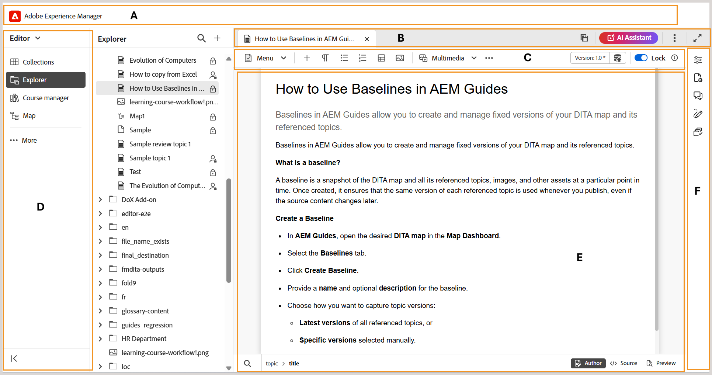

# Overview

This article provides you an overview of the Editor interface, and the various features that are available in the Experience Manager Guides Editor. 

The Editor inteface is divided into the following sections or areas:

- **(A)** [Header bar](./web-editor-header-bar.md)
- **(B)** [Tab bar](./web-editor-tab-bar.md)
- **(C)** [Tool bar](./web-editor-toolbar.md)
- **(D)** [Left panel](./web-editor-left-panel.md)
- **(E)** [Content editing area](./web-editor-content-editing-area.md)
- **(F)** [Right panel](./web-editor-right-panel.md)