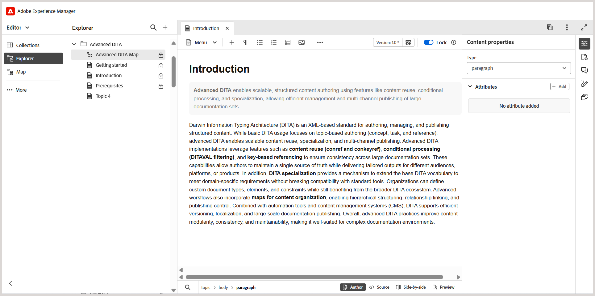

# Overview

This article provides you an overview of the Editor interface, and the various features that are available in the Experience Manager Guides Editor. 

>[!BEGINTABS]

>[!TAB Classic Editor]

This view displays how the content is rendered in the Classic Editor

>[!TAB Editor 2.0 ]

This view displays how the content is rendered in Editor 2.0
    

>[!ENDTABS] 

The Editor inteface is divided into the following sections or areas:

- **(A)** [Header bar](./web-editor-header-bar.md)
- **(B)** [Tab bar](./web-editor-tab-bar.md)
- **\(C\)** [Tool bar](./web-editor-toolbar.md)
- **(D)** [Left panel](./web-editor-left-panel.md)
- **(E)** [Content editing area](./web-editor-content-editing-area.md)
- **(F)** [Right panel](./web-editor-right-panel.md)
