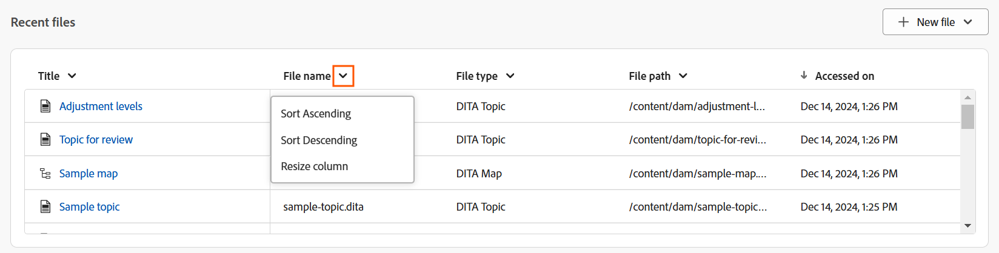
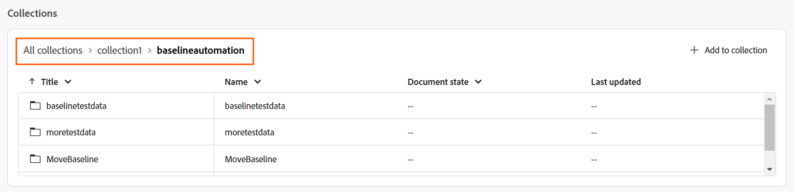
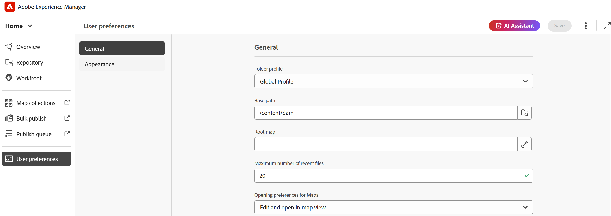

# Experience Manager Guides Home page experience

The Home page is the first screen that you view when logging into Experience Manager Guides. It provides you with a unified and intuitive welcome screen experience, which includes a quick view of the files that you recently accessed, collections, and more.

{align="left"}

The Experience Manager Guides Home page is divided into the following sections: 

- Header bar 
- Navigation bar 
- Left panel 

## Header bar 

The header bar is the top bar of the Home page that displays the Adobe Experience Manager logo (or a Unified Shell if you are using the Unified Shell as your Experience Manager Guides UI). When you select the logo, it directs you to the Experience Manager Navigation page. 

{align="left"}

## Navigation bar 

The navigation bar surfaces tools to switch navigation, customize the overview layout, and adjust the page view. It also displays the current folder profile in use.

>[!NOTE]
>
> If using the Adobe Experience Manager Guides as a Cloud Service, an additional feature labeled as **AI Assistant** is displayed in the navigation bar. 

{align="left"}

Features available in the navigation bar are explained as follows: 

- **Navigation switcher**: Allows seamless navigation to other pages: 
  - **Home**: The default page that you view when logging into Experience Manager Guides.
  - **Editor**: An easy-to-use web-based Editor that allows you to create and manage structured documents in Experience Manager Guides. [Get to know the Editor interface](./web-editor.md). 
  - **Map console**: Provides you a dedicated workspace to handle all aspects of map management and publishing. [Get to know the Map console interface](./map-console-overview.md).
- **AI Assistant**: A powerful, AI-driven tool designed to enhance your productivity through smart help features. Additionally, when working in the Editor interface, you can leverage the smart authoring capabilities of AI Assistant that makes your authoring process smarter and faster through intelligent suggestions for content reuse and optimization.  

  The [AI Assistant](./ai-assistant.md) feature is currently only available for Adobe Experience Manager as Cloud Service.  
- **Customize overview section**: Allows you to hide or show the widgets in the Widgets section. 
- **Folder profile in use**: Displays the folder profile that is currently being used.
- **More actions**: Provides access to additional options. Selecting this button opens a menu with the following options:

  - **Assets**: Takes you to a destination based on your setup.
    - **Cloud Services**: If you are using Cloud Services, selecting the **Assets** option takes you to the AEM Navigation page.

    - **On-premise Software**: If you are using Adobe Experience Manager Guides (4.2.1 and later), selecting the **Assets** option takes you to your current file path in the Assets UI.
  - **Workspace settings**: Takes you to the Editor Settings dialog. For details, refer to [Working with Editor Settings](./web-editor-settings.md).  
- **Expand view**: Allows you to expand the page view using the **Expand** icon. In this view, the header bar is hidden, maximizing the content space. To return to the standard view, use the **Exit the expanded view** icon. 

## Left panel 

The left panel gives you quick access to Overview, Map collections, Bulk publish, Publish queue, and User preferences features. You can expand the panel by selecting the **Expand** icon placed at the bottom-left corner of the interface. Once expanded, use the **Collapse** icon to collapse the panel.

{width="300" align="left"}

What you view on this panel depends on your user role. The following table lists the roles and the respective sections that are displayed in the left panel.

- **Admin & Publisher**: The ability to view all the sections in the panel.
- **Author**: The ability to view all the sections except publishing. Authors do not have access to Map collections, Publish queue, and Bulk publish section.
- **Reviewer**: The ability to view the Overview section only. Selecting the Overview section either displays a default empty state message or the Workfront tasks widget depending on whether Adobe Workfront is configured.  
   

Features available in the left panel are explained as follows: 

- [Overview](#overview)
- [Map Collections](#map-collections) 
- [Bulk Publish](#bulk-publish)
- [Publish Queue](#publish-queue)
- [User Preferences](#user-preferences)  

>[!NOTE]
>
> In addition, if your administrator has configured Adobe Workfront integration in the system, then a **Workfront** option is also shown in the left panel. Learn about [Adobe Workfront integration](./workfront-integration.md) in Experience Manager Guides.
 

### Overview 

**Overview** acts like a personalized dashboard designed to enhance productivity. It features different widgets that help you stay organized and focused. 

The widgets also provide you with options to sort and resize columns. To view these options, select the column header and the options would display in a list.  

The following widgets are present in the Widgets section:

- **Recent Files**: The widget provides you with a snapshot of recently opened files (a list of files that you accessed in the Editor) along with the key file details including Title, File name, File type, File path, and Accessed on dates. 
  
  {align="left"}
  
  You can sort and resize the columns by selecting options from the column dropdown menu. By default, the data is sorted based on last accessed date and time. 

  {align="left"}

  
  From [User Preferences](#user-preferences), you can set the maximum number of files that can be displayed in this widget. By default, this limit is set to **20**. 

  The following options are available when you hover over a file:  

  - **Open in editor**: Allows you to open the file in the Editor. You can also open a file by simply selecting it.   
  - **Pin/unpin**: Allows you to pin one or more files to the Recent files widget. Pinned files are displayed at the top in widget list. To unpin a file, use the **Unpin** option.   
  - **Remove**: Allows you to remove the file from the Recent files widget. 
   
  **Create new file from the New file dropdown menu**  

  The **New file** dropdown menu allows you to create a topic or DITA map right from the **Recent files** widget. On successful file creation, you will be redirected to the Editor interface where you can work upon the file. 

- **Collections**: If you work on a set of files or folders, you can add them to this widget to access them quickly. Once added, you can view the files by Title along with other key details such as Owner and Created On dates. As you select the column dropdown, you can view the options to sort and resize the column.  

  {align="left"}
  
  The selected collection's breadcrumbs are displayed at the top of the Collection widget. You can select it to go back to a specific folder within the hierarchy. 

  {align="left"}

  The following options are available when you hover over a collection and select the More icon :

    - **Rename**: Allows you to rename the collection.  
    - **Delete**: Allows you to delete the collection. 
    - **View in Assets UI**: Allows you to open the collection in the Assets UI. 

    You can open a collection by selecting the Collection title. The following options are available when you hover a Collection file and select the More icon :

    - **Open in editor**: Allows you to open the file in the Editor. Alternatively, you can select the file title to open the file. 
    - **Open in map console**: Allows you to open the map file in the map console. (Available only for a DITA map file).
    - **Add to collections**: Allows you to add the file to a new or existing collection.
    - **Remove from collections**: Allows you to remove the file from the collections list.
    - **View in Assets UI**: Allows you to locate the file in Assets UI. 

    **Create new collection from the New collection dropdown menu**  

  The **New collection** dropdown menu allows you to create a new collection and add it to the **Collections** widget.

>[!NOTE]
>
> In addition, if your administrator has configured Adobe Workfront integration in the system, then **Your tasks** widget is also shown in the Widgets section. Learn more about [Adobe Workfront integration](./workfront-integration.md#working-with-the-your-tasks-widget) in Experience Manager Guides.

### Map collections 

Experience Manager Guides provides you with the ability to organize your content for publishing by using a dashboard called **Map collections**. To use this feature, select **Map collections** from the left panel. It takes you to the Map collections page in the **Assets UI** where you can [use map collection for output generation.](./generate-output-use-map-collection-output-generation.md)  

### Bulk publish 

The Bulk Activation feature allows you to quickly and easily activate your content from authoring to publishing instance. To use this feature, select **Bulk publish** from the left panel. It takes you to the Bulk Activation Collections page in the Assets UI where you can create and manage [Bulk activation of published content](./conf-bulk-activation.md). 

### Publish queue 

When you have a large set of publishing tasks running on your system, it becomes practically impossible to check each DITA map individually to monitor its publishing task. Experience Manager Guides gives the administrators and publishers a unified view of all publishing tasks running in the system.  

To use this feature, select **Publish queue** from the left panel. It takes you to the Publish dashboard page in the Assets UI where you can [manage publish tasks using the publish dashboard](./generate-output-publish-dashboard.md). 

### User preferences 

The User preferences are available to all authors. Using the preferences, you can configure the following settings:

- **General**: The General tab allows you to configure the following settings:

  {align="left"}

  - **Folder profile**: The Folder profile controls various configurations related to conditional attributes, authoring templates, output presets and the Editor configurations. The Global profile is shown by default. In addition, if your administrator has configured folder profiles in the system, then those folder profiles are also shown in the Folder profiles list.     
  - **Base path**: By default, when you access the Experience Manager Guides repository from the Editor, you are shown assets from the /content/dam location. Your working folder would most likely be a few folders inside the /content/dam/ folder. You can set the Base path to your working folder and the Repository view then shows you the content from that location upfront. This reduces the time to access your working folder. Also, when you insert any reference or media file in your topic, the file browse location starts with the folder set in the Base path.
  - **Select Root Map**: Select a DITA map file to resolve key references or glossary entries. The selected root map takes the highest precedence to resolve key references. For more details, view [Resolve key references](./map-editor-other-features.md). 
  - **Maximum number of recent files**: Use this field, to set a maximum limit on the files that are displayed in the Recent files widget.
  - **Opening preferences for Maps**: Here, you can select a default behavior the system will follow while opening a DITA map file. 

- **Appearance**: The Appearance tab provides you with the options to select the themes for the application and the source view of the content editing area. Use this tab to configure the following settings:

  {align="left"}
 
    - **Application theme and Source view**: You can choose from the Light or Dark themes for the application and source view. In the case of the Light theme, the toolbars and panels use a light grey color background. In the case of the Dark theme, the toolbars and panels use a black color background. Select **Use device** theme to allow Experience Manager Guides to select the light and dark themes based on the theme of your device. 
    
      In all themes, the content editing area is shown in white color background in the Author view.

    - **Editor files display configuration**: Select the default way to view the files in the Editor. You can view the list of files by the titles or the file names from the various panels in the Author view. By default, the files are displayed by title in the Editor.
    
    - **Always locate files in the repository**: Select this option to show the location of a file in the repository while editing it in the Editor.
