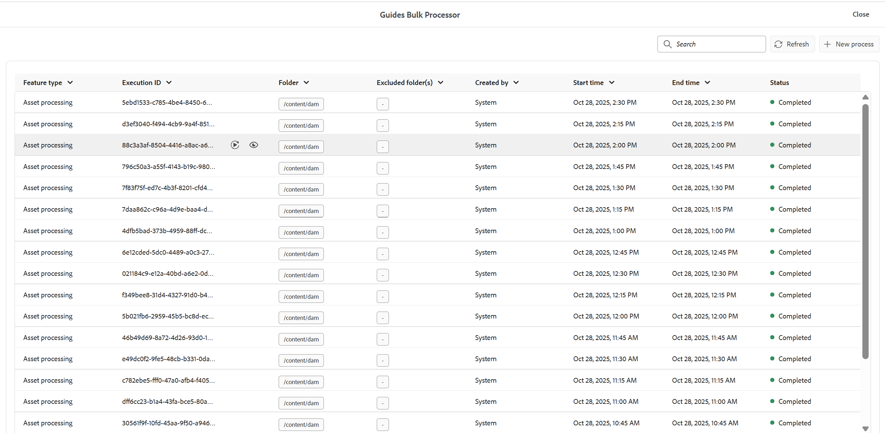

# Migrate old map collections to new map collections

If you already have map collections set up in the old format, you don't need to rebuild them from scratch when moving to the new experience. You can either recreate them manually, or use the built-in migration tool to move everything over in one step.

The migration tool, added as a new process type within the Bulk Processor, reads your existing old map collections and automatically creates matching new map collections for you. This article walks you through how to run the migration and highlights a few key behaviors you should know before using it.

## Migration process

Perform the following steps to migrate the old map collections to new map collections: 

1. Select the Adobe Experience Manager logo and choose **Tools**.
1. In the **Tools** panel, select **Guides**.
1. Select the **Bulk Processor** tile.

    

1. The Guides Bulk Processor window opens with the following details: 

    - **Feature type**: Shows the feature of the process that is being executed.

    - **Execution ID**: It is the unique Id for each migration task that you perform.

    - **Assets**: Shows the folder selected for migration.

    - **Excluded Folders**: Shows the folder that is excluded from migration.

    - **Created by**: Shows who created the task.

    - **Start time:** Shows the date and time the migration is initiated.

    - **End Time**: Shows the date and time the migration ends.

    - **Status**: Shows the status of migration as In progress, Completed, or Cancelled.

        

1. Select **New process** tab on the upper-right corner of the window to start a new migration task.

    The **New process** dialog opens.

         

1. Select **Map collection** from the dropdown of Feature type.

    

1.  Select **Create**.   

This runs a single job that migrates all existing old map collections into new map collections. No additional configuration is required.

## Important notes

- **Re-running the migration:** If the migration process is run again, it does **not** check for changes in the source (old) map collections. It will unconditionally re-migrate or overwrite the new map collections.
- **Timestamps and uniqueness:** Each migrated map collection stores the timestamp from when it was first migrated. This timestamp is used to maintain uniqueness of the migrated record. Because of this, the migrated map collection will **not** reflect later updates made to the original (source) map collection — only the state at the time of migration is captured.

