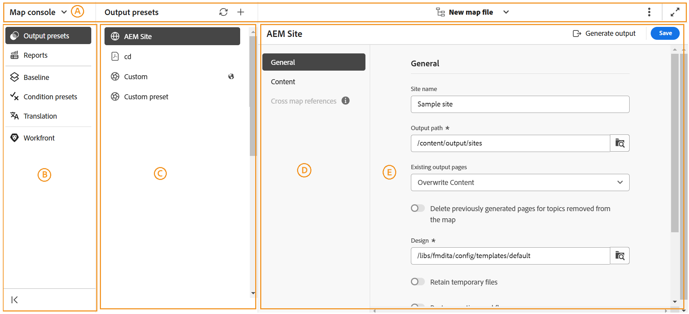

# Map console overview 

Adobe Experience Manager Guides offers a dedicated console, known as the **Map console**, to streamline all your map management and publishing tasks. This centralized interface enhances productivity and accuracy in your map-related activities by providing you options to generate outputs, translate content, access reports, and more – all at one place. 

{align="left"}

The Map console interface is primarily divided into two sections - **Navigation bar** and **Left panel**.

{align="left"}

- (**A**) **Navigation bar**: The navigation bar surfaces tools to switch navigation, adjust the page view, and displays the name of the selected map file.   

    Features available in the navigation bar are explained as follows: 

    - **Navigation switcher**: Allows seamless navigation to other pages - Editor or Home page: 
    - **Selected map file**: Displays the name of the currently selected map file. You can open it in the Editor or choose a different map file for the Map console.
    - **More actions**: Provides options to navigate to the **Assets UI** and **Workspace settings**. For details, view the [Tab bar](./web-editor-tab-bar.md).

    >[!NOTE]
    >
    > If using the Adobe Experience Manager Guides in an On-Premise setup , the Workspace settings option continues to appear as **Settings** under the More actions menu.

    - **Expand view**: Allows you to expand the page view using the **Expand** icon. In this view, the header bar is hidden, maximizing the content space. To return to the standard view, use the **Exit the expanded view** icon. 

    >[!NOTE]
    >
    > If using the Adobe Experience Manager Guides as a Cloud Service, an additional feature [AI Assistant](./ai-assistant.md) is displayed in the navigation bar. 

- (**B**) **Left panel**: The left panel gives you quick access to Output generation, Report creation and management, Baseline, Condition presets, Content translation, and Workfront (only if configured) features. 

    For more details, refer to the [Map console features](#map-console-features) section below.

## Map console features 

The following features are available in the Left panel when you [open a DITA map file in Map console](./open-files-map-console.md). 

**Output generation**

With Map console, you can efficiently generate outputs in various formats, including AEM Sites, PDF, HTML5, EPUB, JSON, and custom output through DITA-OT, Native PDF publishing, and FMPS. You can generate output for an entire DITA map or you can selectively publish only a few topics that you have updated. You can also use the Baseline publishing feature to selectively publish a specific version of your DITA map or topic.

For more details, view [Output generation](./generate-output.md).

**Report creation and management**

In an organizational setup, you want to verify the overall completeness of your technical documentation before you start working on it or pushing the documents live. Such a need becomes even more essential in multi-user and large-scale environments. With Map console, you get access to Experience Manager Guides reports that give a useful insight into the overall health of the content in your repository and how content is being used in the documentation process.

For more details, view [Reports in Experience Manager Guides](./reports-intro.md).

**Baseline**

Experience Manager Guides provides the Baseline feature that allows you to create a version of your topics and assets that can then be used for publishing or translation. You can also publish multiple output presets of the same DITA map in parallel. 

Learn how to [create and manage Baselines in Experience Manager Guides](./web-editor-baseline.md).

**Condition presets** 

Experience Manager Guides allows you to define attributes in your DITA topics and the use the condition preset to specify what happens with the attribute in the final output. For example, you can add attributes as version 1.0 and version 2.0 in your content, and use a condition preset to include version 1.0 for release 1.0 and exclude version 2.0. Similarly, you can add attributes as OS Windows and OS Linux to your content, and then include or exclude the relevant content for your final output according to the operating system.

Learn more about [Condition presets](./generate-output-use-condition-presets.md).

**Content translation**

Experience Manager Guides comes with powerful capabilities that enable you to translate your content into multiple languages. Both, human and machine translation workflows are supported by Experience Manager Guides. 

In Map console, you get access to all the options required to get started with translation workflows. For more details, view [Translate content](./translation.md).  

**Workfront**

The Workfront feature is also present in the Map console that allows you to work with Adobe Workfront tasks right from the Experience Manager Guides. 

Learn about [Adobe Workfront integration in Experience Manager Guides](./workfront-integration.md). 
  
You can access this feature only if your administrator has configured **Adobe Workfront** integration in your Experience Manager Guides instance.
