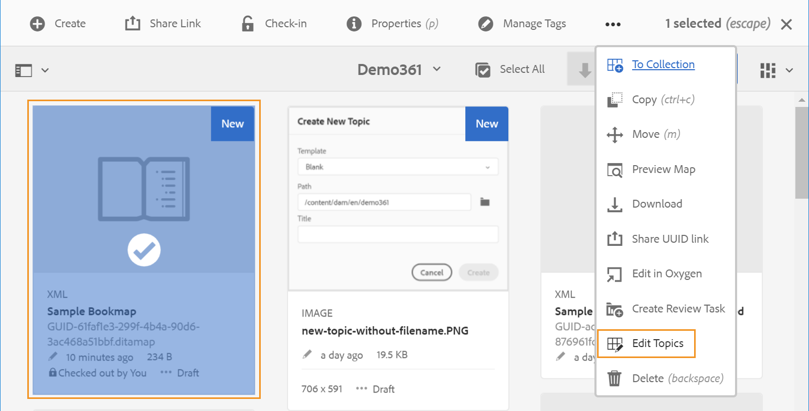
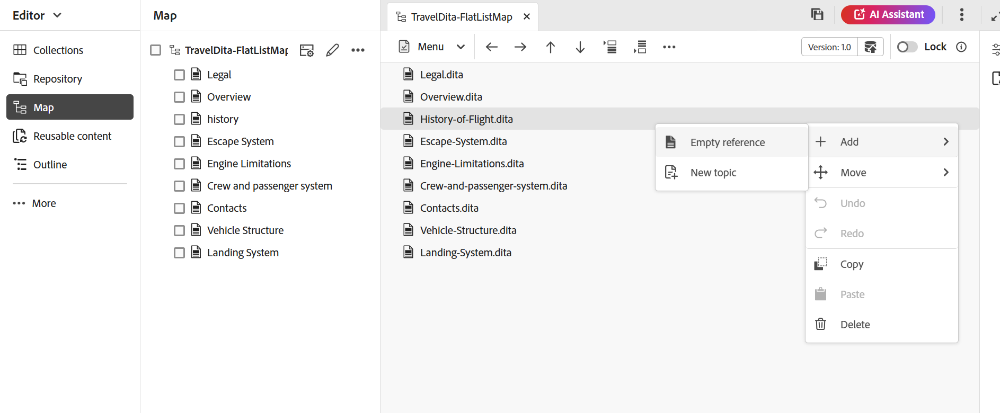

# Work with the Map Editor {#id1942D0S0IHS}

The Map Editor comes with intuitive user interface and it is similar to the Editor. When you open a map file in the Editor, you get an option to edit the map file using the Map Editor interface. The Map Editor allows you to add topic references, key references, structure your content and more.

In addition to editing map files directly from the Editor, you can also open topic files in a map for editing the Editor. This topic walks you through the features in the Map Editor and how you can open and edit files in a DITA map in the Editor.

## Add topics to a map file 

Perform the following steps to build your map file using the Map Editor:

1. In the Repository view, navigate to and open the map file that you want to edit.
1.  Select the **Edit** icon.

    {width="550" align="left"}
   
1. The map file opens in the Map Editor. If you have opened a new map file, then only the title of the map is shown in the editor.

    {width="800" align="left"}

        
    -   **A** - \(*Tab bar*\): This is similar to the Editor's tab bar. View [tab bar](./web-editor-features.md#tab-bar) in the Editor for more details.

    -   **B** - \(*Toolbar*\) This is the toolbar that allows you to work with map files. For more information about the functionalities available through the toolbar, view [Features available in the Map Editor's toolbar](#features-available-in-the-map-editors-toolbar).
    
    -   **C** - \(*Map views*\): Allows you to switch the Map Editor between the Layout, Author, Source and Preview. The **Layout** view allows you to organize the topics in a DITA map. This gives the tree or hierarchical view of the map. The **Author** view allows you to edit the topics in the Map Editor. This also gives the WYSIWYG view of the map file. The **Source** view allows you to work with the underlying XML of the map file. The Preview gives you a consolidated view of all topic and sub-maps within the map file. 

    -   **D** - \(*Left Panel*\): Gives access to the left panel which gives you access to the Collections, Repository, Map, Outline and other features. You can expand or collapse it by clicking the Expand/Collapse icon. For more details about the features available in the left panel, view [Left panel](./web-editor-features.md#left-panel) in the Editor.

    -   **E** - \(*Middle Area*\): Map content editing area.

    -   **F** - \(*Right Panel*\): Gives access to the Properties panel. You can see the content properties and the map properties of the selected topic or map. For more details about the functionalities available in this panel, view [Right panel](web-editor-features.md#right-panel) in the Editor.

1.  In the Left Panel, switch to the **Repository** view.

1.  In the Adobe Experience Manager repository, navigate to the folder that contains the topics or sub-maps that you want to add.

1.  Select the topic or map file in the **Repository** view and drag-and-drop it into the \(middle\) map content editing area.

    The topic is added in the map.

    {width="800" align="left"}

1.  To add subsequent topics or a sub-map, drag-and-drop the topic or sub-map to the required location in the map.

    Consider the following points while building your map file:

    -   The file is added at a location where the dashed rectangle bar appears in the map editing area. In the following screenshot, the *A sample topic* topic will get added in between the *Smart Suggest 1* and *Smart Suggest 2* topics.

        {width="350" align="left"}

    -   To replace a topic, drag and drop the new topic on top of the topic that you want to replace. and drop it over indicates that it will get replaced with the topic being dropped on it.               

    -   If you add a sub-map to your DITA map, the sub-map is shown as a link in the DITA map. To view all the topics of the sub-map, Crtl+Click the sub-map link. The content of the sub-map are shown in a new tab. Similarly, to open a topic from the DITA map, Crtl+Click the topic link and it opens up in the new tab.

    -   You can use shortcut keys CTRL+Z and CTRL+Y or their respective icons in the toolbar to undo or redo any change in the map.

    -   To change the position of a topic, select the topic \(by selecting the topic icon\), then drag-and-drop it at the desired location in the map file. In the following screenshot, the topic *Smart Suggest 1* is being moved after the *A Sample topic* topic.

        {width="350" align="left"}

    -   To check the properties of your map file, right-click anywhere in the map editing area and choose **Properties** from the context menu. Based on your Adobe Experience Manager version, you could see properties like metadata, schedule \(de\)activation, references, document state and more.

1.  Select **Save**.

## Add topics to a map file from the Assets UI

Perform the following steps to access and open a file in the Editor from the Assets UI:

1.  In the Assets UI, navigate to the map file that you want to edit.

    >[!NOTE]
    >
    > Ensure that you have not enabled the asset Select mode.

1.  To get an exclusive lock on the map file, select the map file and then select the **Checkout** opption on the top.

    >[!NOTE]
    >
    > Once you have an exclusive lock on a map file, other users would not be able to edit the map. However, they would be able to work on the topics within the map file. If your administrator has configured your Editor to lock files before editing, then you will not be able to edit a file until you lock it. 

1.  With the map file selected, select **Edit Topics**.

    {width="800" align="left"}

    Or, you can also select the **Edit Topics** option from the action menu on the map file:

    {width="800" align="left"}

    The map file is opened for editing in the in the Editor. To add topics to the map file, follow the steps (4-8) in [Add topics to a map file](#add-topics-to-a-map-file).

## Features available in the Map Editor's toolbar 

The toolbar in the Map Editor is similar to the topic Editor. The basic operations like toggling the left panel, saving map, creating a new version of map, undo/redo last operation, and delete the selected elements are common in both editors. For detail about how these operations work, view [Know the Editor features](web-editor-features.md#) section.

The options that you view in the editor toolbar are based on the Map Editor view. There are four views that are available in the Map Editor:

- [Layout](#layout-view)
- [Author](#author-view)
- [Source](#source-view)
- [Preview](#preview)
    
The following sections cover the toolbar options available in the different views of the Map Editor:

### Layout view

When you open a map for editing it opens the Layout view of the Map Editor.The Layout view displays the map hierarchy in a tree view and allows you to organize the topics in a map.

>[!NOTE]
>
> The Layout view only displays the references present in a map. If any references are broken, then a small cross symbol is displayed on the left of the reference

The following options are available on the toolbar in the Layout view:

**Topic reference** - 

Displays the topic search dialog. Navigate to the topic/map file that you want to insert and click **Select** to add it to the map. 

{width="800" align="left"}

**Topic group** – 

Insert the `topicgroup` element. For more information about grouping topics, view the [topicgroup](https://docs.oasis-open.org/dita/v1.0/langspec/topicgroup.html) documentation in OASIS DITA Language Specification.

**Key definition** – 

Displays the Insert Keydef dialog. Use this dialog to define any key definition that you want to use in the map.

{width="300" align="left"}

**Insert Before/Insert After** –  / 

Displays the Insert Element dialog. Select the element that you want to insert in the map. Depending on the operation, the new element is inserted before or after the current element in the map.

**Insert Front matter** - 

This icon is displayed when you open a bookmap for editing. You can insert components in the beginning of the book like a Table of contents, an Index, and a List of Tables.

**Insert Back matter** - 

This icon is displayed when you open a bookmap for editing. You can insert components for a end of the book like an Index, a Glossary, and a List of Figures.

**Move the selected item left/right** -  / 

Select the left arrow to move the topic towards left side in the hierarchy. This essentially promotes the respective topic one level up in the hierarchy. For example, selecting the left arrow while a child topic is selected make it the sibling of the topic above it. Similarly, if you select the right arrow, the topic is pushed towards the right side making it the child of the topic above it.

**Move the selected item up/down**  - / 

Select the up or down arrow icons' to move the topic up or down in the hierarchy.

>[!NOTE]
>
> You can also drag-and-drop the references to move them in a map.

**Lock/Unlock**  

Gets a lock on the map file and release the lock. If you have unsaved changes in your map file, then at the time of releasing the lock, you are prompted to save the map file. The changes are saved in the current version of the map file.

**Merge** - 

For more details about merging content from a different version of the same or a different file, view [Merge](web-editor-features.md#menu-dropdown) in the Editor.

**Version history** - 

Check the available versions and labels on your active topic, and revert to any version from the editor itself.

**Version label** - 

Displays the version label management dialog. Select a version from the dropdown list. Choose the label you want to apply to the selected version and click **Add label** to add it.

**Show filename**

Shows the filename of the titles of the topics.

>[!NOTE]
>
> When you hover your pointer over a topic's title, you are shown the file path.

**Show line numbers**

Shows or hides the line number for each topic. The line numbers are shown depending on the level in the hierarchy.

**Show checkbox**

Shows or hides a checkbox for each topic. You can use the checkbox to select the topic\(s\) and perform various tasks using the Options menu. 

**Options menu in the layout view**

In addition to organizing topics in the map file, you can also perform the following actions using the Options menu that appears on hovering over a file or right-clicking within the editor in the layout view:

{width="650" align="left"}

-   **Add**: You can choose to add a new topic or an empty reference from the Map Editor:
    -   **Empty reference**: This option allows you to add an empty reference in your DITA map. You can double-click the inserted empty reference later and add the Topic details. 
    -   **New topic**: When you choose to create a new topic from the menu, you get the **New topic** dialog box. In the **New topic** dialog box, provide the required details and select **Create**. 
-   **Move**: You can choose to move a topic up/down/right/left in the hierarchy.You can also drag-and-drop a topic or a map from the repository panel to the map opened in the Map Editor.
-   **Undo**: Undo the last operation in the Layout view.
-   **Redo**: Redo the last operation in the Layout view.
-   **Copy**: Copy the selected reference from the map file.

    >[!NOTE]
    >
    > You can show and then select the checkboxes to copy multiple references.

-   **Paste**: Paste the copied references at the current location in the hierarchy.
-   **Delete**: Delete the selected references from the map file.

    >[!NOTE]
    >
    > You can show and then select the checkboxes to delete multiple references.

**View topics based on conditional filters**

If you have applied any conditions on a topic, a filter icon is displayed on the right of the topic. When you hover your pointer over a filter icon, you are shown the applied condition and its attribute value.

### Author view

The **Author** view allows you to edit your DITA map in the Editor. This shows the WYSIWYG view of the Map Editor and some of the icons displayed in Author view are same as the Layout view. 

In addition, you can view the following icons and perform the related tasks from the Author view:

**Insert before/Insert after** -  / 

Displays the **Insert element before**or **Insert element after**  dialog box. Select the element that you want to insert in the map. Depending on the operation, the new element is inserted before or after the current element in the map.

**Element** - 

Displays the **Insert element** dialog box. Select the element that you want to insert. You can use the keyboard to scroll through the list of elements and press Enter to insert the required element. Alternatively, you can click directly on the element to insert it in the map.

<!-----------------------------------------------------------

**Relationship table** - 

Inserts a relationship table in the map.

Perform the following steps to work with relationship tables in the Basic Map Editor:

1.  In the Assets UI, navigate to the DITA map in which you want to create the relationship table.

1.  Select the DITA map to open it in DITA map console.

1.  Select the **Topics** tab to view a list of topics available in the DITA map.

    >[!TIP]
    >
    > The Topics tab gives you an option to download the map file with its dependents. For more details, view [Export a DITA map file](authoring-download-assets.md#id218UBA00IXA).

1.  In the main toolbar, select **Edit**.

    The map file is opened in the Advanced Map Editor.

1.  Select **Reltable** from the toolbar.

    {width="650" align="left"}

1.  Drag-and-drop topics from the topic list to the Reltable editor.

    >[!NOTE]
    >
    > You can add topics from any folder in the References rail.

    {width="550" align="left"}

1.  To add a header to your relationship table, click **Add Relheader**.

1.  To add a column to your relationship table, click **Add a Column**.

    {width="550" align="left"}

1.  Click **Save**.

You can also perform the following actions from the relationship table editor:

**Delete rows or columns**

If you want to delete a column from your table, select the checkbox in the column header and click Delete. If you want to remove a row from table, select the checkbox in the first column of the respective row and click Delete.

**Delete a topic**

If you want to delete a topic from your table, click the cross icon next to the topic.

**Delete the relationship table**

If you want to delete the relationship table, click anywhere outside the relationship table and click Delete. For details, view [Work with relationship tables in the Map Editor](map-editor-basic-map-editor.md).
----->

**Reusable content** - 

Displays the **Reuse content** dialog box. Use this dialog to insert the content that you want to reuse in your map.

**Refresh navigation title attribute** - 

Synchronizes the `title` element of a referenced file in a map with the value specified in its `@navtitle` attribute. You can add different types of reference files in a map, for example topic, reference, task, \(sub\) maps, and so on. Most of these files support the `@navtitle` attribute. If a file contains the `@navtitle` attribute, then the `@navtitle` attribute for the same file in map is updated. In case the `@navtitle` attribute is not present, then the `@navtitle` attribute is added to that reference file and its `title` is also updated to display the `@navtitle`.

>[!NOTE]
>
> Your administrator can configure auto-adding `@navtitle` attribute to every reference file that you add to a map. For more details about configuring auto-adding `@navtitle` attribute, view *Include @navtitle attribute by default* in Install and configure Adobe Experience Manager Guides as a Cloud Service.

Select the Refresh Navigation Title Attribute icon to synchronize the `title` element's and `@navtitle` attribute's values.

**Tags** 

Shows or hides the XML tags. The tags serve as visual cues indicating an element's boundary. In this mode, if you want to insert a topic/map reference, then drag-and-drop the desired file before or after the tag. The horizontal bar is not shown in the Tags View mode.

**Track changes** - 

You can keep a track of all updates made in the map file by enabling the Track Changes mode. After enabling the track changes, all insertions and deletions are captured in the document. For more details, view [Track changes](web-editor-features.md#track-changes) in the Editor.

**Create review task** - 

You can create a review task of the current topic or map file directly from the Editor. Open the file for which you want to create the review task and select **Create review task** to initiate the review creation process. Follow the instructions given in the [Review topics or maps](review.md#) for more details.

### Source view

This view allows you to edit content in its raw format, providing full control over the structure and formatting.

In this view, the toolbar provides basic content editing and insertion options including Cut, Copy, Undo, Redo, Delete, Find and replace, Version label, Merge, Save as new version, Lock and Unlock.

### Preview

The Preview mode renders the content as it will appear in the final output, enabling you to review the layout and formatting before publishing it. 

No content editing or insertion options are availble in the toolbar in the Preview mode. You can not edit the content in this view. However, you can use the **Save as new version** and **Lock** or **Unlock** features. 

## Right panel in the Map Editor 

The right panel displays the Content Properties and the Map Properties in the Layout view of the Map Editor.

**Content properties**

The Content properties panel contains information about the type of currently selected topic in the map, its link URL, and its attributes. For more details, view [Content Properties](web-editor-features.md#right-panel) in the Editor.

-   **Other Attributes** If your administrator has created a profile for attributes, then you'll get those attributes along with their configured values. Using the content properties panel, you can choose those attributes and assign them to relevant content in your topic. You can also assign attributes configured by your administrator under the **Display attributes** tab in the editor settings. The attributes defined for an element are displayed in the Layout and the Outline view. This helps you to have a quick look at all the topics in a map for which a particular attribute is defined. For example, all topics which have the `audience` attribute are defined as `US`.

    {width="650" align="left"}

   
    For more details, view the *Display attributes* within the *Settings* feature description in the [Editor](web-editor-features.md#main-toolbar).

-   **Metadata** Using the metadata , you can set the metadata information. You can define the Nav Title, Link Text, Short Description, and Keywords.

For more information about the standard topic attributes and metadata, view the [topicref](https://docs.oasis-open.org/dita/v1.2/os/spec/langref/topicref.html) documentation in OASIS DITA Language Specification.

**Map properties**

Displays the Map Properties dialog wherein you can set the attributes and metadata information for the map.

## Edit topics through DITA map {#id17ACJ0F0FHS}

Editing an individual topic doesn't give the complete context to the author. An author would have no information about where a topic is placed in a DITA map. Without this contextual information, it becomes a bit difficult for authors to create content.

Experience Manager Guides allows authors to open a DITA map in the Editor and view the placement of topics within the map. This helps authors to know where exactly the topic is placed within the map and create more relevant content. Also, if there are multiple authors working on a project, they can know what all topics are available in the map and reuse content, wherever required.

To edit topics through a DITA map, perform the following steps:

1. In the Repository panel, navigate to and open the DITA map file that you to want to edit. 

    The map file opens in the Map view. 

>[!NOTE]
>
> You can also use the Assets UI to open a DITA map file. Navigate to the DITA map file that contains the topics you want to edit and select **Edit Topics** in the main toolbar to launch the Editor.

1. Select any topic link to open it in the Editor for editing.

    You can open multiple topics in the editor and each topic is opened in a new tab in the editor. Even if your DITA map contains sub-maps, topics from the sub-maps are also opened in a new tab for editing. If you want to view the topics under a sub-map, you can click and expand the sub-map.

    {width="800" align="left"}

    If you select a map file, the map is opened in a new tab of the web browser.

1.  Once you have finished editing the topics, you can do the following:

    -   You can save them individually. If you close without saving your topics, you will view a dialog box prompting you to save the unsaved topics:

        {width="550" align="left"}

        You can choose to save all selected topics or deselect the topics that you do not want to save.

    -   You can unlock the topic using the **Save as new version** option. When you save a version of the topic, a new version is created and the lock is also released.

        It's recommended to save your changes before unlocking the files.  When you save the changes, the XML file is validated.

    - You can also view the progress of the topics from the **Save as new version** dialog box. A success message is shown when the files are unlocked. 

    -   If your administrator has enabled the option of unlocking files on close, then you will be shown a prompt to save files whenever the locked files are closed. With this option enabled, when you close the editor with changed files, you are shown the list of locked files that need to be saved. The locked files are shown with a lock icon:

        {width="550" align="left"}
 
## Preview a map 

In addition to be able to see the position of each topic file within a map, it is desirable to view the map content in one consecutive flow. The Preview map feature allows you to view the entire content of the map file in a single click. You don't have to generate an output of the map file to view how the entire map will look like once published. You can simply access the map's preview and all topics and sub-maps are rendered in the form of a book.

You can access a map's preview from:

-   **Assets UI**: In the Assets UI, navigate to the map location, select the map file, and choose **Preview Map** in the Toolbar. The map's preview is shown in a new tab. You can view the content of all topics in the preview mode. In this view, you cannot edit any topic.

    >[!NOTE]
    >
    > If the *Preview Map* option is not visible in the main toolbar, it might have moved under the **More** toolbar menu.

-   **Map Editor**: In the Map Editor, select **Preview** from the options menu to view the preview of the current map.

    {width="350" align="left"}

    You can perform the following additional tasks in the preview mode:

    -   Right-click on a topic, and select **Edit** to open the topic for editing in a new tab.

        >[!NOTE]
        >
        > If you don't have editing rights, then the topic will open in read-only mode.

    -   Jump to the desired topic by selecting the topic title in the map tree \(in left panel\).

    -   The current topic in map preview is also highlighted in the map tree.

**Parent topic:** [Work with the Map Editor](map-editor.md)
